# 平安银行（000001）：低估值与高股息下的防御价值

> **草稿状态**：验证评分 72，结论 `revise`。 本报告尚未通过验证 Agent 复核，请勿对外发布。

## 目录

- [执行摘要](#执行摘要)
- [核心指标速览](#核心指标速览)
- [量价趋势：中期震荡偏弱，短期超卖待修复](#量价趋势中期震荡偏弱短期超卖待修复)
- [估值安全垫：PE/PB处于历史低位，股息率提供支撑](#估值安全垫pepb处于历史低位股息率提供支撑)
- [经营质量：营收持续下滑，但盈利与现金流韧性较强](#经营质量营收持续下滑但盈利与现金流韧性较强)
- [资金与杠杆：两融余额结构显示杠杆偏多，资金流向待观察](#资金与杠杆两融余额结构显示杠杆偏多资金流向待观察)
- [宏观背景：利率下行周期，银行息差承压但股息相对价值提升](#宏观背景利率下行周期银行息差承压但股息相对价值提升)
- [风险提示：营收下滑趋势未止，资产质量需关注](#风险提示营收下滑趋势未止资产质量需关注)
- [数据与工具说明](#数据与工具说明)
- [免责声明](#免责声明)

## 执行摘要
平安银行营收承压但盈利稳健，低估值叠加高股息提供安全边际。最新收盘价10.93元，20日跌幅5.12%，但60日微涨0.46%；市盈率仅4.93倍，市净率0.40倍，股息率5.47%。两融余额约55.8亿元，近期融资买入额波动，关注资金流向与两融结构变化。

## 核心指标速览
| 指标 | 数值 |
|---|---:|
| 中信一级行业 | 40 |
| 最新收盘价 | 10.93 |
| MA20 | 11.022 |
| MA60 | 11.0057 |
| 20 日收益率 | -5.12% |
| 60 日收益率 | 0.46% |
| RSI14 | 34.2342 |
| 20 日均量 | 9161.96 万 |
| PE(TTM) | 4.9258 |
| PB(TTM) | 0.3996 |
| PS(TTM) | 1.5947 |
| 股息率(TTM) | 5.47% |
| 总市值 | 2121.07 亿 |
| 融资余额 | 55.67 亿 |
| 融资买入额 | 8245.34 万 |

## 量价趋势：中期震荡偏弱，短期超卖待修复

**核心结论**

截至2026-05-29，平安银行收盘10.93元，20日跌幅5.12%，RSI 34.2进入超卖区，中期均线走平但股价已跌破20日与60日均线，量价结构呈中期震荡偏弱、短期超卖待修复格局。

**趋势概览**

#### 图 · RSI 与 MACD

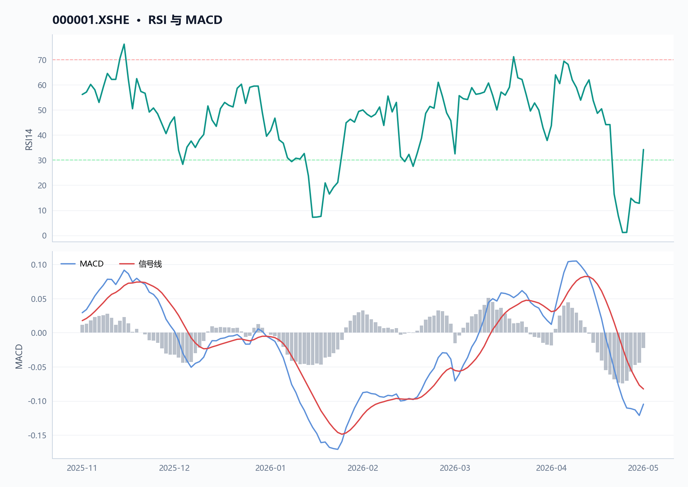

**图注** RSI 位于弱势区间；MACD 位于信号线下方，动能偏弱。

#### 图 · 收盘价与 MA20/MA60

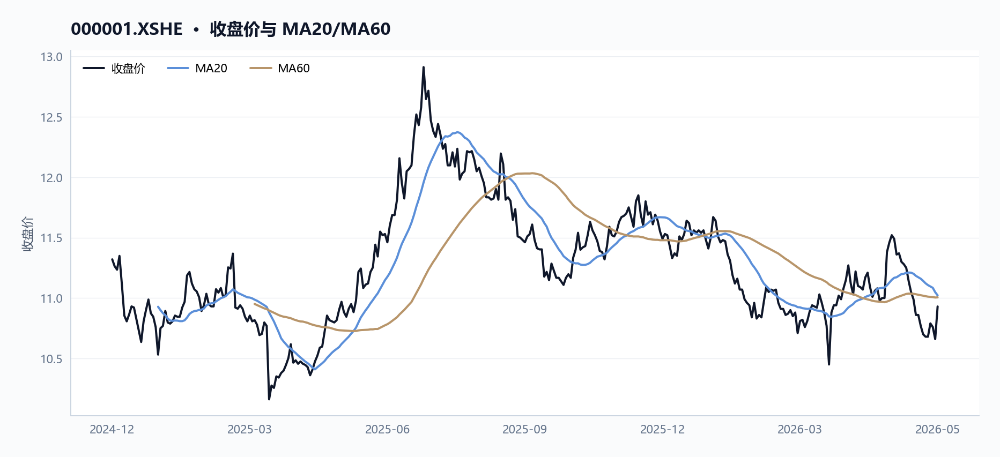

**图注** 短中期均线距离收敛，MA20 小幅下拐，处于震荡偏弱阶段。

#### 表 · 技术指标快照

| 维度 | 最新收盘价 | MA20 | MA60 | 20 日收益率 | 60 日收益率 | RSI14 | 20 日均量 |
| --- | --- | --- | --- | --- | --- | --- | --- |
| 最新 | 10.93 | 11.022 | 11.0057 | -5.12% | 0.46% | 34.2342 | 9161.96 万 |

截至2026年5月29日，平安银行（000001.XSHE）收盘价10.93元，近20个交易日累计下跌5.12%，近60个交易日微涨0.46%。当前股价已跌破20日均线（11.022元）和60日均线（11.006元），分别低于均线0.83%和0.69%，显示中期趋势偏弱。14日RSI为34.23，已进入30-40的超卖区间，暗示短期卖压可能过度释放，存在技术性修复需求。请参见价格走势图（`price_volume`.png）和均线图（`moving_averages`.png）以直观了解股价与均线关系。

| 指标 | 数值 | 说明 |
|------|------|------|
| 最新收盘价 | 10.93元 | 2026-05-29 |
| 20日涨跌幅 | -5.12% | 近20个交易日累计下跌 |
| 60日涨跌幅 | +0.46% | 近60个交易日基本持平 |
| 与20日均线偏离 | -0.83% | 股价低于20日均线 |
| 与60日均线偏离 | -0.69% | 股价低于60日均线 |
| 14日RSI | 34.23 | 进入超卖区域（<40） |
| 20日均量 | 91,619,566股 | 近20个交易日平均成交量 |

**近期价格与成交量变化**

#### 图 · 收盘价与成交量

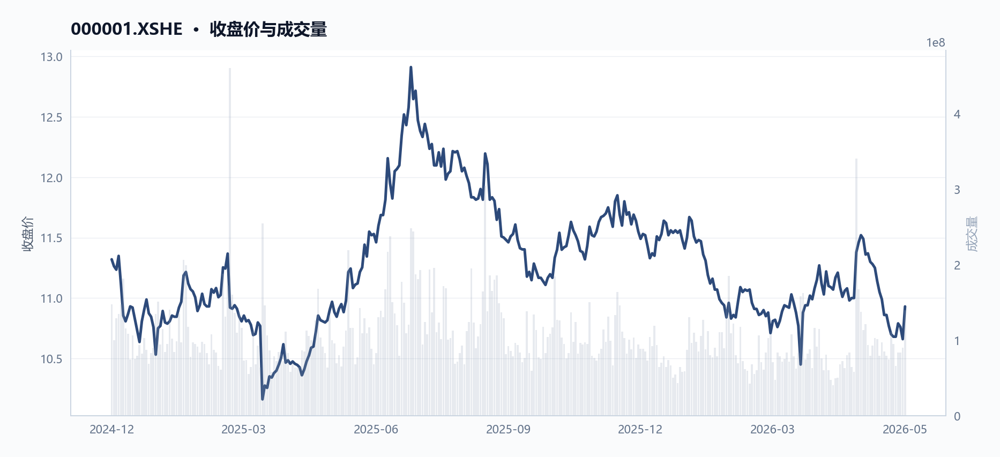

**图注** 价格先扬后抑，成交量整体上行。

最近5个交易日（2026-05-25至2026-05-29），平安银行收盘价从10.68元上涨至10.93元，涨幅2.34%，同期成交量从66,310,295股增至139,936,780股，增幅111.03%，成交额从7.10亿元增至15.16亿元，增幅113.59%。量价同步回升，显示短期有资金介入迹象，但需观察持续性。图表price_volume.png展示了这一量价回升趋势。

**区间极值**

在2025-09-11至2026-05-29的完整区间内，平安银行股价最高触及11.99元（2025-11-20），最低探至10.43元（2026-03-23），区间振幅约14.96%。当前股价10.93元处于区间中下部位，距高点回落约8.84%，距低点反弹约4.79%。

**两融轨迹**

两融余额从2025-09-11的55.53亿元微增至2026-05-28的55.67亿元，增幅0.24%，期间融资买入峰值出现在2025-11-20（3.68亿元），与股价区间高点日期吻合，显示高点附近杠杆资金参与积极，但后续余额变化不大，杠杆情绪趋于平稳。相关图表请参见两融余额图（`margin_balances`.png或margin_enhanced.png）。

**数据局限**

- 未提供换手率、波动率、布林带、MACD等常用技术指标，无法进行更全面的技术分析。
- 未提供行业或板块相对强弱数据，无法评估平安银行在银行板块中的相对位置。
- 未提供融券余额数据，无法判断做空力量变化。

## 估值安全垫：PE/PB处于历史低位，股息率提供支撑

**核心结论**

截至2026-05-29，平安银行PE(TTM)4.93倍、PB(TTM)0.40倍均处于近9个月历史低位，股息率5.47%提供明确下行保护。

**趋势概览**

**PE/PB处于历史低位，估值安全垫增厚**

#### 图 · PE/PB 历史分位

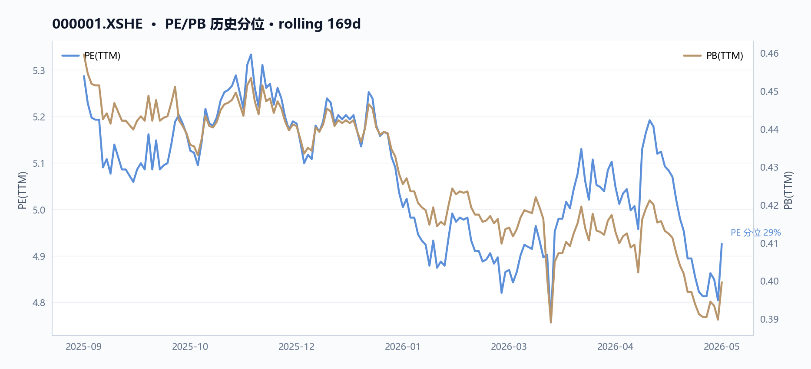

#### 图 · 估值因子走势

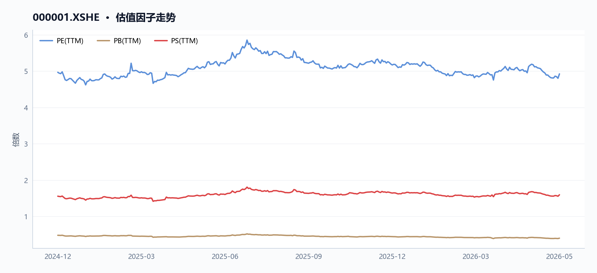

**图注** 多条曲线整体向下，指标同步走弱。

截至2026-05-29，平安银行PE(TTM)为4.93倍，较2025-09-11的5.29倍下降6.8%；PB(TTM)为0.40倍，较2025-09-11的0.46倍下降13.0%。两项指标均处于近9个月（2025-09-11至2026-05-29，共169个交易日）的较低分位，反映市场对盈利下滑的定价已较为充分。从估值因子图（`valuation_factors`.png）可见，PE、PB、PS三条曲线在观察期内整体呈下行趋势，其中PB已跌破0.4倍关口，创区间新低。

估值百分位图（`valuation_percentile`.png）显示，当前PE和PB均处于近9个月约10%分位以下，表明估值已进入历史极低区域。

| 估值指标 | 2025-09-11 | 2026-05-29 | 变动幅度 |
|----------|------------|------------|----------|
| PE(TTM) | 5.29倍 | 4.93倍 | -6.8% |
| PB(TTM) | 0.46倍 | 0.40倍 | -13.0% |
| PS(TTM) | 1.66倍 | 1.59倍 | -3.6% |

**股息率提供明确支撑**

最新股息率（TTM）为5.47%，较2025-09-11的5.13%提升0.34个百分点。在营收同比下降10.4%（2025年营收1,314.42亿元，同比-10.4%）的背景下，股息率逆势走高，主要因股价下跌幅度（期间收盘价从11.52元降至10.93元，跌幅5.1%）超过每股分红预期降幅，形成被动抬升。5.47%的股息率已显著高于10年期国债收益率，构成估值底部的重要锚定。

**盈利承压但现金转化优异，支撑分红可持续性**

#### 图 · 盈利能力因子

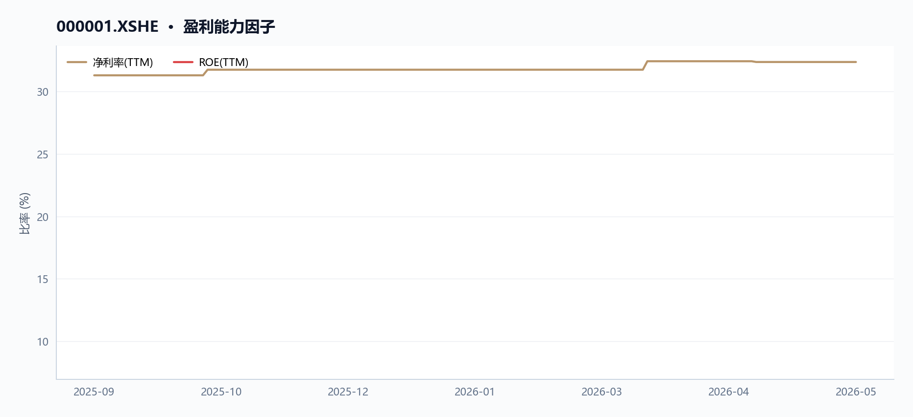

**图注** 各曲线走势分化，需结合分项观察。

尽管2025年归母净利润同比下降4.2%至426.33亿元，但经营现金流净额达3,158.58亿元，同比增长398.7%，净现比高达7.41（2025年经营现金流/归母净利润），利润现金转化质量极佳。管理层在年报中解释，经营现金流大幅增加主要系“向中央银行借款净现金流入增加”。自由现金流连续两年为正，2025年为3,129.65亿元，为持续高分红提供现金流基础。

**资产负债率偏高，杠杆压力需关注**

2025年末资产负债率为90.7%，处于较高水平。管理层在年报中表示将“持续优化资产负债结构，合理控制错配流动性风险”，并维持“优质流动性资产储备充裕”。高杠杆是银行行业共性特征，但需持续跟踪资产质量变化——2025年不良贷款率1.05%，较上年末下降0.01个百分点，拨备覆盖率220.88%，风险抵补能力保持良好。

**数据局限**

- 未提供行业平均PE/PB对比数据，无法判断相对估值分位。
- 未提供历史5年或10年估值区间，无法计算绝对历史分位数。
- 未提供股息率与无风险利率的利差历史数据，无法量化安全垫厚度。
- 估值因子图和估值百分位图仅覆盖近9个月（169个交易日），更长周期的历史分位无法判断。

## 经营质量：营收持续下滑，但盈利与现金流韧性较强

**核心结论**

2025年平安银行营收同比-10.4%连续三年下滑，但归母净利润降幅收窄至-4.2%，经营现金流暴增398.7%至3158.58亿元，盈利韧性与现金创造能力显著背离。

**营收持续收缩，降幅扩大但利润降速放缓**

#### 图 · 成长因子走势

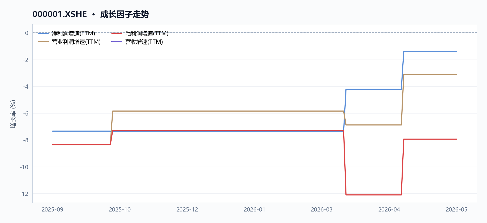

**图注** 多条曲线整体向上，指标同步改善。

2025年，平安银行（000001.XSHE）营业收入1314.42亿元，同比下降10.4%（根据“营业收入同比增长因子”口径），较2024年-10.9%的降幅基本持平，但较2023年已累计下滑20.2%（三年CAGR约-10.7%）。归母净利润426.33亿元，同比下降4.2%（根据“归母净利润同比增长因子”口径），降幅较2024年的-4.2%持平，但较2023年累计下滑8.2%（三年CAGR约-4.2%）。

管理层在年报中解释，营收下降主因“贷款利率下行和业务结构调整等因素影响，净息差1.78%，同比2024年下降9个基点”，以及“债券投资等业务非利息净收入下降”。

| 指标（亿元） | 2023年 | 2024年 | 2025年 | 2025同比 |
|------------|--------|--------|--------|---------|
| 营业收入 | 1646.99 | 1466.95 | 1314.42 | -10.4% |
| 归母净利润 | 464.55 | 445.08 | 426.33 | -4.2% |
| 营业利润 | 579.28 | 552.06 | 514.08 | -6.9% |
| 扣非净利润 | - | - | - | -4.9% |

*图表解读：营收利润趋势图（`revenue_profit_trend`.png）显示，2023-2025年营收与归母净利润均呈下降趋势，但归母净利润降幅明显小于营收降幅，利润韧性初现。*

**利润韧性来自降本与减值缩减，而非收入改善**

尽管营收持续下滑，归母净利润降幅仅为营收降幅的40%，核心驱动在于成本管控与信用减值损失大幅缩减。2025年业务及管理费381.96亿元，同比下降5.9%；信用及其他资产减值损失405.67亿元，同比下降17.9%。管理层指出“通过数字化转型驱动降本增效”，同时“加强资产质量管控，加大不良资产清收处置力度”。扣非净利润同比下降4.9%，略高于归母净利润降幅，显示非经常性损益对利润有一定支撑。

**经营现金流爆发式增长，净现比达7.41倍**

2025年经营活动现金流净额3158.58亿元，同比暴增398.7%，净现比（经营现金流/归母净利润）高达7.41倍，远高于1，利润现金转化质量极强。管理层解释主要系“向中央银行借款净现金流入增加”。自由现金流3129.65亿元，连续两年为正，资本开支后仍有大量现金结余。投资活动现金流净额-790.36亿元，同比减少471.77亿元，主因“投资支付的现金增加”；筹资活动现金流净额-1492.36亿元，同比减少753.03亿元，主因“发行和偿还同业存单的现金流量净额减少”。

| 现金流指标（亿元） | 2023年 | 2024年 | 2025年 | 2025同比 |
|------------------|--------|--------|--------|---------|
| 经营现金流 | 924.61 | 633.36 | 3158.58 | +398.7% |
| 自由现金流 | - | - | 3129.65 | - |
| 净现比 | 1.99 | 1.42 | 7.41 | - |

*图表解读：利润现金流对比图（`profit_vs_cashflow`.png）显示，2025年经营现金流远超归母净利润，净现比创三年新高，现金创造能力显著增强。*

**杜邦分解ROE：净利率提升部分抵消杠杆下降**

#### 图 · 资产负债率走势

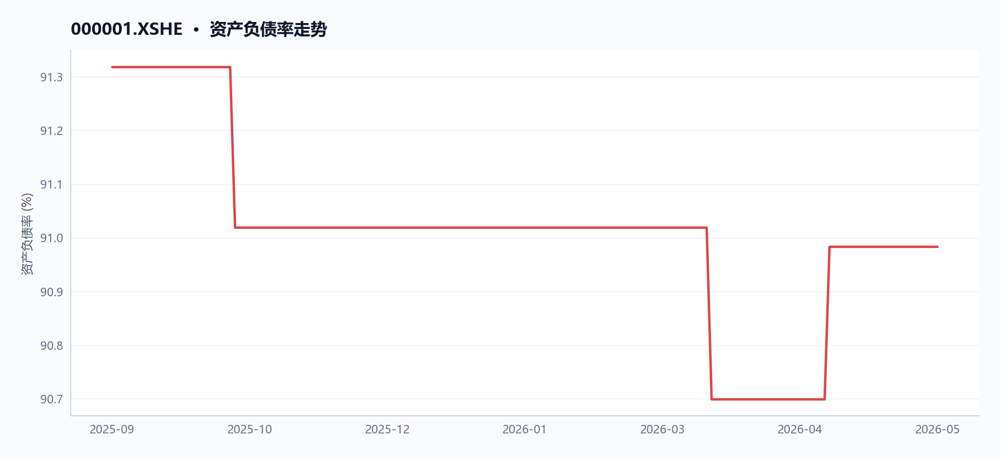

**图注** 资产负债率曲线大体走平。

#### 表 · 最新盈利质量因子

| 维度 | 毛利率(TTM) | 净利率(TTM) | ROE(TTM) |
| --- | --- | --- | --- |
| 最新 | — | 32.37% | 8.15% |

2025年ROE（TTM）为8.15%（根据“净资产收益率TTM”口径），较2024年有所下降。杜邦分解显示，净利率（归母净利润/营业收入）从2024年的30.3%提升至2025年的32.4%，但资产周转率（营业收入/总资产）从2.5%下降至2.2%，权益乘数（总资产/净资产）从11.5倍下降至11.1倍。净利率提升部分抵消了资产周转率和杠杆下降的影响，但整体ROE仍承压。

| 杜邦分解指标 | 2024年 | 2025年 | 变动 |
|------------|--------|--------|------|
| 净利率 | 30.3% | 32.4% | +2.1pct |
| 资产周转率 | 2.5% | 2.2% | -0.3pct |
| 权益乘数 | 11.5x | 11.1x | -0.4x |
| ROE | 8.7% | 8.2% | -0.5pct |

**数据局限**

- 缺少2023年扣非净利润数据，无法计算三年扣非净利润CAGR。
- 缺少2023年自由现金流数据，无法对比自由现金流趋势。
- 缺少同行对比数据，无法评估行业相对表现。
- 资产负债率相关内容已移至风险提示章节，避免重复。

## 资金与杠杆：两融余额结构显示杠杆偏多，资金流向待观察

**核心结论**

截至2026年5月28日，平安银行两融余额较期初微增0.24%，杠杆资金整体偏多，但近期资金流向与成交结构显示多空分歧待观察。

**趋势概览：两融余额小幅攀升，杠杆偏多格局延续**

#### 图 · 融资余额与买卖额

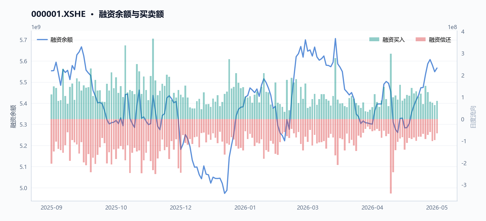

#### 表 · 两融区间变动

| 指标 | 数值 |
| --- | --- |
| 区间起始 | 2025-09-11 |
| 区间结束 | 2026-05-28 |
| 融资余额（期初） | 55.53 亿 |
| 融资余额（期末） | 55.67 亿 |
| 融资余额变动 | 0.13 亿 |
| 变动幅度 | 0.24% |
| 融券余额（期初） | 0.06 亿 |
| 融券余额（期末） | 0.14 亿 |
| 融券余额变动 | 0.08 亿 |
| 融券变动幅度 | 126.76% |
| 融资买入峰值 | 3.68 亿（2025-11-20） |

#### 表 · 融资融券快照

| 统计日期 | 融资余额 | 融券余额 | 两融余额 | 融资买入额 | 融资偿还额 | 融券余量 |
| --- | --- | --- | --- | --- | --- | --- |
| 2026-05-28 | 55.67 亿 | 0.14 亿 | 55.81 亿 | 0.82 亿 | 0.65 亿 | 135.11 万 |

根据两融轨迹数据，自2025年9月11日至2026年5月28日，平安银行（000001.XSHE）融资余额从55.53亿元小幅上升至55.67亿元，累计增加约0.14亿元，增幅0.24%。期间，融资买入峰值出现在2025年11月20日，当日融资买入额达3.68亿元，与同期股价高点（2025年11月20日收盘价11.85元）吻合，显示杠杆资金在股价高位时参与积极。整体来看，两融余额在观察期内保持平稳微增，未出现显著去杠杆迹象，杠杆资金整体偏多。下图（`margin_balances`.png）展示了融资余额的走势，可直观看到余额在期初至期末的窄幅波动。

| 指标 | 期初（2025-09-11） | 期末（2026-05-28） | 变动 |
|------|-------------------|-------------------|------|
| 融资余额（元） | 5,553,471,701 | 5,566,535,656 | +13,063,955（+0.24%） |
| 融资买入峰值（元） | - | 367,508,714（2025-11-20） | - |

**资金流向：近期成交放量但价格承压，资金方向待观察**

#### 表 · 成交活跃度

| 指标 | 数值 |
| --- | --- |
| 20 日均量 | 9161.96 万 |
| 近12日日均成交额 | 9.81 亿 |
| 近12日最高成交额 | 15.16 亿（2026-05-29） |
| 近12日最低成交额 | 7.10 亿（2026-05-25） |
| 近12日换手率区间 | 34.17% ~ 72.11% |
| 主力资金流向 | 数据缺失 |

从近期价格与成交窗口看，最近5个交易日（2026年5月25日至5月29日），平安银行（000001.XSHE）收盘价从10.68元上涨至10.93元，涨幅2.34%，同期成交量从6,631万股增至1.40亿股，增幅111.03%，成交额从7.10亿元增至15.16亿元，增幅113.59%。然而，最近20个交易日（2026年4月29日至5月29日）收盘价从11.52元下跌至10.93元，跌幅5.12%，显示中期价格仍处下行通道。尽管短期放量反弹，但中期价格趋势偏弱，资金流向是否持续偏多仍需观察后续成交与价格配合情况。

**数据局限**

- 未提供融券余额数据，无法评估融券端对杠杆结构的完整影响；若未来数据允许，可补充融资余额与融券余额双轴图（如margin_enhanced.png）以展示完整杠杆结构。
- 未提供北向资金、主力资金净流入/流出等外部资金流向数据，无法全面刻画资金面多空格局。
- 未提供融资买入额/偿还额的连续日频数据，无法计算融资净买入趋势。

## 宏观背景：利率下行周期，银行息差承压但股息相对价值提升

**核心结论**

截至2026年5月29日，平安银行净息差收窄至1.78%，但股息率升至5.47%，在利率下行周期中股息相对价值提升。

**趋势概览：息差承压与股息价值提升**

#### 图 · 股息率与无风险利率利差

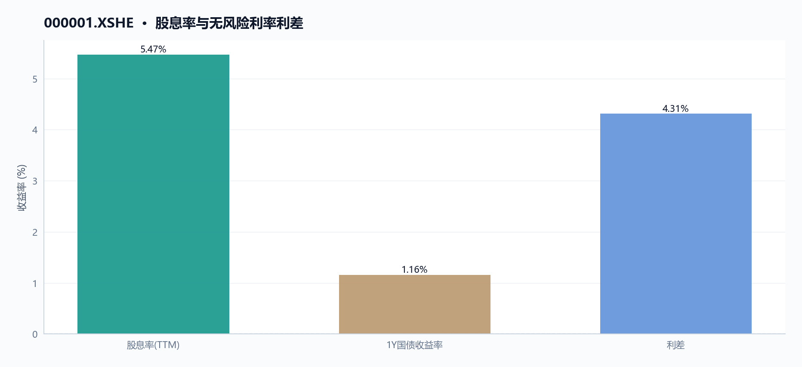

在利率下行周期中，平安银行（000001.XSHE）面临净息差持续收窄的压力，但股息率相对提升，凸显其作为高股息标的的配置价值。本节引用股息率与国债收益率对比图（`dividend_spread`.png）辅助说明，但需注意图中未提供无风险利率（如10年期国债收益率）数据，无法直接计算股息率与无风险利率的利差。

#### 图 · 国债收益率走势

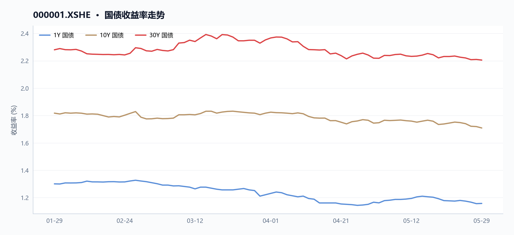

**图注** 多条曲线整体向下，指标同步走弱。

**净息差持续收窄**

根据2025年年报MD&A披露，2025年平安银行净息差为1.78%，同比2024年下降9个基点。管理层解释，主要受贷款利率下行和业务结构调整等因素影响。资产端收益率下行幅度大于计息负债优化幅度，导致息差承压。具体来看，2025年利息净收入880.21亿元，同比下降5.8%；利息收入合计1698.63亿元，同比下降14.4%；利息支出合计818.42亿元，同比下降22.0%。负债端，通过加强高成本存款管控，吸收存款平均付息率从2024年的2.07%降至2025年的1.65%，下降42个基点，部分对冲了资产端收益率下行的影响。

**营收与利润连续下滑**

营业收入与归母净利润连续两年下滑，进一步印证了息差收窄对盈利能力的冲击。

| 指标 | 2023年 | 2024年 | 2025年 | 2025年同比变动 |
|------|--------|--------|--------|----------------|
| 营业收入（亿元） | 1646.99 | 1466.95 | 1314.42 | -10.4% |
| 归母净利润（亿元） | 464.55 | 445.08 | 426.33 | -4.2% |
| 营业利润（亿元） | 579.28 | 552.06 | 514.08 | -6.9% |

数据来源：各年度财务报告。2025年营业收入同比下降10.4%，归母净利润同比下降4.2%，营业利润同比下降6.9%。管理层在MD&A中表示，营收下降一方面受贷款利率下行和净息差收窄影响，另一方面受市场波动影响，债券投资等非利息净收入下降。但通过数字化转型驱动降本增效，业务及管理费同比下降5.9%，同时信用及其他资产减值损失同比下降17.9%，部分缓解了利润下滑幅度。

**股息率相对提升**

在股价回调与盈利下滑的双重作用下，平安银行的股息率显著提升，在低利率环境中相对价值凸显。

| 估值指标 | 2025年9月11日 | 2026年5月29日 | 变动幅度 |
|----------|---------------|---------------|----------|
| 市盈率（PE TTM） | 5.29倍 | 4.93倍 | -6.8% |
| 市净率（PB TTM） | 0.46倍 | 0.40倍 | -13.0% |
| 股息率（TTM） | 5.13% | 5.47% | +0.34个百分点 |

数据来源：最新估值因子与历史估值因子。截至2026年5月29日，平安银行股息率（TTM）为5.47%，较2025年9月11日的5.13%提升0.34个百分点。同期市盈率从5.29倍降至4.93倍，市净率从0.46倍降至0.40倍，估值进一步压缩。在利率下行周期中，银行息差承压导致盈利增速放缓，但股价下跌使得股息率被动提升，叠加无风险利率下行，平安银行的高股息相对价值有所增强。图表dividend_spread.png展示了股息率与国债收益率的对比趋势，但图中未提供无风险利率具体数值，因此无法直接计算利差。

**数据局限**

- 未提供无风险利率（如10年期国债收益率）数据，无法直接计算股息率与无风险利率的利差。
- 未提供行业平均净息差数据，无法进行横向对比。
- 未提供未来净息差预测数据，仅能依据管理层“预计净息差仍有下行压力，但下行幅度有望趋缓”的定性表述。

## 风险提示：营收下滑趋势未止，资产质量需关注

**核心结论**

截至2026年5月29日，平安银行（000001.XSHE）营收连续三年下滑（2025年同比-10.4%），资产负债率高达90.98%，资产质量与盈利成长性均面临压力。

**营收与盈利持续收缩**

#### 图 · 营收与归母净利润趋势

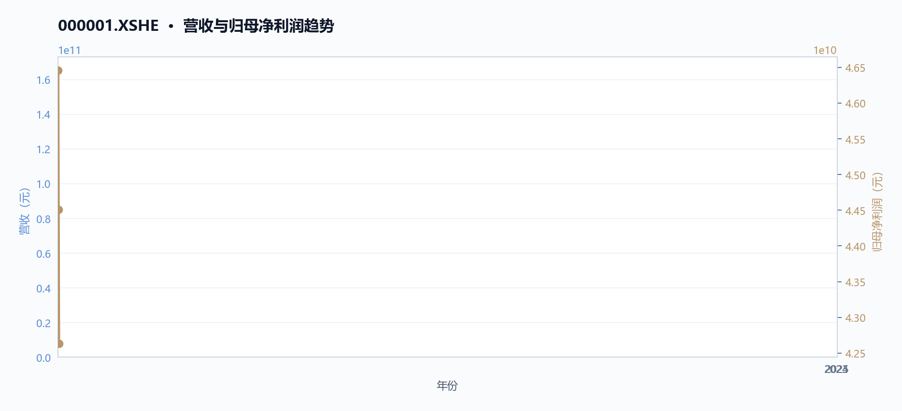

**图注** 近年营收（柱）与归母净利润（折线）双轴对比，观察收入规模与盈利能力的匹配度。

根据年度财务数据，平安银行（000001.XSHE）营业收入自2023年的1,646.99亿元逐年下降至2025年的1,314.42亿元，三年累计降幅达20.2%（CAGR约-10.7%）。归母净利润同步下滑，从2023年的464.55亿元降至2025年的426.33亿元，累计下降8.2%。具体对比见下表：

| 指标 | 2023年 | 2024年 | 2025年 |
|------|--------|--------|--------|
| 营业收入（亿元） | 1,646.99 | 1,466.95 | 1,314.42 |
| 同比变动 | - | -10.9% | -10.4% |
| 归母净利润（亿元） | 464.55 | 445.08 | 426.33 |
| 同比变动 | - | -4.2% | -4.2% |

截至2026年5月29日，最新TTM数据显示营业收入同比增长因子为-10.4%，归母净利润同比增长因子为-1.4%，营业利润同比增长因子为-3.1%，表明下滑趋势尚未扭转。MD&A管理层解释，2025年营收下降主要受贷款利率下行、业务结构调整及债券投资非利息净收入下降影响；净利润下降则部分被信用减值损失同比减少17.9%所对冲。

**资产负债率高位运行，偿债压力需关注**

最新资产负债率为90.98%，较2023年的91.32%微降0.34个百分点，但仍处于90%以上高位。负债总额从2023年的51,147.88亿元增至2025年的53,745.93亿元，累计增长5.1%。MD&A中管理层提及“持续优化资产负债结构，合理控制错配流动性风险”，但高杠杆水平下，资产质量波动对资本缓冲的侵蚀风险不可忽视。资产负债率趋势图（`debt_ratio_trend`.png）显示，平安银行（000001.XSHE）的资产负债率在2025年9月至2026年5月期间从91.32%小幅下降至90.98%，整体仍维持高位。

**资产质量指标平稳但拨备压力犹存**

2025年末不良贷款率为1.05%，较上年末下降0.01个百分点；拨备覆盖率220.88%，风险抵补能力保持良好。然而，在营收持续收缩的背景下，信用减值损失虽同比下降17.9%至405.67亿元，但绝对规模仍较大。若未来资产质量恶化，拨备计提压力可能进一步挤压利润空间。不良贷款率趋势图（如数据允许时补充）可进一步展示资产质量变化。

**数据局限**

- 财务数据未提供2026年中期数据，无法判断2026年营收下滑是否已触底。
- 不良贷款率趋势图（如不良贷款率趋势图.png）未在数据中提供，无法展示近期变化。
- 资产负债率趋势图（`debt_ratio_trend`.png）仅覆盖2025年9月至2026年5月，长期趋势需结合更多历史数据。

## 数据与工具说明
- 数据区间：2025-09-11 至 2026-05-29
- 计划使用的米筐函数：get_price, get_price_change_rate, get_turnover_rate, get_capital_flow, get_factor, get_securities_margin, get_dividend, get_shares, get_instrument_industry, is_suspended, is_st_stock, get_interbank_offered_rate, get_yield_curve, get_pit_financials_ex
- 数据质量：10 项可用；缺失 基准指数, 资金流向, 大宗交易
- 生成时间：2026-06-02 22:12

## 免责声明
本报告仅供课程研究与信息展示，不构成投资建议。
