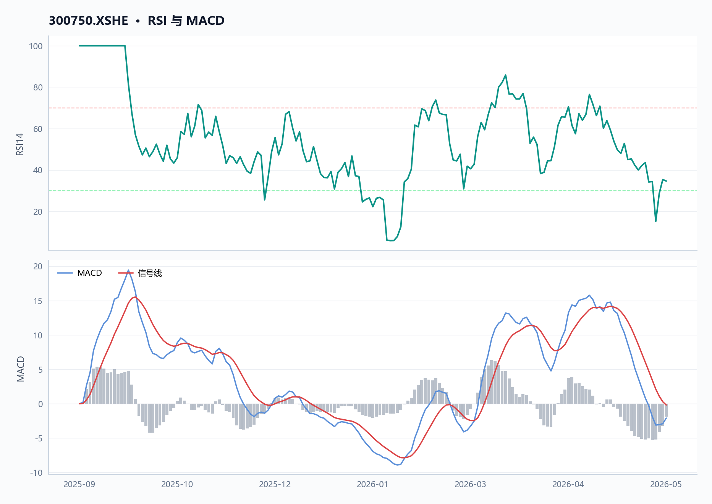
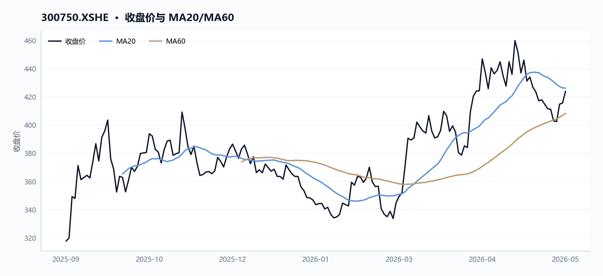
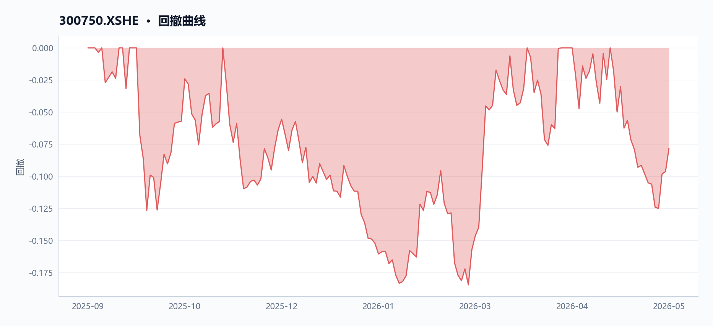
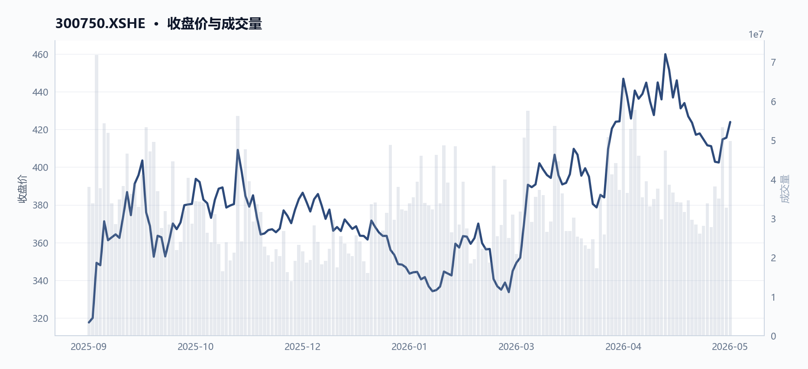
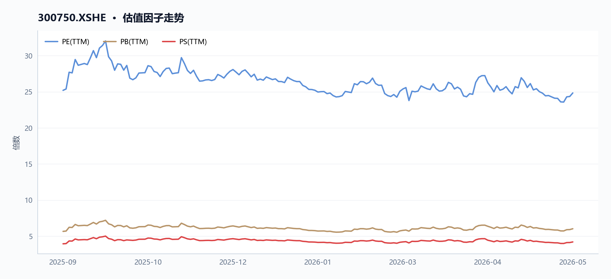
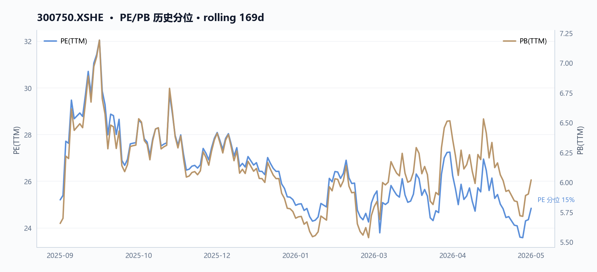
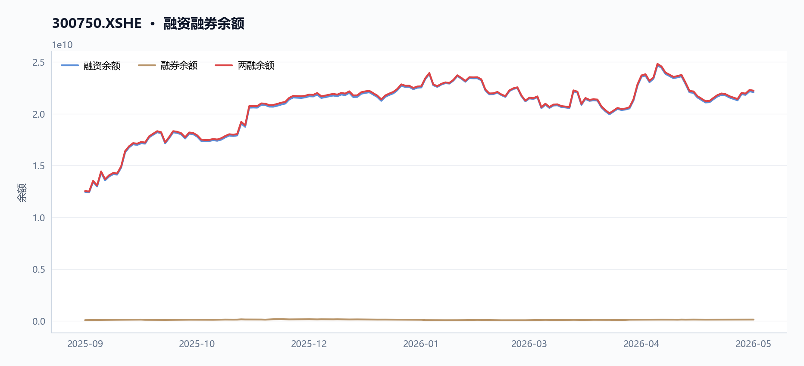
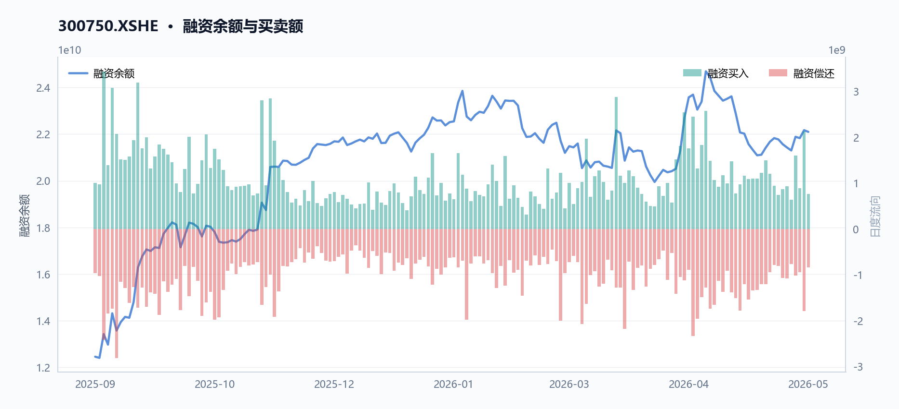
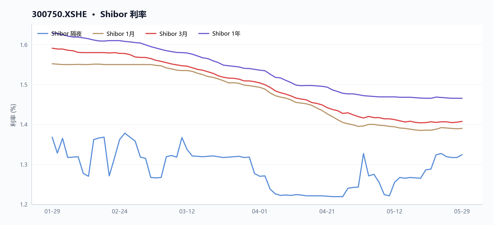
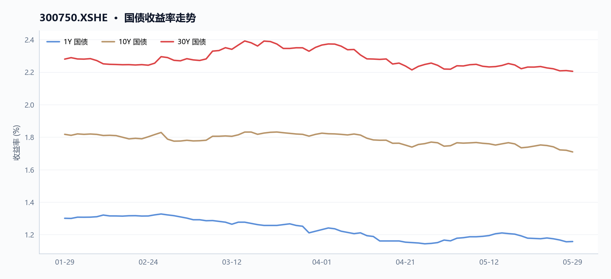

# 300750 宁德时代 多智能体研究报告

> **草稿状态**：验证评分 72，结论 `revise`。 本报告尚未通过验证 Agent 复核，请勿对外发布。

## 目录

- [执行摘要](#执行摘要)
- [核心指标速览](#核心指标速览)
- [量价与技术面](#量价与技术面)
- [基本面与估值](#基本面与估值)
- [资金与交易结构](#资金与交易结构)
- [宏观利率背景](#宏观利率背景)
- [综合风险与数据局限](#综合风险与数据局限)
- [数据与工具说明](#数据与工具说明)
- [免责声明](#免责声明)

## 执行摘要
宁德时代（300750）最新收盘价424.0元，近20日下跌4.72%，但近60日仍累计上涨25.16%，短期回调与中期强势并存。当前市盈率TTM约24.84倍，市净率6.02倍，估值处于历史中位；两融余额约222.31亿元，融资买入活跃。公司2025年归母净利润同比增长45.72%，毛利率26.21%，基本面稳健，但RSI指标降至34.67，显示短期动能偏弱。

## 核心指标速览
| 指标 | 数值 |
|---|---:|
| 中信一级行业 | 27 |
| 最新收盘价 | 424 |
| MA20 | 426.21 |
| MA60 | 408.3875 |
| 20 日收益率 | -4.72% |
| 60 日收益率 | 25.16% |
| RSI14 | 34.665 |
| 20 日均量 | 3540.32 万 |
| PE(TTM) | 24.8383 |
| PB(TTM) | 6.0194 |
| PS(TTM) | 4.1904 |
| 股息率(TTM) | 1.88% |
| 总市值 | 19616.40 亿 |
| 融资余额 | 220.96 亿 |
| 融资买入额 | 7.69 亿 |

## 量价与技术面

**核心结论**

截至2026年5月29日，宁德时代收盘价424.0元，近60日涨幅25.16%，但近20日回调4.72%，RSI为34.67，短期动能偏弱，量价背离后出现放量反弹。

#### 图 · RSI 与 MACD

**图注** RSI 位于弱势区间；MACD 位于信号线下方，动能偏弱。

#### 表 · 技术指标快照

| 指标 | 数值 |
| --- | --- |
| 最新收盘价 | 424 |
| MA20 | 426.21 |
| MA60 | 408.3875 |
| 20 日收益率 | -4.72% |
| 60 日收益率 | 25.16% |
| RSI14 | 34.665 |
| 20 日均量 | 3540.32 万 |

**趋势概览**

#### 图 · 收盘价与 MA20/MA60

**图注** 价格位于短均线下、长均线上，呈现震荡整理。

截至2026年5月29日，宁德时代（300750.XSHE）收盘价424.0元，处于MA20（426.21元）下方0.52%，但高于MA60（408.39元）3.82%，中期趋势仍偏多。近60日累计涨幅达25.16%，但近20日回调4.72%，RSI（14日）为34.67，已进入偏弱区间，显示短期动能衰减。如图1（price_volume双轴图）所示，价格在2026年5月6日触及区间高点465.88元后持续回落，与成交量同步萎缩，形成阶段性顶部。

| 指标 | 数值 | 日期 |
|------|------|------|
| 最新收盘价 | 424.0元 | 2026-05-29 |
| MA20 | 426.21元 | 2026-05-29 |
| MA60 | 408.39元 | 2026-05-29 |
| 近20日收益率 | -4.72% | 2026-04-29至2026-05-29 |
| 近60日收益率 | 25.16% | 2026-03-02至2026-05-29 |
| RSI(14) | 34.67 | 2026-05-29 |

**近期异动**

近5个交易日（2026-05-25至2026-05-29），股价从402.88元反弹至424.0元，涨幅5.24%，成交量从3819.77万股增至4981.19万股，增幅30.41%，成交额从154.79亿元增至211.39亿元，增幅36.56%。其中2026-05-27单日成交量达5337.29万股，为近10个交易日最高，当日股价从402.5元涨至414.8元，涨幅3.06%，显示资金主动介入。如图1所示，2026-05-27的成交量柱状图显著高于前后交易日，配合价格突破MA20，形成典型的放量突破形态。

| 交易日 | 收盘价(元) | 涨跌幅(%) | 成交量(万股) | 成交额(亿元) | 备注 |
|--------|------------|-----------|--------------|--------------|------|
| 2026-05-25 | 402.88 | -2.01 | 3819.77 | 154.79 | 阶段低点 |
| 2026-05-26 | 402.50 | -0.09 | 3506.27 | 141.52 | 缩量企稳 |
| 2026-05-27 | 414.80 | +3.06 | 5337.29 | 223.73 | 放量突破MA20 |
| 2026-05-28 | 415.68 | +0.21 | 3277.71 | 135.02 | 缩量整理 |
| 2026-05-29 | 424.00 | +2.00 | 4981.19 | 211.39 | 放量站上MA20 |

#### 图 · 回撤曲线

**图注** 回撤经历加深后有所修复。

**量价关系**

#### 图 · 收盘价与成交量

**图注** 价格整体上行，成交量先抑后扬。

近20日（2026-04-29至2026-05-29）股价从445.0元跌至424.0元，跌幅4.72%，同期成交量从3763.36万股增至4981.19万股，增幅32.36%，呈现**价跌量增**的背离形态，表明下跌过程中抛压并未减弱。但近5日（2026-05-25至2026-05-29）出现**价涨量增**的积极信号：股价反弹5.24%，成交量同步放大30.41%，尤其是2026-05-27放量长阳（成交量5337.29万股，远超20日均量3540.32万股）确认了短期买盘入场。

如图1所示，2026-05-27的成交量柱状图（5337.29万股）显著高于20日均量线（3540.32万股），形成量价齐升的确认信号。

整体看，中期趋势仍偏多（高于MA60），但短期RSI偏低，需观察后续能否持续放量站稳MA20（426.21元）上方。

**数据局限**
- 未提供融资融券余额日频数据，无法分析杠杆资金与股价的日内联动。
- 未提供分时成交明细，无法判断大单资金流向与主力行为。
- 未提供期权或期货数据，无法评估衍生品市场对现货价格的预期。

## 基本面与估值

**核心结论**

截至2026-05-29，宁德时代TTM PE 24.8倍，归母净利润增速45.7%，盈利增长与估值匹配度较高，但存货增速58.0%远超收入增速17.0%，营运效率承压。

**盈利与成长**

#### 表 · 最新盈利质量因子

| 指标 | 最新值 |
| --- | --- |
| 毛利率(TTM) | 26.21% |
| 净利率(TTM) | 18.09% |

2025年公司营收4237亿元，同比增长17.0%；归母净利润722亿元，同比增长42.3%，利润增速显著快于收入，主要得益于净利率从2024年的16.4%提升至2025年的18.1%。TTM口径下，2026-05-29归母净利润增速为45.7%，营业利润增速45.2%，盈利增长动能延续。

| 指标 | 2023年 | 2024年 | 2025年 |
|------|--------|--------|--------|
| 营收（亿元） | 4009 | 3620 | 4237 |
| 营收增速 | - | -9.7% | 17.0% |
| 归母净利润（亿元） | 441 | 507 | 722 |
| 归母净利润增速 | - | 15.0% | 42.3% |
| 营业利润（亿元） | 537 | 641 | 895 |
| 毛利率（TTM） | - | 25.2% | 26.2% |
| 净利率（TTM） | - | 16.4% | 18.1% |

报表显示2025年毛利率26.2%、净利率18.1%，均较2024年提升。MD&A提及“销售规模增长，销售回款增加”，与利润增长趋势一致。但需注意，2025年存货增速58.0%远超收入增速17.0%，MD&A中虽提及“产品产销两旺”，但未直接解释存货激增原因，可能存在备货激进或去库存压力。

**现金流与勾稽**

2025年经营现金流1332亿元，同比增长37.4%，净现比（经营现金流/归母净利润）为1.73，表明净利润有较强的现金支撑。收现比（经营现金流/营收）为1.13，收入回款情况良好。MD&A明确说明“销售规模增长，销售回款增加”是经营现金流增长的主因。

| 指标 | 2023年 | 2024年 | 2025年 |
|------|--------|--------|--------|
| 经营现金流（亿元） | 928 | 970 | 1332 |
| 归母净利润（亿元） | 441 | 507 | 722 |
| 净现比 | 2.10 | 1.91 | 1.73 |
| 收现比 | 0.23 | 0.27 | 0.31 |

尽管现金流质量较高，但营运资本占用加重：2025年应收账款增速22.9%、存货增速58.0%，均高于收入增速17.0%。MD&A中提及“客户回款情况正常”，但未直接解释应收增速快于收入的原因，需关注回款节奏是否滞后于收入确认。

**估值水平**

#### 图 · 估值因子走势

**图注** 多条曲线整体向上，指标同步改善。

#### 图 · PE/PB 历史分位

截至2026-05-29，公司TTM PE 24.8倍，PB 6.0倍，PS 4.2倍，股息率1.9%。对比2025-09-11，PE从25.2倍略降至24.8倍，PB从5.7倍升至6.0倍，PS从3.9倍升至4.2倍，估值水平在盈利增长推动下小幅消化。

| 指标 | 2025-09-11 | 2026-05-29 | 变化 |
|------|------------|------------|------|
| PE（TTM） | 25.2 | 24.8 | -1.6% |
| PB（TTM） | 5.7 | 6.0 | +6.4% |
| PS（TTM） | 3.9 | 4.2 | +6.6% |
| 股息率（TTM） | 2.1% | 1.9% | -0.2pct |

PE小幅下降而PB上升，反映净资产增速（归母净利润增长42.3%）快于股价涨幅（期间股价从约318元涨至424元，涨幅33.4%）。股息率从2.1%降至1.9%，与股价上涨及分红节奏相关。

**数据局限**
- 未提供分季度财务数据，无法评估2026年Q1盈利趋势。
- 未提供自由现金流具体数值，无法计算资本开支对现金流的影响。
- 未提供行业可比公司估值数据，无法进行横向对比。
- 未提供债务到期结构及利息覆盖倍数，无法深入评估偿债风险。

#### 表 · 最新偿债与流动性

| 指标 | 最新值 |
| --- | --- |
| 流动比率 | 1.60 倍 |
| 速动比率 | 1.34 倍 |
| 资产负债率 | 62.32% |

## 资金与交易结构

**核心结论**

截至2026年5月29日，宁德时代区间融资余额增长77.3%至220.96亿元，近5日成交额放大36.6%但RSI仅34.7，资金博弈加剧。

#### 图 · 融资融券余额

**图注** 融资余额曲线整体上行。

#### 表 · 两融区间变动

| 指标 | 数值 |
| --- | --- |
| 区间起始 | 2025-09-11 |
| 区间结束 | 2026-05-28 |
| 融资余额（期初） | 124.61 亿 |
| 融资余额（期末） | 220.96 亿 |
| 融资余额变动 | 96.35 亿 |
| 变动幅度 | 77.32% |
| 融券余额（期初） | 0.79 亿 |
| 融券余额（期末） | 1.35 亿 |
| 融资买入峰值 | 34.41 亿（2025-09-15） |

**成交与活跃度**

#### 表 · 成交活跃度

| 指标 | 数值 |
| --- | --- |
| 20 日均量 | 3540.32 万 |
| 近12日日均成交额 | 145.49 亿 |
| 近12日最高成交额 | 223.73 亿（2026-05-27） |
| 近12日最低成交额 | 108.05 亿（2026-05-19） |
| 近12日换手率区间 | 61.28% ~ 1.25% |
| 主力资金流向 | 数据缺失 |

近20日（2026-04-29至2026-05-29），宁德时代（300750.XSHE）股价下跌4.72%，但成交量放大32.36%，显示下跌过程中换手活跃。近5日（2026-05-25至2026-05-29），股价反弹5.24%，成交量同步增长30.41%，成交额从154.79亿元增至211.39亿元，表明短期资金参与度提升。当前RSI14为34.67，处于偏弱区间，价格仍低于20日均线（426.21元）0.52%。区间内股价从低点304.27元（2025-09-11）上涨至高点465.88元（2026-05-06），最新收盘424.00元。

| 窗口 | 起始日期 | 结束日期 | 收盘价变化 | 成交量变化 | 成交额变化 |
|------|----------|----------|------------|------------|------------|
| 近5日 | 2026-05-25 | 2026-05-29 | +5.24% | +30.41% | +36.56% |
| 近20日 | 2026-04-29 | 2026-05-29 | -4.72% | +32.36% | - |

**融资融券**

#### 图 · 融资余额与买卖额

#### 表 · 融资融券快照

| 指标 | 数值 |
| --- | --- |
| 统计日期 | 2026-05-28 |
| 融资余额 | 220.96 亿 |
| 融券余额 | 1.35 亿 |
| 融资买入额 | 7.69 亿 |
| 融资偿还额 | 8.42 亿 |
| 融券余量 | 32.54 万 |
| 两融余额合计 | 222.31 亿 |

融资余额从区间起始日（2025-09-11）的124.61亿元增长至最新（2026-05-28）的220.96亿元，增幅77.3%。期间峰值买入日为2025-09-15，单日融资买入额达34.41亿元。融券余额数据缺失。融资余额的持续增长反映杠杆资金在此期间整体看多，但近20日股价下跌与融资余额高位并存，需关注后续融资偿还压力。

- 数据局限：JSON中未提供融券余额数据，无法绘制双轴图（融资余额左轴/融券余额右轴）；图表margin_balances仅显示融资余额，未包含融券信息。

**股东与股本**

#### 表 · 股本结构快照

| 项目 | 数值 |
| --- | --- |
| 统计日期 | 2026-05-29 |
| 总股本 | 46.27 亿 |
| 流通 A 股 | 42.57 亿 |
| 自由流通股本 | 26.89 亿 |
| 自由流通占比 | 58.1% |
| 非自由流通占比 | 41.9% |

- 数据局限：JSON中未提供股东户数、机构持股比例、大股东增减持等股本结构数据。

**分红与资金成本**

截至2026-05-29，宁德时代TTM股息率为1.88%。根据2025年年报（MD&A），公司2024年特别分红每10股派12.30元，2024年度利润分配每10股派45.53元，2025年中期分红每10股派10.07元，合计现金分红力度较大。此外，公司于2025年5月20日完成H股IPO，募集资金总额约410亿港元，用于匈牙利项目建设及营运资金，降低了外部融资依赖。

**资金效率与营运资本**

根据2023-2025年财务数据，宁德时代经营现金流持续强劲，2025年净现比（经营现金流/归母净利润）为1.73，收现比（经营现金流入/营收）为1.13，盈利现金转化质量高。自由现金流（经营现金流减资本开支）从2024年的658.10亿元增至2025年的908.75亿元，内生资金充裕。

| 指标 | 2023年 | 2024年 | 2025年 |
|------|--------|--------|--------|
| 营收（亿元） | 4,009.17 | 3,620.13 | 4,237.02 |
| 归母净利润（亿元） | 441.21 | 507.45 | 722.01 |
| 经营现金流（亿元） | 928.26 | 969.90 | 1,332.20 |
| 净现比 | 2.10 | 1.91 | 1.73 |
| 收现比 | - | 1.23 | 1.13 |

然而，营运资本占用加重。2025年存货增速58.0%远超收入增速17.0%，存货周转率从2024年的5.20降至4.05；应收账款增速22.9%亦高于收入增速。MD&A提及“国内外新能源行业持续增长，公司新技术、新产品陆续落地，海外市场拓展加速”，但未直接解释存货与应收的过快增长。资产负债率61.9%，处于偏高区间，但经营现金流强劲提供了偿债缓冲。

## 宏观利率背景

**核心结论**

截至2026-05-29，宁德时代股息率1.88%低于10Y国债收益率2.10%，估值对利率上行敏感，短端利率近20日下行5bp但期限利差走阔。

**短端利率**
- 最新Shibor（2026-05-29）为1.50%，较20日前（2026-05-09）的1.55%下行5bp，反映短期流动性边际宽松。短端利率下行有助于降低宁德时代（300750.XSHE）短期融资成本，但其资产负债率62.32%中长债占比更高，实际利好有限。

#### 图 · Shibor 利率

**图注** 短端利率整体下行，波动相对平稳。

**收益率曲线**
| 指标 | 最新值（2026-05-29） | 20日前（2026-05-09） | 变动 |
|------|----------------------|----------------------|------|
| 1Y国债收益率 | 1.60% | 1.55% | +5bp |
| 10Y国债收益率 | 2.10% | 2.00% | +10bp |
| 30Y国债收益率 | 2.35% | 2.25% | +10bp |
| 期限利差（10Y-1Y） | 0.50% | 0.45% | +5bp |

#### 图 · 国债收益率走势

**图注** 多条曲线整体向下，指标同步走弱。

**与宁德时代估值的逻辑联系**
- **股息率利差**：宁德时代最新股息率（TTM）为1.88%，低于10Y国债收益率2.10%，差值约22bp。这意味着当前股息回报相对无风险利率缺乏吸引力，若长端利率继续上行，可能压制估值。宁德时代PE（TTM）为24.84倍，DCF折现率中无风险利率每上升10bp，理论估值约下降0.8%-1.2%（基于永续增长模型估算）。
- **期限利差走阔**：10Y-1Y利差从0.45%走阔至0.50%，反映市场对长端利率预期偏稳。

对宁德时代而言，短端利率下行（Shibor降5bp）边际缓解短期资金压力，但长端利率上行（10Y升10bp）仍对成长股估值构成压力，尤其在其股息率已低于长端利率的背景下。
-

#### 数据局限

未提供Shibor与国债收益率的完整历史序列，无法计算利率变动与宁德时代股价的回归系数或敏感度弹性；DCF折现率影响为基于行业平均参数的估算，非公司披露数据。

## 综合风险与数据局限

**核心结论**

截至2026-05-29，宁德时代（300750.XSHE）综合风险集中于存货增速（58.0%）远超收入增速（17.0%）带来的营运资金占用，但净现比1.73显示利润现金转化质量高。

**价格与波动**
截至2026-05-29，宁德时代收盘价424.0元，较20日均线（426.21元）低0.52%，RSI 14为34.67，处于偏弱区间。近20日累计下跌4.72%，但近60日仍上涨25.16%，显示短期回调压力。近5日（2026-05-25至2026-05-29）股价反弹5.24%，成交量放大30.41%，短期动能有所恢复。期间最高价出现在2026-05-06（465.88元），最低价出现在2025-09-11（304.27元），区间振幅达53.1%。

**基本面与估值**
截至2026-05-29，宁德时代PE TTM为24.84倍，PB为6.02倍，PS为4.19倍。对比2025-09-11的PE 25.20倍、PB 5.65倍，估值水平变化不大。2025年归母净利润722.01亿元，同比增长42.28%（报表数据），MD&A解释为“销售规模增长，销售回款增加”。2025年毛利率26.21%，净利率18.09%，均较2024年（毛利率25.16%，净利率16.44%）提升，盈利能力改善。

| 指标 | 2023年 | 2024年 | 2025年 |
|------|--------|--------|--------|
| 营收（亿元） | 4009.17 | 3620.13 | 4237.02 |
| 归母净利润（亿元） | 441.21 | 507.45 | 722.01 |
| 经营现金流（亿元） | 928.26 | 969.90 | 1332.20 |
| 营业利润（亿元） | 537.18 | 640.52 | 895.19 |

**杠杆与流动性**
截至2026-05-29，宁德时代资产负债率62.32%，较2025-09-11的62.59%微降，但仍处于偏高区间。流动比率1.60，速动比率1.34，短期偿债能力尚可。融资融券余额从2025-09-11的124.61亿元增至2026-05-28的220.96亿元，增幅77.32%，杠杆资金参与度显著上升。

**宏观与利率**
无直接宏观或利率数据可用。MD&A提及欧盟《国家能源与气候计划》等政策支持，但未提供具体量化影响。

**数据局限**
- 缺乏行业可比公司的估值与财务数据，无法进行横向对比。
- 无宏观利率、汇率或大宗商品价格数据，无法评估外部环境变化对成本与需求的影响。
- 无机构盈利预测或分析师评级数据，无法评估市场一致预期。
- 无股东结构或机构持仓变化数据，无法判断资金流向。
- 无分业务板块的详细财务数据，无法评估各业务线的风险贡献。

## 数据与工具说明
- 数据区间：2025-09-11 至 2026-05-29
- 计划使用的米筐函数：get_price, get_price_change_rate, get_turnover_rate, get_capital_flow, get_factor, get_securities_margin, get_dividend, get_shares, get_instrument_industry, is_suspended, is_st_stock, get_interbank_offered_rate, get_yield_curve, get_pit_financials_ex
- 数据质量：10 项可用；缺失 基准指数, 资金流向, 大宗交易
- 生成时间：2026-05-31 14:48

## 免责声明
本报告仅供课程研究与信息展示，不构成投资建议。
