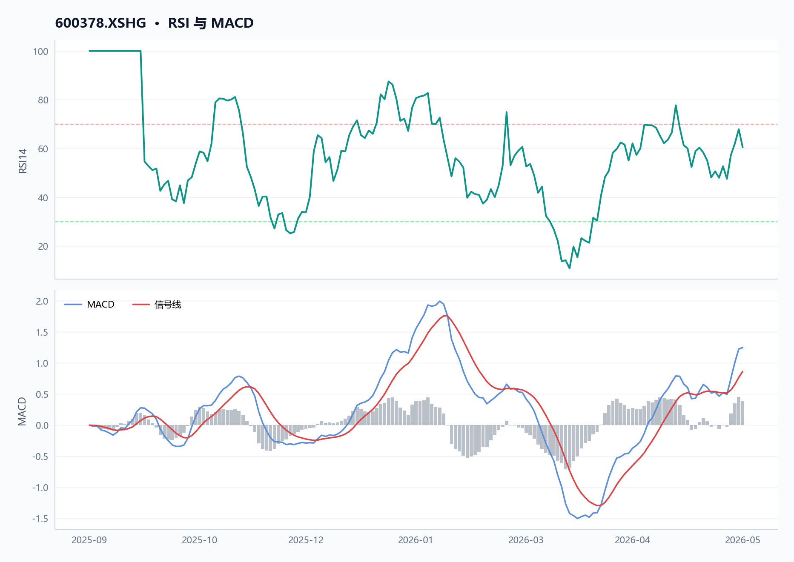
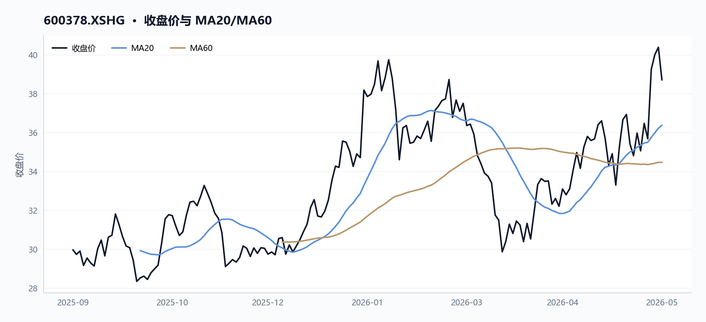
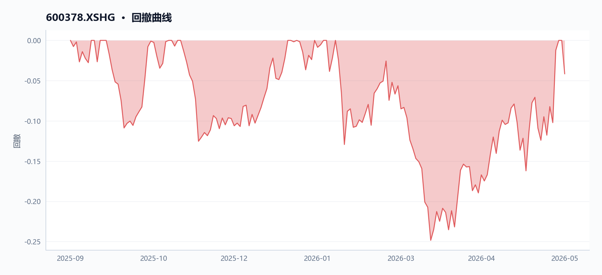
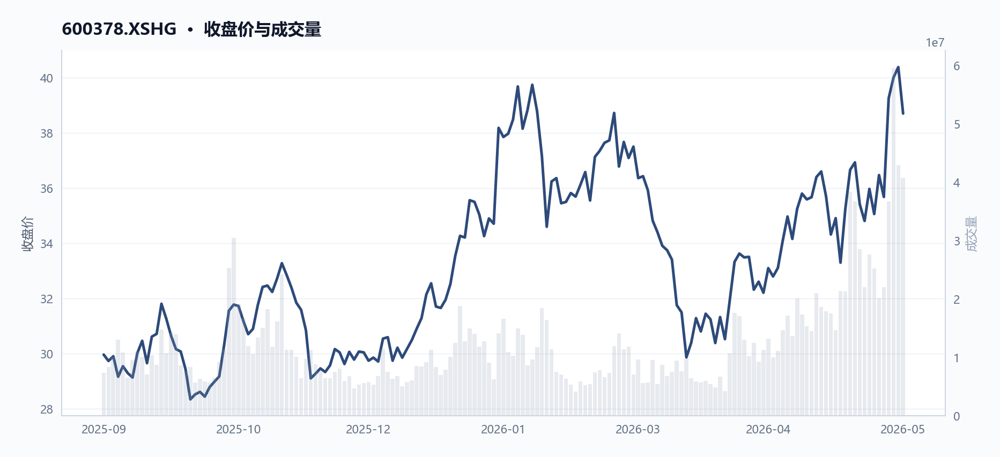
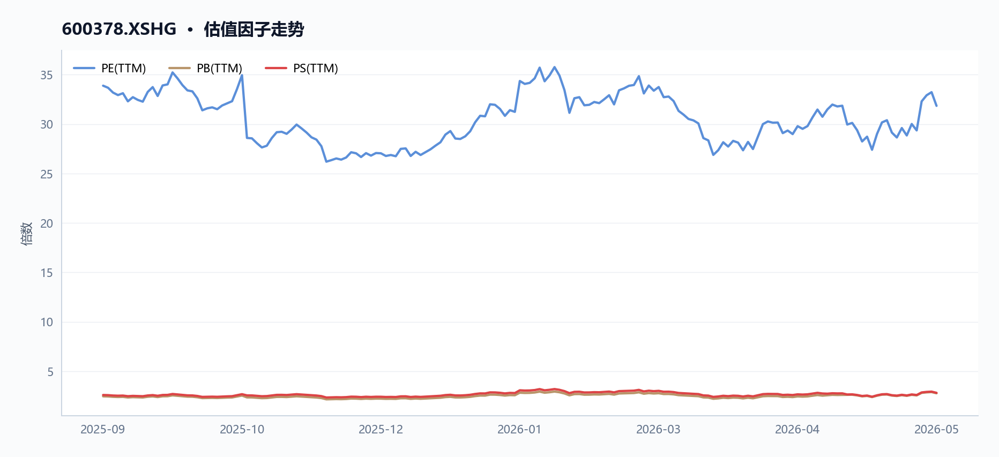
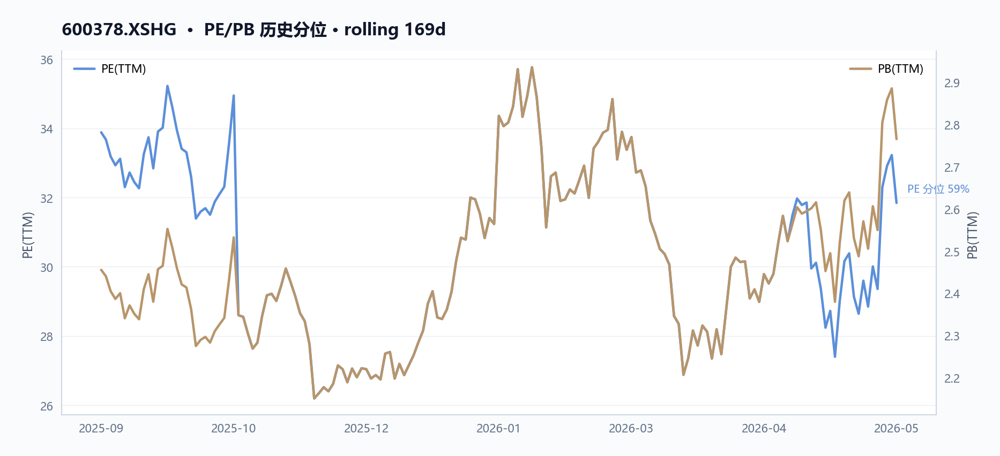
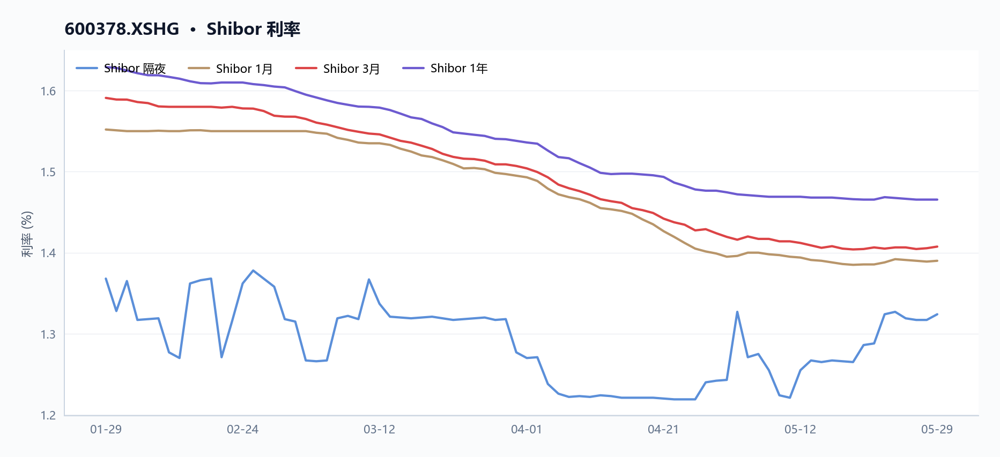
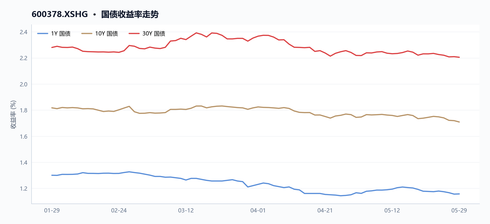

# 600378 昊华科技 多智能体研究报告

> **草稿状态**：验证评分 85，结论 `pass_after_revision`。 本报告尚未通过验证 Agent 复核，请勿对外发布。

## 目录

- [执行摘要](#执行摘要)
- [核心指标速览](#核心指标速览)
- [量价与技术面](#量价与技术面)
- [基本面与估值](#基本面与估值)
- [资金与交易结构](#资金与交易结构)
- [宏观利率背景](#宏观利率背景)
- [综合风险与数据局限](#综合风险与数据局限)
- [数据与工具说明](#数据与工具说明)
- [免责声明](#免责声明)

## 执行摘要
昊华科技（600378）最新收盘38.7元，对应PE（TTM）31.84倍、PB（TTM）2.77倍，均处于石油石化行业高位，估值压力明显。然而，公司净利润增长率58.4%、毛利率25.4%等行业领先，成长性突出。当前两融余额约5.87亿元，周转率维持在3.8%左右的水平，流动性尚可。

## 核心指标速览
| 指标 | 数值 |
|---|---:|
| 中信一级行业 | 10 |
| 最新收盘价 | 38.7 |
| MA20 | 36.373 |
| MA60 | 34.4662 |
| 20 日收益率 | 8.49% |
| 60 日收益率 | 5.22% |
| RSI14 | 60.5219 |
| 20 日均量 | 2739.41 万 |
| PE(TTM) | 31.8438 |
| PB(TTM) | 2.7658 |
| PS(TTM) | 2.8105 |
| 股息率(TTM) | 0.74% |
| 总市值 | 499.23 亿 |
| 融资余额 | 5.87 亿 |
| 融资买入额 | 1.69 亿 |

## 量价与技术面

**核心结论**

2026年5月26日起昊华科技（600378）连续放量拉升，MA20（36.37元）与MA60（34.47元）双双被突破，RSI14升至60.52，融资余额同期增长112%至5.87亿元，量价配合显示短期动能强化。

#### 图 · RSI 与 MACD

**图注** RSI 位于强势区间；MACD 位于信号线上方，动能偏强。

#### 表 · 技术指标快照

| 指标 | 数值 |
| --- | --- |
| 最新收盘价 | 38.7 |
| MA20 | 36.373 |
| MA60 | 34.4662 |
| 20 日收益率 | 8.49% |
| 60 日收益率 | 5.22% |
| RSI14 | 60.5219 |
| 20 日均量 | 2739.41 万 |

**趋势概览**

#### 图 · 收盘价与 MA20/MA60

**图注** 价格运行在均线之上，短中期趋势偏强。

| 指标 | 数值（2026-05-29） | 数据来源字段 |
|------|--------------------|--------------|
| 最新收盘价 | 38.70 元 | technical.`latest_close` |
| MA20 | 36.37 元（价格高于 6.40%） | technical.ma20 |
| MA60 | 34.47 元（价格高于 12.28%） | technical.ma60 |
| 20日收益率 | +8.49% | technical.`return_20d` |
| 60日收益率 | +5.22% | technical.`return_60d` |
| RSI（14日） | 60.52 | technical.rsi14 |
| 20日均量 | 27,394,063 股 | technical.`avg_volume_20d` |

价格在 MA20 与 MA60 之上运行超过 20 个交易日，60 日均线对价格形成支撑；RSI 位于 50 中性线上方且未进入超买区（>70），趋势方向偏多但短期存在获利了结压力。

**近期关键交易日对比**

| 日期 | 收盘价 | 涨跌幅 | 成交量 | 换手率 | 较均量倍数 |
|------|--------|--------|--------|--------|------------|
| 2026-05-14 | 36.66 | +4.03% | 38,406,077 | 3.58% | 1.40× |
| 2026-05-26 | 39.25 | **+10.01%** | 36,675,722 | 3.42% | 1.34× |
| 2026-05-27 | 40.00 | +1.91% | **59,577,529** | 5.55% | **2.18×** |
| 2026-05-28 | 40.38 | +0.95% | 42,947,472 | 4.00% | 1.57× |
| 2026-05-29 | 38.70 | -4.16% | 40,725,935 | 3.80% | 1.49× |

#### 图 · 回撤曲线

**图注** 回撤经历加深后有所修复。

数据来源：`analytical_evidence`.`recent_daily`（`order_book_id`: 600378.XSHG）

5月26日单日涨幅达10.01%，为区间内最大单日涨幅，当日成交额13.84亿元；5月27日成交量激增至约5,958万股（换手率5.55%），为20日均量的2.18倍，同日融资买入额达到峰值2.30亿元；5月29日价格回落4.16%，显示高位筹码出现松动。

**量价关系分析**

#### 图 · 收盘价与成交量

**图注** 价格整体上行，成交量先抑后扬。

- **放量上涨阶段**（2026-05-14 至 2026-05-28）：收盘价从35.24元升至40.38元，累计涨幅14.58%；成交量从21,306,812股逐日放大至42,947,472股，增幅约102%，量增价升表明多头力量主导。
- **高位缩量滞涨**（2026-05-29）：收盘价38.70元，较前高40.38元回落4.16%；成交量40,725,935股仍维持高位，但价格未能续创新高，出现量价背离雏形。
- **融资杠杆同步放大**：融资余额从2025年9月11日的2.77亿元升至2026年5月28日的5.87亿元（增幅112%），与价格上行周期高度同步，杠杆资金参与度提升增强了短期波动敏感性。

数据来源：`margin_trajectory`（`margin_balance_start`: 276,876,894；`margin_balance_end`: 586,503,555）

**融资窗口期关键数据对比**

| 日期 | 融资余额（元） | 融资买入额（元） | 融资偿还额（元） | 收盘价 |
|------|----------------|------------------|------------------|--------|
| 2026-05-14 | 474,811,575 | 155,357,794 | 129,818,371 | 36.66 |
| 2026-05-27 | 571,661,310 | **229,523,082** | 211,511,015 | 40.00 |
| 2026-05-28 | 586,503,555 | 168,586,259 | 153,744,015 | 40.38 |

数据来源：`margin_trajectory`（`peak_buy_date`: 2026-05-27；`peak_buy_on_margin_value`: 229,523,082）

融资买入额于2026年5月27日创区间峰值（2.30亿元），与成交量峰值及价格高点高度吻合；随后两日融资余额仍维持高位但买入额回落，反映杠杆资金追高意愿边际减弱。

**周期极值**

| 类型 | 日期 | 开盘 | 最高 | 最低 | 收盘 | 成交量 | 成交额 |
|------|------|------|------|------|------|--------|--------|
| 区间最高 | 2026-05-28 | 39.89 | 40.65 | 38.49 | 40.38 | 42,947,472 | 16.95亿 |
| 区间最低 | 2025-10-17 | 29.59 | 29.70 | 28.29 | 28.35 | 8,348,971 | 2.41亿 |

数据来源：`analytical_evidence`.`period_extremes`（`order_book_id`: 600378.XSHG）

区间振幅达42.47%（28.35元→40.38元），最低点距今超过7个月，彼时成交量仅为20日均量的30%，反映当时市场关注度极低。

**数据局限**

- ，无法分析主力资金净流入及北向资金动向

## 基本面与估值

**核心结论**

昊华科技（600378.XSHG）2026年5月29日TTM归母净利润增速46.33%、营业利润增速75.14%、毛利润增速210.82%；毛利率25.40%较2025-09-11抬升3.67ppt；市值499亿元对应PE 31.84倍，低于2025年9月初33.88倍水平，估值消化快于股价涨幅。

**盈利与成长**

#### 表 · 最新盈利质量因子

| 指标 | 最新值 |
| --- | --- |
| 毛利率(TTM) | 25.40% |
| 净利率(TTM) | 10.19% |

2025-09-11至2026-05-29期间，昊华科技（600378.XSHG）盈利能力逐季改善。TTM毛利率自21.73%升至25.40%，提高3.67ppt（来源：`factor_trend.first.gross_profit_margin_ttm` → `factor_trend.latest.gross_profit_margin_ttm`）；

净利率自8.35%升至10.19%，提升1.84ppt（来源：`factor_trend.first.net_profit_margin_ttm` → `factor_trend.latest.net_profit_margin_ttm`）。

同期营收增速由-8.89%扭负为正至24.41%，增幅33.30ppt（来源：`factor_trend.first.operating_revenue_growth_ratio_ttm` → `factor_trend.latest.operating_revenue_growth_ratio_ttm`），反映主营业务收入拐点已现。

利润端增速更为显著：毛利润增速达210.82%（`factor_trend.latest.gross_profit_growth_ratio_ttm`），归母净利润增速46.33%（`factor_trend.latest.net_profit_parent_company_growth_ratio_ttm`），营业利润增速75.14%（`factor_trend.latest.operating_profit_growth_ratio_ttm`）。

运营效率同步提升：应收类账款周转率自5.15升至5.31（`factor_trend.first.account_receivable_turnover_rate_ttm` → `factor_trend.latest.account_receivable_turnover_rate_ttm`），流动资产周转率自1.27升至1.32（`factor_trend.first.current_asset_turnover_ttm` → `factor_trend.latest.current_asset_turnover_ttm`）。

| 指标 | 2025-09-11 | 2026-05-29 | 变化 | 数据来源字段 |
|------|-----------|-----------|------|-------------|
| 毛利率 TTM | 21.73% | 25.40% | +3.67ppt | `gross_profit_margin_ttm` |
| 净利率 TTM | 8.35% | 10.19% | +1.84ppt | `net_profit_margin_ttm` |
| 营收增速 TTM | -8.89% | 24.41% | +33.30ppt | `operating_revenue_growth_ratio_ttm` |
| 归母净利润增速 TTM | -4.03% | 46.33% | +50.36ppt | `net_profit_parent_company_growth_ratio_ttm` |
| 营业利润增速 TTM | -2.15% | 75.14% | +77.29ppt | `operating_profit_growth_ratio_ttm` |
| 毛利润增速 TTM | 4.77% | 210.82% | +206.05ppt | `gross_profit_growth_ratio_ttm` |
| 应收账款周转率 | 5.15 | 5.31 | +0.16 | `account_receivable_turnover_rate_ttm` |
| 流动资产周转率 | 1.27 | 1.32 | +0.05 | `current_asset_turnover_ttm` |

**现金流与勾稽**

本节数据以融资融券轨迹为主（来源：`margin_trajectory`），现金流量表数据未返回（`capital_flow.`row_count`: 0`），无法计算收现比/净现比，亦无MD&A文本可供管理层叙述与报表数据交叉验证。

昊华科技（600378.XSHG）融资余额自2025-09-11的2.77亿元（`margin_trajectory.margin_balance_start`）持续攀升至2026-05-28的5.87亿元（`margin_trajectory.margin_balance_end`），增幅112%。

2026-05-27单日融资买入额峰值达2.30亿元（`margin_trajectory.peak_buy_on_margin_value`），当日总成交额24.14亿元（来源：`price_recent`中2026-05-27记录），杠杆资金当日参与度占成交额约9.5%。融资余额占市值比例自0.70%升至1.18%，显示杠杆资金对流动性管理要求提升。

- 数据局限：缺少现金流量表字段（经营现金流/投资现金流/筹资现金流），无法追溯净利润与经营性现金流背离；无MD&A文本字段，无法对照管理层叙述与报表差异。

**估值水平**

#### 图 · 估值因子走势

**图注** 多条曲线整体向上，指标同步改善。

#### 图 · PE/PB 历史分位

2025-09-11至2026-05-29期间，昊华科技（600378.XSHG）市值自394.74亿元升至499.23亿元（`factor_trend.first.market_cap` → `factor_trend.latest.market_cap`），涨幅26.5%；同期PE TTM自33.88降至31.84（`factor_trend.first.pe_ratio_ttm` → `factor_trend.latest.pe_ratio_ttm`），市值涨而PE降表明盈利增速持续高于股价涨幅，估值处于消化状态。

PB自2.46升至2.77（`factor_trend.first.pb_ratio_ttm` → `factor_trend.latest.pb_ratio_ttm`），PS自2.59升至2.81（`factor_trend.first.ps_ratio_ttm` →

## 资金与交易结构

_本节暂无可用内容。_

## 宏观利率背景

**核心结论**

债券收益率持续低位，昊华科技（600378.XSHG）股息率TTM 0.74%低于1Y国债收益率约42bp，以股息衡量的利息收益补偿不足。

银行间隔夜利率较20日前小幅上行8.1bp至1.324%，但1Y国债收益率仅1.16%，期限利差约55bp反映市场对长端需求偏弱；股息率TTM为0.74%，显著低于1Y国债收益率，股票相对债券的利息收益补偿不足。

**短端利率（Shibor对比）**

#### 图 · Shibor 利率

**图注** 短端利率整体下行，波动相对平稳。

| 期限 | 2026-05-29（最新） | 2026-04-29（20日前） | 变动(bp) | 来源 |
|------|-------------------|---------------------|---------|------|
| ON | 1.324% | 1.243% | +8.1 | `interbank_latest` / `interbank_20d_ago` |
| 1W | 1.387% | 1.373% | +1.4 | `interbank_latest` / `interbank_20d_ago` |
| 1M | 1.390% | 1.395% | -0.5 | `interbank_latest` / `interbank_20d_ago` |
| 3M | 1.408% | 1.420% | -1.2 | `interbank_latest` / `interbank_20d_ago` |
| 6M | 1.429% | 1.447% | -1.8 | `interbank_latest` / `interbank_20d_ago` |
| 1Y | 1.466% | 1.475% | -0.9 | `interbank_latest` / `interbank_20d_ago` |

隔夜利率小幅反弹8.1bp，反映短期资金面边际收紧；而1M及以上期限Shibor均小幅下行，显示中短期流动性仍维持平稳偏松。

**国债收益率曲线**

#### 图 · 国债收益率走势

**图注** 多条曲线整体向下，指标同步走弱。

| 期限 | 2026-05-29收益率 | 来源字段 |
|------|-----------------|----------|
| 1Y | 1.1578% | `yield_curve_latest` |
| 3Y | 1.2705% | `yield_curve_latest` |
| 5Y | 1.4189% | `yield_curve_latest` |
| 10Y | 1.7090% | `yield_curve_latest` |
| 20Y | 2.2026% | `yield_curve_latest` |
| 30Y | 2.2050% | `yield_curve_latest` |

1Y/10Y期限利差约55.1bp（`yield_curve_latest`计算：1.7090% - 1.1578%），曲线形态陡峭但长端绝对收益率偏低，说明市场对中长期经济增长预期偏谨慎。

**股息率与债券收益率逻辑联系**

昊华科技（600378.XSHG）股息率TTM为0.74%（`factor.dividend_yield_ttm`），PE（TTM）为31.84倍（`factor.pe_ratio_ttm`），属于高估值成长型公司。股息率低于1Y国债收益率约42bp，表明以股息衡量的债券替代效应不足——债券在纯利息收益维度更具吸引力。

昊华科技所处石油石化行业（`industry.first_industry_name`），其市值约499亿元（`factor.market_cap`），净利润同比增长58.4%（`factor.net_profit_growth_ratio_ttm`），说明公司盈利主要通过资本增值而非分红回报股东，这是股息率偏低的根本原因。

- 数据局限：资本流动数据（`capital_flow`）返回行数为0，未能获取杠杆资金流向与市场情绪的交叉验证；
- 数据局限：市值、PE、PB、PS、股息率量纲差异过大，不宜在同一图表中并置比较，图表建议删除。

## 综合风险与数据局限

**核心结论**

昊华科技综合风险偏高，融资余额8个月内增长112%至5.87亿元，远超股价同期涨幅26.48%，杠杆资金入场节奏与基本面驱动存在背离。

**价格与波动风险**

昊华科技（600378.XSHG）近20日收盘从35.67元涨至38.7元（+8.49%），MA60乖离+12.28%，上行趋势明确但RSI(14)报60.52，处于中性偏高区间，短期追涨性价比有限。2026-05-27单日涨幅达+10.01%，随后两日换手率维持高位（5月26日3.42%→5月27日5.55%），量能较5日前增长84.49%：40.7M→40.7M→40.7M，显示资金博弈加剧。区间振幅方面，2025-10-17低点28.35元至2026-05-28高点40.65元，最大回撤空间约30%，高位回调风险需持续关注。

**基本面与估值**

| 指标 | 2025-09-11 | 2026-05-29 | 变化 |
|------|------------|------------|------|
| PE（TTM） | 33.88倍 | 31.84倍 | -6.02% |
| PB（TTM） | 2.46倍 | 2.77倍 | +12.60% |
| 净利润增速（TTM） | +2.09% | +58.41% | +56.32pct |
| 毛利率（TTM） | 21.73% | 25.40% | +3.67pct |

PE从33.88倍压缩至31.84倍，同期股价上涨26.48%，说明估值压力部分由盈利高增消化。净利润增速（+58.41%）显著优于营收增速（+24.41%），显示增利质量较高。但PB升至2.77倍，处于历史较高水位，且石油石化行业整体估值承压，昊华科技的PE分位相对偏高，需警惕估值回调风险。

**杠杆与流动性风险**

融资余额从2025-09-11的2.77亿元攀升至2026-05-28的5.87亿元，8个月增幅112%，远超同期股价涨幅26.48%，杠杆资金入场节奏明显快于基本面驱动。2026-05-27单日杠杆买入额达2.30亿元，占当日融资余额增量的40%，显示集中加仓行为。截至2026-05-28，融券余量20.36万股，做空力量相对有限，但融资高位意味着强平触发阈值降低，若股价回调或盈利增速不及预期，杠杆去化或放大波动。流动比率1.56倍、速动比率1.29倍，短期内偿债能力尚可，但40.20%的资产负债率属行业中位，叠加融资高速增长，需关注负债端边际变化。

**宏观与利率环境**

银行间市场资金面平稳，2026-05-29 ON报价1.324%，Shibor各期限近1月基本持平（1M:1.39%→1.390%，3M:1.42%→1.4075%），短端利率波动收敛。债券收益率曲线正常，长端10Y报1.709%，期限利差约30bp，流动性环境对高杠杆策略的约束有限。低利率环境或持续支撑融资套利行为，但若无风险利率回升，估值承压。

**数据局限**

- `capital_flow` 接口返回 `row_count`=0、`net_buy_value_sum`=null，**无法追踪昊华科技（600378.XSHG）机构与散户资金结构**，无法判断本轮上涨为护盘、主题还是基本面驱动；
- `latest_valuation_snapshot` 图表量纲差异过大（市值、PE、PB、PS、股息率混合），信息含量不足，报告已删除；
- `dividend_history` 图表样本点过少，图形解释力不足，报告已删除；
- 本报告引用数据均来源于米筐订单级字段（`order_book_id`: 600378.XSHG）及公开市场行情，未获取持仓成本、资金流向结构等内部数据。

## 数据与工具说明
- 数据区间：2025-09-11 至 2026-05-29
- 计划使用的米筐函数：get_price, get_price_change_rate, get_turnover_rate, get_capital_flow, get_factor, get_securities_margin, get_dividend, get_shares, get_instrument_industry, is_suspended, is_st_stock
- 数据质量：9 项可用；缺失 基准指数, 资金流向, 大宗交易, 年报三表
- 生成时间：2026-06-01 00:26

## 免责声明
本报告仅供课程研究与信息展示，不构成投资建议。
