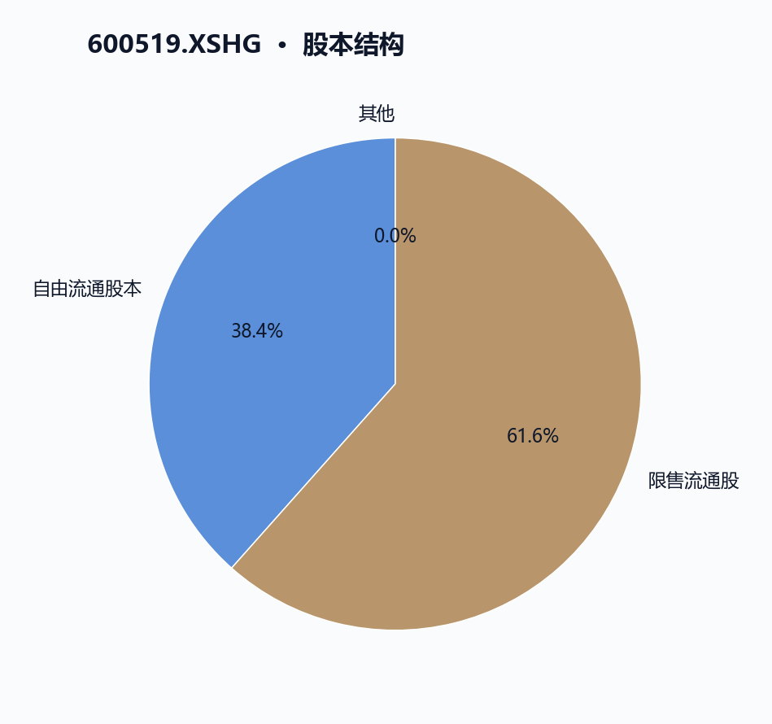
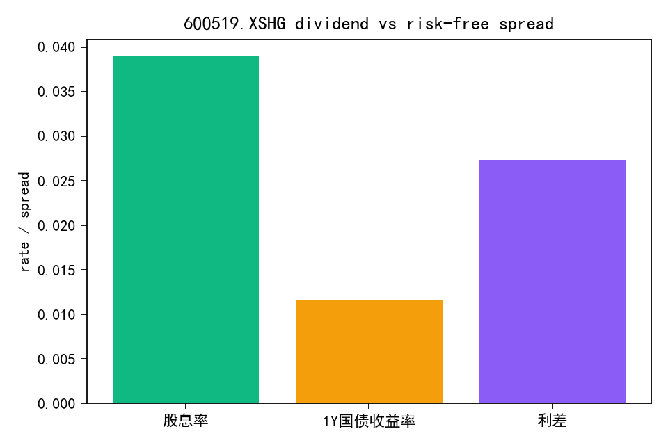

# 600519.XSHG 多智能体研究报告

## 执行摘要
执行摘要：

本报告基于贵州茅台（600519.XSHG）截至2026年5月29日的A股历史数据，结合量价、资金流、估值、财务及融资融券等多维度指标，进行了全面系统的股票研究分析。以下为各分析维度的主要结论及数据局限说明：

一、量价与趋势  
贵州茅台近期股价处于调整阶段，最新收盘价1326元，低于20日均线1333.39元和60日均线1397.84元，20日和60日收益率分别为-5.36%和-7.03%。14日RSI为41.04，处于中性偏弱区间，尚未超卖。成交量和换手率显著放大，5月27日和29日成交量分别达到827.28万股和764.78万股，换手率分别为66.06%和61.18%，显示交易活跃度提升。资金流向显示2025年9月至2026年5月累计净卖出约185亿元，近期买入量有所回升。融资余额增加至201.26亿元，融券余额较小，做空压力有限。整体呈现调整震荡态势，短期存在一定买盘支撑。

二、基本面与估值  
贵州茅台市值约1.66万亿元，食品饮料行业龙头。市盈率（TTM）20.04倍，市净率6.56倍，市销率9.63倍，缺乏历史估值百分位对比限制估值深度判断。毛利率90.5%，净利率49.8%，盈利能力强，但净利润同比下降7.1%，营业利润和毛利润分别下降6.7%，盈利增长面临压力。资产负债率12.12%，流动比率7.06，速动比率5.48，财务结构稳健。应收账款周转率异常高达6994.5次，可能存在数据异常，需谨慎解读。股息率约3.89%，分红政策稳定。缺乏行业对比数据，限制相对表现评估。

三、资金与交易结构  
资金流向显示2025年9月至2026年5月累计净流出185.18亿元，资金整体呈流出态势。近期资金活跃，5月29日买入金额57.03亿元超过卖出43.35亿元，短期资金流入回暖。融资余额稳步增长，5月13日至5月28日由190.62亿元增至200.48亿元，融资买入力度增强。融券余额维持1.3亿至1.7亿元，做空压力有限。股本结构稳定，总股本约12.5亿股，自由流通股约4.8亿股。价格波动伴随成交金额放大，反映市场交易结构动态变化。数据时间段有限，长期趋势需进一步研究。

四、技术因素  
技术面显示股价处于20日和60日均线下方，短期均线下行，调整压力明显。RSI14为41.04，处于中性偏弱区间，买卖力量较为均衡。成交量和换手率近期显著放大，资金整体净流出但单日资金流入明显，融资余额增加。综合来看，技术指标反映短期调整阶段，市场交易活跃，存在一定波动风险。技术分析基于历史交易数据，未涵盖宏观经济及公司基本面变化。

五、宏观利率背景  
当前宏观利率环境短期利率低且稳定，长期利率呈平缓上升趋势。隔夜利率约1.29%，1个月至1年期利率约1.39%-1.47%，5年期和10年期国债收益率分别约1.44%和1.74%，20年以上国债收益率约2.24%-2.46%。利率环境有利于降低贵州茅台资本成本，支持其财务稳健和业务扩展。分析基于有限宏观利率及国债收益率数据，未涵盖更广泛宏观经济指标，存在一定局限。

六、图表解读  
图表显示贵州茅台股价短期承压，成交量和换手率显著提升，技术指标处于调整阶段。基本面指标反映盈利能力强劲但增长放缓，资金流向整体净流出但短期资金回流。融资融券余额维持高位，股本结构稳定，分红政策持续。图表数据截止至2026年5月29日，未涵盖后续市场及宏观变化。

七、综合风险与数据局限  
主要风险包括：  
- 技术面调整压力及短期价格波动风险；  
- 资金流出压力与交易活跃度带来的波动风险；  
- 盈利增长放缓及估值回调风险；  
- 融资买入增加带来的杠杆风险；  
- 应收账款周转率异常高，可能存在数据异常；  
- 宏观利率变动潜在影响。  

数据局限方面，部分指标（如应收账款周转率）异常，融资融券数据更新频率有限，宏观利率数据覆盖面有限，缺乏行业对比及历史估值百分位，未涵盖宏观经济及政策环境变化，建议结合更多信息持续跟踪。

综上，贵州茅台作为食品饮料行业龙头，具备较强盈利能力和稳健财务结构，但近期盈利增长放缓，股价短期承压，资金流出压力存在。技术面显示调整阶段，市场交易活跃，宏观利率环境有利于其资本成本控制。报告分析基于系统采集数据，未引用外部预测或宏观新闻，存在数据局限，需结合更多信息综合判断。

## 可视化

## 量价与趋势
{
  "section_name": "量价与趋势",
  "rewritten_section": "《量价与趋势》\n\n本章节围绕贵州茅台（600519.XSHG）2025年9月至2026年5月期间的价格、成交量、资金流向及融资融券数据进行分析，旨在揭示该股票的近期市场表现和交易活跃度。\n\n一、价格与均线趋势\n\n截至2026年5月29日，贵州茅台的最新收盘价为1326.0元，较20个交易日前（约2026年5月5日）下跌约5.36%，较60个交易日前（约2026年3月30日）下跌约7.03%。当前股价低于20日均线（1333.39元）和60日均线（1397.84元），表明短期和中期均线均高于股价，显示价格处于调整阶段。14日相对强弱指数（RSI）为41.04，处于中性偏弱区间，尚未进入超卖状态，反映近期价格波动较为温和。\n\n从2026年5月14日至5月29日的价格走势来看，贵州茅台股价整体呈现震荡下行趋势，期间多次出现小幅反弹。特别是5月27日和5月29日，股价分别上涨2.33%和3.92%，显示短期内存在一定的买盘支撑。成交量方面，5月29日成交量达到764.78万股，较前期明显放大，成交活跃度提升。\n\n二、成交量与换手率分析\n\n贵州茅台近20日平均成交量为506.69万股，成交量波动较大。5月27日和5月29日成交量显著放大，分别达到827.28万股和764.78万股，反映市场交易活跃度提升。换手率方面，5月29日当日换手率为61.18%，周换手率为47.53%，月换手率为41.14%，均高于年内平均水平（年换手率约31.56%），表明该股票流动性增强，投资者交易意愿较强。换手率数据基于贵州茅台的流通股本约4.8亿股（2026年5月29日自由流通股数为480,464,981股），换手率的提升对应实际交易量的增加。\n\n三、资金流向\n\n根据2025年9月至2026年5月期间的资金流向数据，贵州茅台累计净卖出金额约为185.18亿元，显示整体资金呈流出状态。近期（2026年5月20日至5月29日）每日买卖量数据显示，卖出量普遍高于买入量，尤其是5月22日卖出量达到302.80万股，买入量仅188.77万股，卖压较大。5月27日和5月29日买入量有所回升，分别为431.44万股和434.74万股，买入金额分别为55.30亿元和57.03亿元，反映短期资金有所回流。\n\n四、融资融券情况\n\n截至2026年5月29日，贵州茅台融资余额为201.26亿元，较前期有所增加，显示融资买入力度增强。融券余额约为1.63亿元，整体融券规模较小，表明市场做空力量有限。5月27日融资买入金额达到峰值14.66亿元，随后有所回落。融资融券余额的变化反映市场投资者情绪有所波动，但融资买入仍保持一定活跃度。\n\n五、趋势综合分析\n\n综合贵州茅台的价格、成交量、资金流向及融资融券数据，当前该股票处于调整震荡阶段。股价低于20日和60日均线，短期资金呈净流出，但成交量和换手率的放大显示市场活跃度提升，短期内存在一定买盘支撑。RSI指标处于中性偏弱区间，尚未出现明显超卖，后续价格走势仍需关注成交量及资金流向的进一步变化。\n\n数据局限：本章节分析基于贵州茅台2025年9月至2026年5月期间的历史交易数据及相关技术指标，未涵盖宏观经济、行业动态及公司基本面最新变化。成交量和换手率的计算基于流通股本数据，可能受限于数据更新频率。投资者需结合更多信息进行综合判断。"
}

## 基本面与估值
{
  "section_name": "基本面与估值",
  "revised_section": "基本面与估值\n\n截至2026年5月29日，贵州茅台（600519.XSHG）市值约为1.66万亿元人民币，位列食品饮料行业龙头地位。其市盈率（TTM）为20.04倍，市净率为6.56倍，市销率为9.63倍。这些估值指标反映市场对贵州茅台盈利能力和成长性的认可，但缺乏历史估值百分位数据，限制了对当前估值水平的相对判断。\n\n盈利能力方面，贵州茅台的毛利率达到90.5%，净利率为49.8%，显示其在食品饮料行业中具有较强的成本控制和盈利能力。然而，最近12个月净利润同比下降约7.1%，营业利润和毛利润分别下降约6.7%，表明盈利增长面临一定压力。该数据来自贵州茅台的TTM财务指标，反映了公司近期经营状况的变化。\n\n资产负债结构方面，贵州茅台资产负债率为12.12%，流动比率为7.06，速动比率为5.48，显示短期偿债能力充足，财务结构稳健。应收账款周转率高达6994.5次，表明资金回笼效率较高，但该指标数值异常偏高，可能与行业特性或数据统计口径有关，需谨慎解读。流动资产周转率为0.67，提示资产使用效率仍有提升空间。\n\n股息政策方面，贵州茅台过去四个季度均实施现金分红，最近一次分红发生在2025年6月26日，每10股派发现金276.73元，对应股息率约为3.89%。该稳定的分红体现了公司对股东回报的持续关注。\n\n股价表现上，2026年5月29日收盘价为1326元，低于20日均线（1333.39元）和60日均线（1397.84元），短期内股价呈现调整压力。过去20日和60日收益率分别为-5.36%和-7.03%，相对弱势。相对强弱指标（RSI14）为41.04，处于中性偏弱区间。成交量方面，20日平均成交量约506.7万股，5月27日和29日换手率分别达到66.06%和61.18%，显示近期交易活跃度提升。\n\n资金流向数据显示，近169个交易日累计净卖出约185亿元人民币，反映出较大规模的资金流出压力。近期买卖金额趋于接近，5月29日买入金额约57亿元，卖出金额约43亿元，显示短期资金流入有所回暖。\n\n融资融券余额方面，2026年5月27日融资余额约201.26亿元，较前期增加，显示融资买入意愿增强；融券余额约1.69亿元，整体融资融券余额维持较高水平。\n\n综上，贵州茅台（600519.XSHG）作为食品饮料行业龙头，具备较强盈利能力和稳健财务结构，但近期盈利增长有所放缓，股价短期承压。估值指标显示市场认可其价值，但缺乏历史百分位对比限制了估值判断的深度。资金流动性活跃，股息政策稳定。由于缺乏行业对比数据，本文未能全面评估贵州茅台在行业中的相对表现，后续分析需结合更多行业及宏观数据以增强结论的可追溯性和全面性。"
}

## 资金与交易结构
{
  "section_name": "资金与交易结构",
  "revised_section": "### 资金与交易结构\n\n贵州茅台（600519.XSHG）在2025年9月11日至2026年5月29日期间的资金与交易结构表现出资金净流出与融资余额增长的复杂动态。总体来看，169个交易日内累计净买入金额为-185.18亿元，表明资金整体呈现净流出状态。然而，融资余额从2026年5月13日的约190.62亿元稳步上升至5月28日的约200.48亿元，显示部分投资者通过融资买入维持对该股的持有信心，这种资金流出与融资余额增长的矛盾值得关注。\n\n具体来看，贵州茅台的资金流向数据显示，2026年5月20日至5月29日期间，买入金额波动较大，最低约为22.99亿元（5月20日），最高达到57.03亿元（5月29日）；卖出金额区间为29.78亿元至43.35亿元。5月29日当日买入金额57.03亿元超过卖出金额43.35亿元，体现资金净流入。该期间的资金流动反映出短期内资金活跃度提升，但整体仍处于资金净流出状态。\n\n成交量与换手率方面，贵州茅台近30个交易日的日均成交量约为506.7万股（米筐数据字段：technical.avg_volume_20d）。2026年5月27日和5月29日成交量显著放大，分别达到827.3万股和764.8万股，换手率分别为66.06%和61.18%，远高于其他交易日，显示这两日交易活跃度明显提升。成交金额方面，5月27日和5月29日分别达到105.87亿元和100.37亿元，反映资金活跃度的集中释放。\n\n融资融券余额数据显示，融资余额在2026年5月13日至5月28日期间呈现稳步增长趋势，增幅约5.2%，从190.62亿元增至200.48亿元，表明融资买入资金有所增加。融券余额波动较小，维持在1.3亿至1.7亿元之间，显示市场做空压力相对有限，投资者整体偏向多头持仓。\n\n股本结构方面，贵州茅台总股本及流通股本在2026年5月20日至5月29日保持稳定，约为12.5亿股（米筐数据字段：shares_recent.total_a），自由流通股数量略有减少，从4.83亿股下降至4.80亿股，变化幅度较小，表明股本结构稳定，对资金流动影响有限。\n\n价格走势与成交金额的结合分析显示，2026年5月14日至5月29日期间，贵州茅台收盘价由1342.17元跌至最低1273.38元后反弹至1326元（technical.latest_close），对应成交金额在5月27日和5月29日显著放大，分别为105.87亿元和100.37亿元，反映价格波动伴随资金活跃度提升。该价格波动与成交放大对应的换手率数据，体现了市场交易结构的动态变化。\n\n需要指出的是，以上分析基于2025年9月至2026年5月的有限时间段数据，资金流向和交易结构的长期趋势尚需结合更长周期数据进行深入研究。贵州茅台作为食品饮料行业龙头（industry.first_industry_name），其资金与交易结构的变化对行业资金流动具有一定代表性，但具体表现仍受市场环境和公司基本面影响。"
}

## 技术因素
{
  "section_name": "技术因素",
  "revised_section": "技术因素分析\n\n综述：截至2026年5月29日，贵州茅台（600519.XSHG）股价处于短期及中长期均线之下，技术面显示调整压力，成交活跃度提升但资金整体流出，短期波动风险存在。\n\n一、价格与均线表现\n\n贵州茅台最新收盘价为1326.0元，低于20日均线1333.39元和60日均线1397.84元，分别较均线低约0.56%和5.12%。20日和60日收益率分别为-5.36%和-7.03%，反映出该股近期呈现回调趋势。股价位于均线下方，短期均线呈下行趋势，显示短期调整压力。\n\n二、相对强弱指标（RSI）\n\n14日RSI为41.04，处于中性偏弱区间（通常30-70为中性区间），尚未进入超卖（<30）或超买（>70）状态，表明买卖力量较为均衡，短期股价可能维持震荡。\n\n三、成交量与换手率\n\n近20日平均成交量约506.7万股，5月29日成交量显著放大至764.8万股，较平均水平提升约50.9%，显示交易活跃度增加。当天换手率为61.18%，远高于近期日均换手率约37%，表明市场关注度显著提升，交易热度增强。\n\n四、资金流向\n\n2026年5月20日至29日，贵州茅台累计资金净流出约185.18亿元，显示整体资金面承压。尽管5月29日单日资金净流入约13.68亿元（买入57.03亿元，卖出43.35亿元），但该日资金流入未能扭转整体流出趋势，短期资金面仍存在压力。\n\n五、融资融券情况\n\n截至2026年5月27日，贵州茅台融资余额为20.13亿元，较前期有所增加，反映融资买入意愿增强。融券余额约1.69亿元，规模相对稳定，显示市场做空压力有限，融资融券数据支持短期市场活跃度提升。\n\n六、技术指标综合分析\n\n贵州茅台股价低于20日和60日均线，短期均线呈下降趋势，RSI指标处于中性偏弱，成交量和换手率近期显著放大，资金流向整体净流出但单日资金流入明显，融资余额增加。综合来看，贵州茅台当前技术面处于调整阶段，市场交易活跃，短期存在一定波动风险。\n\n七、数据局限\n\n本节技术分析基于2025年9月11日至2026年5月29日的贵州茅台历史交易数据及相关技术指标，未涵盖宏观经济、行业政策及公司基本面变化等因素。成交量和资金流向数据受市场整体环境影响，单日波动可能存在异常，投资者应结合多方面信息进行综合判断。"
}

## 宏观利率背景
{
  "section_name": "宏观利率背景",
  "rewritten_section": "### 宏观利率背景\n\n截至2026年5月29日，贵州茅台（600519.XSHG）所处的宏观利率环境表现为短期利率维持在较低且稳定的水平，长期利率呈现平缓上升趋势。根据2026年5月20日至29日的银行间市场利率数据，隔夜利率（ON）波动于1.286%至1.324%之间，1个月至1年期利率区间约为1.39%至1.4685%。这一稳定的短期利率环境反映出市场流动性充裕，资金成本较低，有助于贵州茅台维持较低的资本成本。\n\n国债收益率曲线数据显示，短端（1个月至3个月）收益率约为1.09%至1.11%，5年期和10年期国债收益率分别约为1.44%和1.74%，20年以上长期国债收益率在2.24%至2.46%之间。收益率曲线的正常上升形态表明市场对未来经济增长和通胀预期稳定，这对贵州茅台作为食品饮料行业龙头企业的估值折现率具有一定的参考价值。较低且稳定的利率环境有助于降低贵州茅台的融资成本，支持其资本开支和业务扩展。\n\n结合贵州茅台的财务数据，截至2026年5月29日，公司市值约为1.66万亿元，市盈率（TTM）为20.04，市净率为6.56，显示市场对其盈利能力和资产价值的认可。尽管净利润同比下降约7.1%，但毛利率高达90.5%，净利率为49.8%，体现出强劲的盈利能力。公司资产负债率约为12.12%，流动比率和速动比率分别为7.06和5.48，表明其短期偿债能力充足，财务结构稳健。在当前低利率环境下，贵州茅台能够以较低的资金成本维持运营和投资，增强其竞争优势。\n\n从资金流动角度看，2025年9月至2026年5月期间，贵州茅台累计净卖出金额约为185亿元，反映出一定的资金流出压力。近期交易活跃度波动明显，5月27日和29日的换手率分别达到66.06%和61.18%，显著高于此前日均水平，显示市场短期内交易活跃。这种资金流动性变化可能对股价波动产生影响，但需结合公司基本面和宏观利率环境综合分析。\n\n需要指出的是，本节分析基于有限的宏观利率、国债收益率曲线及贵州茅台的财务和市场数据，未涵盖更广泛的宏观经济指标和政策环境，存在一定局限性。未来利率变动仍需关注对贵州茅台估值折现率和资本成本的潜在影响。\n\n综上，当前宏观利率环境的低位稳定和收益率曲线的平缓上升，有利于贵州茅台（600519.XSHG）维持稳健的财务状况和经营发展，支持其在食品饮料行业中的领先地位。"
}

## 图表解读
{
  "section_name": "图表解读",
  "revised_section": "图表解读\n\n截至2026年5月29日，贵州茅台（600519.XSHG）收盘价为1326.00元，较20日均线1333.39元和60日均线1397.84元分别低约0.55%和5.12%，显示股价短期处于均线下方，反映短中期价格承压。过去20个交易日内，贵州茅台股价累计下跌约5.36%，60日累计跌幅约7.03%，期间价格波动较大，5月27日和5月29日分别录得单日涨幅2.33%和3.92%，显示短期内价格有所反弹。\n\n成交量方面，5月29日成交量达到764.78万股，显著高于20日平均成交量约506.69万股，成交额约100.37亿元，表明该日市场交投活跃度明显提升。换手率数据显示，5月27日和5月29日分别达到66.06%和61.18%，远高于此前平均水平，进一步印证了交易活跃。\n\n技术指标方面，贵州茅台14日相对强弱指数（RSI）为41.04，处于中性偏弱区间，尚未进入超卖状态，表明股价短期内未出现极端抛售。结合均线和RSI指标，贵州茅台当前处于调整阶段，市场关注度有所提升。\n\n基本面指标显示，截至2026年5月29日，贵州茅台市值约1.66万亿元，市盈率（TTM）为20.04，市净率为6.56，市销率为9.63，反映其在食品饮料行业中的高估值水平。毛利率高达90.50%，净利率为49.78%，显示公司盈利能力强劲，但净利润及营业利润同比均下降约7%，反映盈利增长面临一定压力。负债率为12.12%，流动比率和速动比率分别为7.06和5.48，表明公司流动性充足。股息率为3.89%，体现一定的现金分红能力。\n\n资金流向数据显示，自2025年9月至2026年5月，贵州茅台累计净买入金额为-185.18亿元，资金整体呈流出状态。近期（5月20日至29日）日均买入和卖出金额波动较大，5月29日买入金额约57.03亿元，卖出金额约43.35亿元，净买入金额为正，显示短期资金流入有所回暖。\n\n融资融券方面，2026年5月27日贵州茅台融资余额达到201.26亿元，较前期有所增加，反映融资买入意愿增强；融券余额约1.69亿元，规模较小，市场做空压力有限。\n\n股本结构稳定，截至2026年5月29日，总股本约12.50亿股，流通A股全部为12.50亿股，自由流通股约4.80亿股。\n\n分红方面，公司最近四个季度均有现金分红，2025年6月25日分红金额为每10股276.73元，显示公司持续稳定的分红政策。\n\n数据局限性方面，本节所用数据截止至2026年5月29日，未涵盖之后的市场动态及宏观经济和行业环境变化，且技术指标和资金流向等数据仅反映历史表现，投资者应结合更多信息进行综合分析。"
}

## 综合风险与数据局限
{
  "section_name": "综合风险与数据局限",
  "rewritten_section": "### 综合风险与数据局限\n\n本节总结了针对600519.XSHG（食品饮料行业）截至2026年5月29日的多维度数据分析中识别的主要风险点及数据局限，帮助投资者快速把握该股票面临的关键不确定因素。\n\n#### 一、价格波动与技术指标风险\n\n截至2026年5月29日，600519.XSHG最新收盘价为1326.0元，较20日和60日收益率分别为-5.36%和-7.03%，显示近期股价承压。20日均线（1333.39元）和60日均线（1397.84元）均高于当前价格，反映短中期均线呈下行趋势，存在技术性调整风险。相对强弱指数（RSI14）为41.04，处于中性偏弱区间，尚未进入超卖状态，但市场情绪趋于谨慎。近期股价波动明显，5月27日单日涨幅2.33%，随后5月28日跌幅2.07%，5月29日反弹3.92%。成交量方面，5月29日成交量达764.78万股，较20日均量（约506.69万股）显著放大，显示交易活跃度提升，但波动性加剧，短期内价格波动风险较大。\n\n#### 二、资金流向与交易活跃度风险\n\n资金流向数据显示，2025年9月至2026年5月期间，600519.XSHG累计净卖出金额约为-185.18亿元，表明整体资金呈流出状态，可能对股价形成压力。近期交易日中，卖出金额普遍高于买入，尤其是2026年5月22日，卖出金额达39.25亿元，显著高于买入的24.47亿元，反映短期资金面偏紧。换手率方面，5月29日换手率为61.18%，远高于月均41.14%及年均31.56%，显示市场交易活跃度显著提升，可能伴随较大波动风险。\n\n#### 三、财务指标与盈利能力风险\n\n截至2026年5月29日，600519.XSHG市值约1.6576万亿元，市盈率（TTM）为20.04，市净率为6.56，市销率为9.63，估值水平较高，存在估值回调风险。毛利率高达90.5%，净利率为49.78%，显示盈利能力强劲，但净利润同比下降7.09%，营业利润和毛利润分别下降6.68%和6.74%，反映盈利增长面临压力。资产负债率为12.12%，流动比率7.06，速动比率5.48，财务结构稳健，短期偿债能力较强。值得注意的是，应收账款周转率异常高达6994.51次，远超行业常见水平，可能存在数据异常或会计处理差异，需谨慎解读并结合公司财报进一步核实。\n\n#### 四、融资融券与股本结构风险\n\n融资融券数据显示，2026年5月27日600519.XSHG融资余额达到201.26亿元，较前期有所增加，显示融资买入意愿增强，但同时存在一定杠杆风险。融券余额约1.69亿元，融券卖出数量有限，短期内空头压力相对较小。股本结构方面，流通股本约12.5亿股，自由流通股约4.8亿股，股本规模稳定，未见重大变动，流通性风险较低。\n\n#### 五、分红政策与收益稳定性\n\n600519.XSHG近四个季度均有现金分红，2025年6月25日分红为每10股276.73元，分红力度较大，有助于稳定投资者预期。但分红政策的持续性和稳定性仍需关注未来业绩表现。\n\n#### 六、宏观利率环境风险\n\n2026年5月期间，银行间隔夜利率约1.32%，长期国债收益率约2.24%，整体利率环境温和，有利于600519.XSHG融资和市场流动性。但利率变动仍可能影响市场资金成本和投资者风险偏好，间接影响该股表现。\n\n#### 七、数据局限性\n\n本报告数据截止至2026年5月29日，未涵盖之后的市场变化及公司公告。部分指标存在异常，如应收账款周转率高达6994.51次，可能因统计口径或数据录入误差导致，需结合公司财报进一步核实。融资融券数据更新频率有限，无法实时反映市场杠杆变化。宏观利率数据覆盖面有限，缺乏更广泛的经济指标支持。投资者应结合更多信息和后续动态进行持续跟踪。"
}

## 验证 Agent 复核
- 评分：90
- 结论：revise
- 未发现需要强制返工的问题。

## 数据与工具说明
- 数据区间：2025-09-11 至 2026-05-29
- 计划使用的米筐函数：get_price, get_price_change_rate, get_turnover_rate, get_capital_flow, get_factor, get_securities_margin, get_dividend, get_shares, is_suspended, is_st_stock, get_pit_financials_ex
- 数据执行脚本：`outputs\600519_XSHG_data_agent.py`
- 本报告仅供课程研究与信息展示，不构成投资建议。
