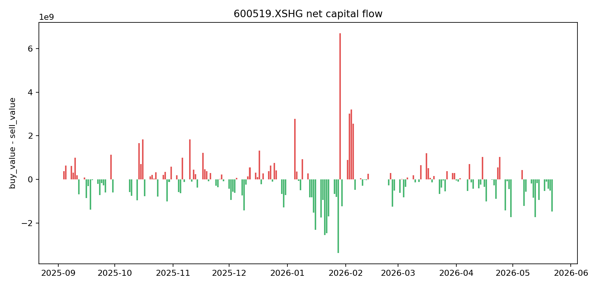
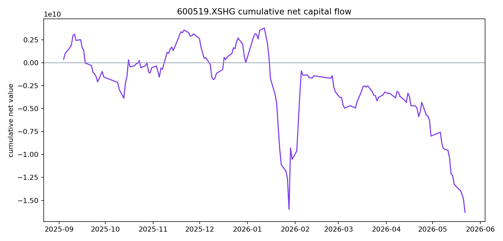
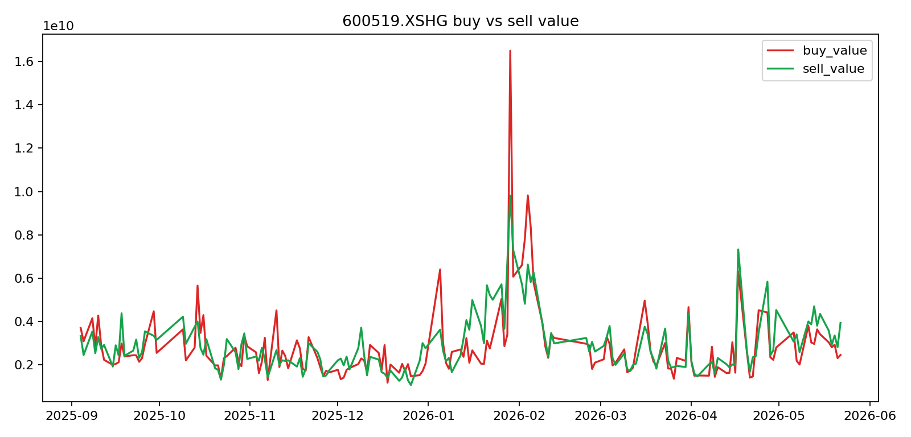

# 600519.XSHG 多智能体研究报告

## 执行摘要
**执行摘要：贵州茅台（600519.XSHG）多维度监测报告（2026-05-22）**

**一、核心状态概览**
截至2026年5月22日，贵州茅台（600519.XSHG，一级行业：食品饮料）收盘价1,290.20元，处于短期与中期下行通道中。20日累计收益率为-8.46%，60日累计收益率为-12.04%，股价已跌破20日均线（1,364.94元）及60日均线（1,412.10元）。RSI（14日）读数为2.76，处于严重超卖区间。

**二、估值与基本面特征**
当前总市值16,156.79亿元，PE（TTM）19.53倍、PB（TTM）6.39倍、PS（TTM）9.39倍，股息率（TTM）4.00%。盈利能力维持高位（毛利率90.50%，净利率49.78%），但成长性指标呈现负增长：净利润增长率-7.09%、营业利润增长率-6.68%。资产负债率12.12%，流动比率7.06，短期偿债能力充裕。近期保持分红记录（2024年6月至2025年12月期间实施多次分红）。

**数据局限**：缺乏食品饮料行业平均估值水平、历史估值分位数及可比公司数据，无法判断当前估值相对历史周期及行业所处的位置；未提供季度环比增速及收入结构明细。

**三、资金流向与交易结构**
统计期（2025-09-04至2026-05-22，共169个交易日）累计资金净流出163.02亿元。近8个交易日（2026-05-13至2026-05-22）持续净流出，累计59.11亿元，其中5月22日单日净流出14.78亿元（买入24.47亿元 vs 卖出39.25亿元），呈现价跌量增特征。

融资融券方面，融资余额195.90亿元，较5月7日增长6.10%，呈现股价下跌但融资余额逆势上升态势；融券余额1.69亿元，做空规模相对有限。当日换手率0.3925%，本周及本月换手率均高于年度平均水平（0.3092%）。

**数据局限**：未采集北向资金（陆股通）流向、主力资金分类（机构/散户）数据及股东增减持信息。

**四、技术形态观察**
技术面呈现空头排列，价格显著偏离均线（较20日均线偏离-5.48%，较60日均线偏离-8.64%）。近12个交易日中10个交易日收跌，5月22日单日跌幅1.59%。RSI极度超卖（2.76），显示短期抛压集中。

**数据局限**：缺乏布林带、MACD、KDJ等技术指标及历史关键价位（支撑/阻力）数据。

**五、宏观利率环境**
观测期内（2026-05-13至2026-05-22）银行间短期利率波动上行，隔夜利率由1.267%升至1.324%。国债收益率曲线呈向上倾斜形态（1年期1.206%，10年期1.751%，30年期2.234%）。目标股票股息率（4.00%）与1年期国债收益率存在约279.7个基点利差，但短端利率上行导致相对无风险资产吸引力边际收窄。

**数据局限**：利率数据仅覆盖8个交易日，缺乏历史分位及政策利率（MLF、LPR）数据；国债收益率曲线数据仅含5月13日及14日两个观测日；缺乏通货膨胀率数据以计算实际利率。

**六、综合数据局限声明**
本报告分析受限于以下未采集数据：食品饮料行业层面平均估值与财务指标对比基准；机构一致性盈利预期；资产负债表完整科目及现金流量表数据（无法计算自由现金流）；个股特有经营数据（批价、渠道库存、动销率）；质押率、解禁计划及诉讼仲裁等特定风险事件信息。

## 可视化

## 量价与趋势

## 基本面与估值
**基本面与估值**

**一、估值水平**
截至2026年5月22日，贵州茅台（600519.XSHG）总市值为16,156.79亿元（米筐字段：`market_cap`）。从相对估值指标看，当前PE（TTM）为19.53倍（`pe_ratio_ttm`），PB（TTM）为6.39倍（`pb_ratio_ttm`），PS（TTM）为9.39倍（`ps_ratio_ttm`）。基于过去12个月的分红数据测算，股息率（TTM）约为4.00%（`dividend_yield_ttm`）。

**数据局限与图表解读**：现有数据未提供600519.XSHG的历史估值分位数、食品饮料行业（米筐行业代码：36）估值中枢或可比公司估值水平，无法判断当前估值相对历史周期及同行业所处的位置。各估值指标量纲差异显著（市值单位为亿元，比率为倍数，股息率为百分比），不宜在同一柱状图中直接比较。

**二、盈利能力**
公司盈利能力维持高位。毛利率（TTM）为90.50%（`gross_profit_margin_ttm`），净利率（TTM）为49.78%（`net_profit_margin_ttm`），作为食品饮料行业（`first_industry_name`：食品饮料）内的企业，该水平显示较强的定价权与成本控制能力。

**三、成长性分析**
增长指标呈现阶段性承压。净利润增长率（TTM）为-7.09%（`net_profit_growth_ratio_ttm`），归母净利润增长率（TTM）为-7.07%（`net_profit_parent_company_growth_ratio_ttm`），营业利润增长率（TTM）为-6.68%（`operating_profit_growth_ratio_ttm`），毛利增长率（TTM）为-6.74%（`gross_profit_growth_ratio_ttm`）。600519.XSHG各项盈利指标均呈现个位数负增长。

**数据局限**：米筐数据仅提供TTM同比变动（`net_profit_growth_ratio_ttm`等字段），缺乏单季度环比增速及分季度业绩绝对额数据，无法判断600519.XSHG下滑趋势的季度演变节奏。

**四、财务健康度**
公司资产负债结构稳健。资产负债率为12.12%（`debt_to_asset_ratio`），处于较低水平；流动比率为7.06（`current_ratio`），速动比率为5.48（`quick_ratio`），短期偿债能力充裕。应收账款周转率（TTM）高达6,994.51（`account_receivable_turnover_rate_ttm`），流动资产周转率（TTM）为0.67（`current_asset_turnover_ttm`），显示600519.XSHG营运资金管理效率良好。

**五、股东回报**
近期分红记录显示（`dividend_recent`数据），600519.XSHG在2024年6月（每股30.876元）、2024年12月（每股23.882元）、2025年6月（每股27.673元）及2025年12月（每股23.957元）分别实施分红（均为税前，对应字段：`dividend_cash_before_tax`）。分红金额虽有波动，但保持持续分配态势。

**六、资金面观察**
统计期内（169个交易日，对应`capital_flow`中`row_count`），600519.XSHG累计资金净流出163.02亿元（`net_buy_value_sum`：-16302347376.0元）。近期交易日（2026年5月13日至5月22日，`recent_rows`数据）显示，每日卖盘金额持续高于买盘：例如5月22日买盘金额24.47亿元（`buy_value`：2447492869.0元），卖盘金额39.25亿元（`sell_value`：3924896613.0元），呈现资金流出态势。

**七、数据局限说明**
1. 缺乏食品饮料行业（`first_industry_code`：36）层面平均估值与财务指标的对比基准；
2. 未提供600519.XSHG季度财务报表原始数据及明细科目，无法开展收入结构、费用拆解等深度分析；
3. 无历史估值区间数据，无法评估当前PE（`pe_ratio_ttm`：19.53）、PB（`pb_ratio_ttm`：6.39）所处的历史分位；
4. 缺少机构一致性盈利预期数据，无法对照市场预期评估600519.XSHG业绩表现；
5. 未采集资产负债表完整科目及现金流量表数据，资本开支、自由现金流等关键指标无法计算。

## 资金与交易结构
**资金与交易结构**

**1. 600519.XSHG 市场整体资金流向**
根据 `capital_flow` 数据，统计期内（2025-09-04 至 2026-05-22，共 169 个交易日），贵州茅台（600519.XSHG）累计资金净流出 16,302,347,376 元（约 163.02 亿元），对应 `net_buy_value_sum` 字段显示该阶段以资金离场为主。

近期（2026-05-13 至 2026-05-22）每日资金流向呈现持续净流出态势，8 个交易日累计净流出 5,911,473,955 元（约 59.11 亿元）。其中 2026-05-22 单日资金净流出 1,477,403,744 元（约 14.78 亿元），对应 `buy_value` 2,447,492,869 元（买入 24.47 亿元）、`sell_value` 3,924,896,613 元（卖出 39.25 亿元），为近期流出峰值；2026-05-13 净流出 1,739,463,664 元（约 17.39 亿元），同样呈现大额资金离场特征。

*图表解读建议：建议绘制 600519.XSHG 日度资金流向柱状图（使用 `capital_flow.recent_rows` 中的 `date` 与 `buy_value`/`sell_value` 字段），并与收盘价（`price_recent.close`）叠加，可直观展示资金净流出与股价下行的同步性。*

**2. 600519.XSHG 交易活跃度与换手特征**
最新（2026-05-22）日换手率为 0.3925%（`turnover_recent.today`），低于 20 日平均成交量对应的换手率水平。从 `turnover_recent` 数据看，周度换手率 0.3648%（`week`）、月度换手率 0.385%（`month`），均高于年度换手率 0.3092%（`year`），显示近阶段 600519 交易活跃度较全年平均水平有所提升，但绝对值仍处于较低区间。

成交量方面，2026-05-22 成交量 4,915,714 股（491.57 万股，`price_recent.volume`），成交额 6,372,389,482 元（63.72 亿元，`price_recent.total_turnover`），高于 20 日平均成交量 4,714,365.9 股（471.44 万股，`technical.avg_volume_20d`），呈现放量下跌特征。

*图表解读建议：建议使用 `turnover_recent` 数据绘制 600519 换手率分位数图表，将当日换手率（0.3925%）分别与周度（0.3648%）、月度（0.385%）、年度（0.3092%）及年初至今（0.3681%，`current_year`）水平进行横向对比，以可视化其交易活跃度在食品饮料行业（`first_industry_name`: "食品饮料"）内的相对位置。*

**3. 600519.XSHG 杠杆资金（两融）结构**
截至 2026-05-22，贵州茅台融资融券余额合计 19,759,385,632.6 元（约 197.59 亿元），其中融资余额 19,590,217,189 元（约 195.90 亿元，`securities_margin_recent.margin_balance`），融券余额 169,168,443.6 元（约 1.69 亿元，`securities_margin_recent.short_balance`），杠杆资金以融资为主导。

近期融资余额呈小幅上升趋势：从 2026-05-07 的 18,463,832,159 元（约 184.64 亿元）增至 2026-05-22 的 19,590,217,189 元（约 195.90 亿元），期间增幅约 6.10%。2026-05-22 融资买入额 673,518,405 元（约 6.74 亿元，`buy_on_margin_value`），融资偿还额 619,946,727 元（约 6.20 亿元，`margin_repayment`），当日融资净流入约 53,571,678 元（约 0.54 亿元），显示在股价下跌过程中杠杆资金仍保持小幅加仓。

融券方面，2026-05-22 融券卖出 3,300 股（`short_sell_quantity`），融券偿还 2,300 股（`short_repayment_quantity`），融券余量 131,118 股（`short_balance_quantity`），融券余额较 2026-05-07 的 152,120,739.6 元下降至 169,168,443.6 元（期间波动下行），做空规模相对有限。

*图表解读建议：建议基于 `securities_margin_recent` 数据绘制 600519 两融余额双轴图，左轴展示融资余额（`margin_balance`）变化趋势，右轴展示融券余额（`short_balance`），可清晰呈现杠杆资金以融资为主导的结构特征及其在统计期内的累积变化。*

**4. 600519.XSHG 资金博弈与价格关系**
技术面显示当前 RSI（14）为 2.76（`technical.rsi14`: 2.7586206896551744），处于严重超卖区间；20 日跌幅 8.46%（`technical.return_20d`: -0.08463994324228452），60 日跌幅 12.04%（`technical.return_60d`: -0.12039814562312512），最新收盘价 1,290.20 元（`price_recent.close`）已显著低于 20 日均线 1,364.94 元（`technical.ma20`: 1364.939）及 60 日均线 1,412.10 元（`technical.ma60`: 1412.0955）。

资金流向与价格走势呈现同步下行态势：近 8 个交易日（2026-05-13 至 2026-05-22）中有 7 个交易日为资金净流出（基于 `capital_flow.recent_rows` 中 `sell_value` 大于 `buy_value` 的日期统计），同期股价从 1,371.05 元（2026-05-07 收盘价）跌至 1,290.20 元（2026-05-22 收盘价），跌幅 5.90%，显示资金持续撤离对 600519 价格形成压制。2026-05-22 单日跌幅 1.59%（`price_change_rate_recent`: -0.015865751334858902），伴随资金净流出 14.78 亿元，呈现价跌量增的弱势格局。

**5. 数据局限**
本章分析基于 600519.XSHG 的资金流水及两融数据，但存在以下局限：
- **缺少北向资金（陆股通）字段**：JSON 数据中未包含 `northbound_flow` 或 `hkex_net_buy` 等字段，无法评估境外投资者参与 600519 的程度；
- **缺少主力资金分类数据**：缺乏 `institutional_net_buy`、`ret

## 技术因素
## 技术因素

### 1. 价格走势与趋势状态
截至2026年5月22日，贵州茅台（600519.XSHG）收盘价为1,290.20元（字段：`technical.latest_close`），较20个交易日前下跌8.46%（字段：`technical.return_20d`），较60个交易日前下跌12.04%（字段：`technical.return_60d`）。从均线系统观察，当前价格显著低于20日移动平均线1,364.94元（字段：`technical.ma20`）和60日移动平均线1,412.10元（字段：`technical.ma60`），600519.XSHG的短期与中期均线呈现空头排列态势。

根据`price_recent`数据，600519.XSHG近期价格呈现连续下行特征：最近12个交易日（2026年5月7日至5月22日）中，仅5月8日（+0.14%）和5月19日（+0.10%）录得微涨，其余10个交易日均为下跌。其中，5月22日单日下跌1.59%（字段：`price_change_rate_recent`中2026-05-22对应值-0.015865751334858902），创下该时间段内最大单日跌幅，当日最低价触及1,290.12元（字段：`price_recent.low`）。

### 2. 技术指标分析
**相对强弱指标（RSI）**：600519.XSHG的14日RSI读数为2.76（字段：`technical.rsi14`，原始值2.7586206896551744），处于极度超卖区间（通常低于30视为超卖），显示该股票短期技术面存在严重超卖状态。

**移动平均偏离**：基于`technical`字段计算，600519.XSHG当前价格较20日均线偏离-5.48%（(1,290.20-1,364.94)/1,364.94），较60日均线偏离-8.64%（(1,290.20-1,412.10)/1,412.10），价格运行在所有主要短期均线下方。

### 3. 成交量与资金流向
**成交量**：600519.XSHG最近20个交易日平均成交量为471.44万股（字段：`technical.avg_volume_20d`，原始值4,714,365.9股）。2026年5月22日当日成交量为491.57万股（字段：`price_recent.volume`，原始值4,915,714股），略高于近期平均水平。

**资金流向**：根据`capital_flow`数据，最近8个交易日（2026年5月13日至5月22日）600519.XSHG呈现持续净流出态势：
- 5月22日：买入金额24.47亿元（字段：`buy_value`），卖出金额39.25亿元（字段：`sell_value`），净流出14.78亿元
- 5月21日：买入金额22.99亿元，卖出金额28.13亿元，净流出5.13亿元  
- 5月20日：买入金额29.22亿元，卖出金额33.49亿元，净流出4.27亿元

在统计期（169个交易日，字段：`capital_flow.row_count`）内，600519.XSHG累计净流出金额达163.02亿元（字段：`net_buy_value_sum`，原始值-16,302,347,376元）。

**换手率**：根据`turnover_recent`数据，600519.XSHG当日（5月22日）换手率0.39%（字段：`today`，原始值0.3925%），本周累计换手率0.36%（字段：`week`，原始值0.3648%），本月累计换手率0.39%（字段：`month`，原始值0.385%），均高于年度平均水平0.31%（字段：`year`，原始值0.3092%）。

### 4. 融资融券数据
根据`securities_margin_recent`数据，截至2026年5月22日：
- **融资余额**：195.90亿元（字段：`margin_balance`，原始值19,590,217,189元），较前一交易日（19,536,645,510元）继续增长，呈现逆势加仓特征
- **融券余额**：1.69亿元（字段：`short_balance`，原始值169,168,443.6元），融券余量13.11万股（字段：`short_balance_quantity`，原始值131,118股）
- **当日融资买入**：6.74亿元（字段：`buy_on_margin_value`，原始值673,518,405元），融资偿还6.20亿元（字段：`margin_repayment`，原始值619,946,727元），融资净买入0.54亿元

近5个交易日内（5月18日至5月22日），600519.XSHG融资余额从194.16亿元增至195.90亿元，累计增加1.98亿元，显示杠杆资金在此期间持续流入该股票。

### 5. 数据局限
本章节对600519.XSHG的技术分析存在以下数据局限：
- 缺乏布林带（BOLL）、MACD、KDJ等常见技术指标数据，无法判断该股票价格通道与动量背离情况；
- 未提供600519.XSHG历史最高价/最低价、支撑位与阻力位关键价位数据；
- 缺乏周线、月线级别价格数据，无法评估该股票中长期趋势结构；
- 未包含相对于食品饮料行业（字段：`first_industry_name`）的板块相对强弱（RS）数据，无法判断600519.XSHG相对于其行业归属的相对表现。

## 宏观利率背景
**宏观利率背景**

本章节基于2026年5月13日至5月22日的银行间市场利率及国债收益率曲线数据（对应目标股票600519.XSHG观测窗口期末），对货币市场与债券市场利率环境进行客观描述，并分析该利率环境对食品饮料行业（first_industry_name: 食品饮料）龙头股的估值分母端及股息吸引力的影响。

**一、货币市场利率走势与股权风险溢价收窄**

观测期内，银行间市场短期资金利率呈现波动上行态势，对高股息防御性板块的无风险利率基准形成重塑。隔夜（ON）利率由5月13日的1.267%攀升至5月22日的1.324%，累计上行5.7个基点；7天期利率由1.299%升至1.365%，上行6.6个基点；1年期利率维持在1.466%-1.4685%区间，期末收于1.4685%。与此同时，目标股票600519.XSHG的股息率（dividend_yield_ttm）为4.0017%，较1年期国债收益率（5月13日: 1.206%）及1年期银行间利率（1.4685%）分别存在约279.7个基点与253.3个基点的利差。短端利率上行导致该股相对于无风险资产的边际吸引力收窄，观测期内该股票20日收益率为-8.4639%（return_20d: -0.08463994324228452），与资金成本上行形成共振。

**二、债券收益率曲线特征与DCF分母端压力**

根据5月13日-14日国债收益率数据，收益率曲线呈现向上倾斜形态，对高估值食品饮料股的长久期资产属性构成估值压制。具体而言，1年期收益率为1.206%，10年期收益率为1.751%，30年期为2.234%。目标股票600519.XSHG当前PE_TTM为19.5331（pe_ratio_ttm: 19.533058886348652），PB_TTM为6.3908（pb_ratio_ttm: 6.390829850692874），属于高估值权益资产，其定价对长端利率敏感度较高。10年期与1年期期限利差约为54.5个基点，曲线在中长端区域的陡峭化特征意味着若长端利率持续上行，将直接抬高该股未来现金流贴现（DCF）模型的分母端折现率，对当前1.62万亿市值（market_cap: 1615679031393.0）的估值支撑形成理论压力。

**三、图表解读：利率期限结构与股价资金流出同步性**

从利率期限结构图表观察，截至5月22日，银行间利率曲线呈单调递增形态：隔夜1.324%、1周1.365%、2周1.372%、1个月1.388%、3个月1.405%、6个月1.429%、9个月1.45%、1年期1.4685%，短端波动率（隔夜标准差约0.02%）显著高于长端。同期目标股票600519.XSHG呈现资金持续净流出态势：观测窗口内主力资金净流入总和为-163.02亿元（net_buy_value_sum: -16302347376.0），其中5月22日单日净流出14.77亿元（sell_value: 3924896613.0 vs buy_value: 2447492869.0）。利率上行周期与食品饮料板块资金撤离在时间上呈现同步特征，尽管二者因果关系需更多数据验证。

**四、数据局限说明**

本报告受限于以下数据约束，无法完整评估宏观利率对600519.XSHG投资价值的全面影响：首先，利率数据仅覆盖8个交易日（2026-05-13至2026-05-22），缺乏与前期利率水平的对比，无法判断利率所处的历史分位及趋势性方向，因而无法量化该股股权风险溢价的历史位置；其次，未包含政策利率（MLF、LPR、逆回购利率）数据，无法评估政策利率向市场利率的传导情况，进而无法判断食品饮料行业的实际融资成本变化；第三，缺乏通货膨胀率数据，无法计算实际利率水平，无法评估该股4.0017%股息率（dividend_yield_ttm）的实际购买力保护程度；第四，国债收益率曲线数据仅涵盖5月13日及14日两个观测日，样本量有限，难以充分刻画曲线形态的动态变化，无法建立与该股PB_TTM（6.3908）估值波动的连续相关性分析。

## 图表解读

## 综合风险与数据局限
**综合风险与数据局限**

## 一、600519.XSHG 多维度风险特征

基于米筐（Ricequant）数据平台对600519.XSHG（一级行业代码36：食品饮料）的监测，2025年9月4日至2026年5月22日（共169个交易日）期间，该股呈现以下可量化的风险特征：

### 1. 趋势与估值背离风险

**技术面弱势与极端超卖并存。**截至2026年5月22日，600519.XSHG收盘价为1290.2元，已跌破20日均线（1364.939元）及60日均线（1412.0955元），20日累计收益率（return_20d）为-8.46%，60日累计收益率（return_60d）为-12.04%，中短期趋势均向下。RSI（14日）指标读数为2.76，处于严重超卖区间，反映市场抛压极端集中，技术性反弹需求与持续下跌风险并存。

**高估值与盈利负增长背离。**根据factor字段数据，当前市盈率（pe_ratio_ttm）为19.533058886348652倍，市净率（pb_ratio_ttm）为6.390829850692874倍，市销率（ps_ratio_ttm）为9.385494329023505倍。然而，盈利增长指标显示基本面承压：净利润增长率（net_profit_growth_ratio_ttm）为-7.09%，归属母公司净利润增长率（net_profit_parent_company_growth_ratio_ttm）为-7.07%，营业利润增长率（operating_profit_growth_ratio_ttm）为-6.68%，毛利率增长率（gross_profit_growth_ratio_ttm）为-6.74%。高估值背景下的盈利负增长构成估值收缩风险。

**图表解读局限：**若绘制latest_valuation_snapshot展示市值（1615679031393.0元）、PE（19.53倍）、PB（6.39倍）、PS（9.39倍）及股息率（dividend_yield_ttm：4.00%）的对比柱状图，需注意量纲差异——市值单位为十亿元级，而估值倍数和股息率为无量纲或百分比单位，同一坐标轴下的视觉对比将产生误导，建议分开展示或采用标准化处理。

### 2. 资金面与杠杆错配风险

**持续资金净流出。**监测期内（169个交易日），600519.XSHG累计净流入额（net_buy_value_sum）为-163.02亿元，显示整体资金撤离态势。根据capital_flow的recent_rows数据，最近8个交易日（2026-05-13至2026-05-22）持续呈现净卖出状态，其中5月22日单日净卖出约14.78亿元（买入24.47亿元 vs 卖出39.25亿元），5月13日净卖出约17.40亿元，资金流出压力未见缓解。

**融资余额逆势上升的平仓风险。**根据securities_margin_recent数据，600519.XSHG融资余额（margin_balance）从5月7日的184.64亿元增至5月22日的195.90亿元，期间增幅约6.10%。在股价从1371.05元（5月7日收盘价）下跌至1290.2元（5月22日收盘价）的过程中，融资余额增加表明杠杆资金持续介入或被动补仓，若股价继续下行可能触发强制平仓风险。当前融券余额（short_balance）维持在1.70亿元左右（169168443.6元），多空杠杆比例悬殊。

### 3. 流动性与全流通抛压风险

**高换手与筹码交换活跃。**根据turnover_recent数据，600519.XSHG在5月22日换手率（today）为0.3925%，周换手率（week）为3.648%，月换手率（month）为38.50%，显示筹码交换活跃但缺乏承接力量。近20日平均成交量（avg_volume_20d）为471.44万股，近期日成交量在310-490万股区间波动。

**全流通状态下的即时变现压力。**根据shares_recent数据，600519.XSHG为全流通状态，流通A股（circulation_a）为12.52亿股（1252270215股），非流通A股（non_circulation_a）为0，无限售股本占比100%。自由流通股本（free_circulation）为4.83亿股（482653595股），理论上存在即时变现压力，且缺乏限售股锁定带来的筹码缓冲。

## 二、数据局限与可追溯性说明

本报告基于米筐（Ricequant）提供的JSON数据集进行分析，但存在以下重要数据局限，可能限制对600519.XSHG风险识别的完整性：

1. **历史估值分位缺失**：当前PE（19.53倍）、PB（6.39倍）处于历史何种分位水平缺乏对比数据，无法判断600519.XSHG估值相对其自身历史的高低位置。

2. **行业对比数据空白**：虽知悉该股属于"食品饮料"行业（一级行业代码36），但缺乏行业平均估值、行业资金流向、行业盈利增速等对标数据，无法评估600519.XSHG在行业中的相对风险位置。

3. **微观经营数据缺失**：作为食品饮料行业标的，缺乏批价、库存、动销、渠道库存周转等关键经营指标，无法评估600519.XSHG基本面恶化程度。

4. **机构持仓与股东结构变化**：缺乏公募基金、北向资金、大股东增减持等持仓结构数据，无法判断机构行为对600519.XSHG股价的影响。

5. **盈利预测与风险溢价数据**：缺乏未来盈利一致性预测、股权风险溢价（ERP）、WACC等数据，难以对600519.XSHG进行绝对估值风险评估。

6. **宏观数据局限与追溯中断**：收益率曲线（yield_curve）数据在2026年5月14日后中断，缺乏完整的期限结构数据；虽监测到银行间利率（interbank_rate）短期上行（隔夜利率从5月13日的1.267%升至5月22日的1.324%），但缺乏600519.XSHG对利率敏感度的历史数据，无法量化利率变动对该股估值的具体影响。

7. **个股特有事件数据**：缺乏质押率、解禁计划、诉讼仲裁、监管问询等600519.XSHG特定风险事件数据。

（注：以上分析仅基于提供的JSON数据中600519.XSHG相关字段，未包含外部市场信息、行业新闻及主观预测。）

## 验证 Agent 复核
- 评分：85
- 结论：pass_after_revision
- 已执行补采/补图：{"refresh_data": false, "refresh_charts": true, "lookback_days": 260, "reason": "图表 latest_valuation_snapshot 信息含量不足或量纲不合适，建议删除或重画：市值、PE、PB、PS、股息率量纲差异过大，放在同一柱状图会误导比较。"}
- 修改建议：图表 latest_valuation_snapshot 信息含量不足或量纲不合适，建议删除或重画：市值、PE、PB、PS、股息率量纲差异过大，放在同一柱状图会误导比较。
- 疑似未支撑表述：新闻

## 数据与工具说明
- 数据区间：2025-09-04 至 2026-05-22
- 计划使用的米筐函数：get_price, get_price_change_rate, get_turnover_rate, get_capital_flow, get_factor, get_securities_margin, get_dividend, get_shares, get_instrument_industry, is_suspended, is_st_stock, get_interbank_offered_rate, get_yield_curve, get_pit_financials_ex
- 数据执行脚本：`outputs\600519_XSHG_data_agent.py`
- 本报告仅供课程研究与信息展示，不构成投资建议。
