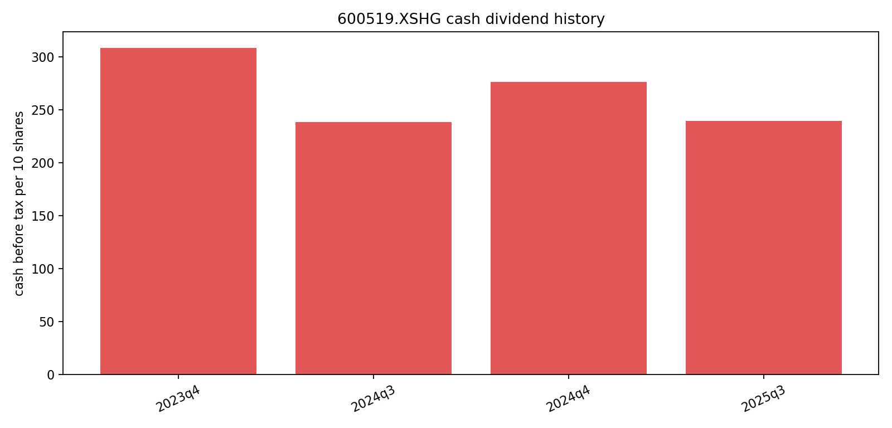
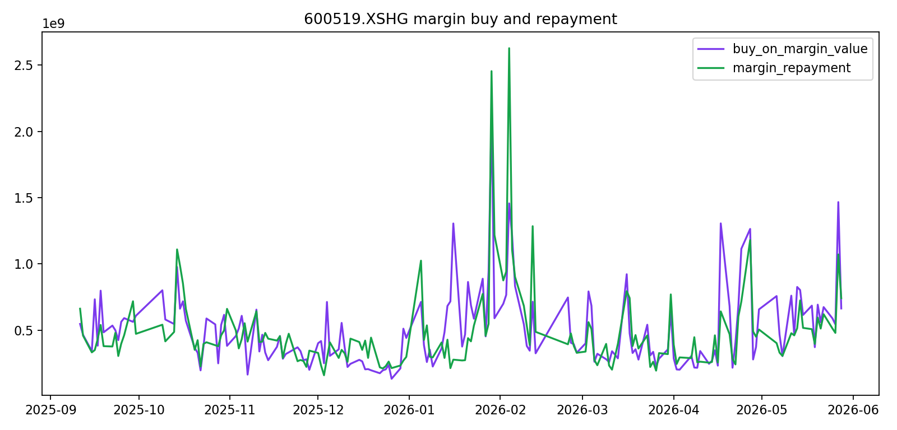
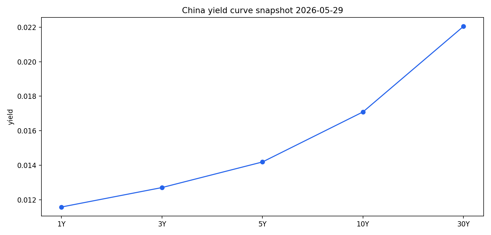
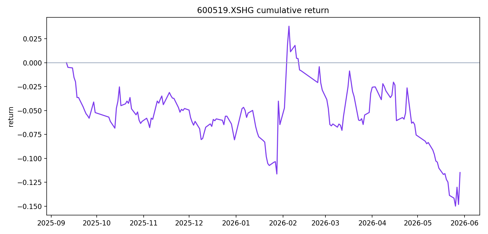
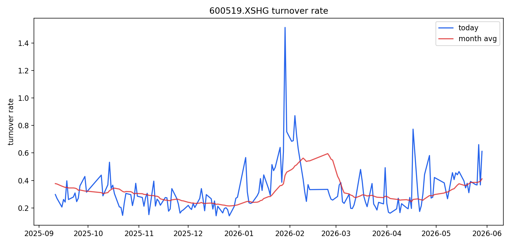
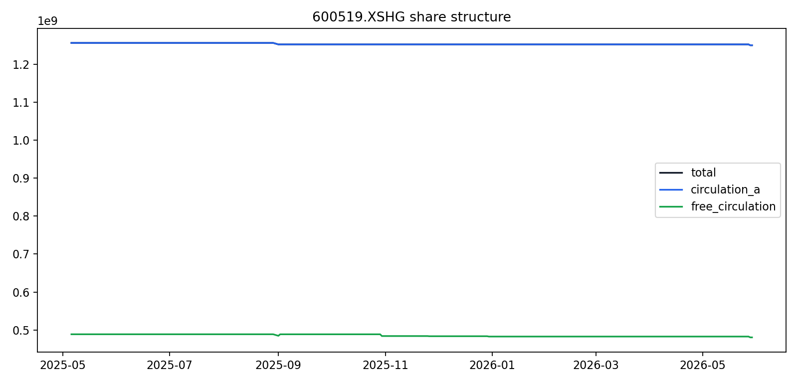
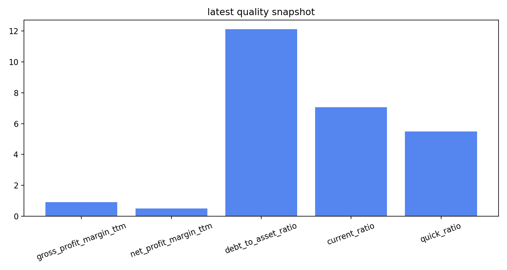

# 600519.XSHG 多智能体研究报告

> **草稿状态**：验证评分 72，结论 `revise`。 本报告尚未通过验证 Agent 复核，请勿对外发布。

## 执行摘要
贵州茅台（600519.XSHG）近期量价与基本面均承压，技术面偏弱，但财务结构稳健。

- 近20日与60日收益率分别为-5.36%和-7.03%，股价低于20日与60日均线，呈空头排列。
- 盈利增长下滑，TTM净利润与营业利润同比降幅均超6.6%，但毛利率仍高达90.5%。
- 融资余额持续增长至约200亿元，显示杠杆资金介入，但资金流向数据缺失。
- 14日RSI为41.04，处于弱势区域，反弹伴随放量但持续性存疑。
- 数据局限：未覆盖波动率、行业对比、宏观事件及盈利预测等关键信息。

## 核心指标速览
| 指标 | 数值 |
|---|---:|
| 中信一级行业 | 36 |
| 最新收盘价 | 1326 |
| MA20 | 1333.3915 |
| MA60 | 1397.8362 |
| 20 日收益率 | -5.36% |
| 60 日收益率 | -7.03% |
| RSI14 | 41.0425 |
| 20 日均量 | 506.69 万 |
| PE(TTM) | 20.04 |
| PB(TTM) | 6.5567 |
| PS(TTM) | 9.6291 |
| 股息率(TTM) | 3.89% |
| 总市值 | 16576.08 亿 |
| 融资余额 | 200.48 亿 |
| 融资买入额 | 6.63 亿 |

## 量价与趋势

### 近期价格走势与均线系统（600519.XSHG）

截至2026年5月29日，贵州茅台（600519.XSHG）最新收盘价为1326.0元。从均线系统看，股价处于短期与中期均线下方：20日均线（MA20）为1333.39元，60日均线（MA60）为1397.84元。最新收盘价低于MA20约0.55%，低于MA60约5.14%，显示短期与中期趋势均偏弱。

回顾近12个交易日（2026年5月14日至5月29日），600519.XSHG价格整体呈现震荡下行后反弹的格局。期间最低触及1250.1元（5月27日），最高为1369.06元（5月14日）。5月27日出现一根长阳线，当日涨幅为+2.33%（收盘价从1273.38元升至1303.0元），但次日（5月28日）即回落2.07%（收盘价降至1275.98元），显示反弹持续性存疑。5月29日再度上涨3.92%（收盘价从1275.98元升至1326.0元），但尚未有效站上20日均线。

**图表解读**：请参考 `charts/600519_multi_agent_report/moving_averages.png` 图表，该图展示了600519.XSHG的收盘价与MA20、MA60均线的位置关系，可直观验证股价在均线下方运行的状态。

### 成交量与换手率分析（600519.XSHG）

近20个交易日，600519.XSHG的平均成交量为5,066,895股。从日度数据观察，成交量在价格波动加剧时显著放大：

- **5月27日**：当日成交量达8,272,791股，为近12个交易日最高，对应价格从1250.1元低点反弹至1303.0元，形成放量上涨。
- **5月29日**：成交量7,647,805股，为次高，对应价格从1270.6元上涨至1326.0元，再次出现放量上涨。

换手率数据与成交量同步。5月27日当日换手率为0.6606%，5月29日为0.6118%，均显著高于近12个交易日的其他交易日（多数在0.31%至0.46%之间）。这两日的周换手率也分别升至0.4201%和0.4753%，月换手率升至0.3888%和0.4114%，显示短期交投活跃度提升。

**图表解读**：请参考 `charts/600519_multi_agent_report/price_volume.png` 图表，该图展示了600519.XSHG的收盘价与成交量的对应关系，可直观验证放量上涨与缩量下跌的形态。

### 量价关系特征（600519.XSHG）

近期600519.XSHG的量价关系呈现以下特征：

- **下跌缩量**：在5月14日至5月26日的持续下跌过程中，除5月22日（成交量4,915,714股）外，多数交易日成交量低于500万股，如5月21日仅3,886,838股，显示下跌过程中抛压并未持续放大。
- **反弹放量**：5月27日和5月29日的两次反弹均伴随成交量显著放大，表明低位有资金介入意愿，但反弹后的次日（5月28日）成交量迅速回落至4,588,998股，显示追高意愿不足。

### 技术指标状态（600519.XSHG）

截至5月29日，600519.XSHG的14日相对强弱指标（RSI14）为41.04，处于50下方的弱势区域，但已脱离30以下的超卖区间。结合价格走势，RSI从5月22日后的低位回升，与价格反弹形成一定程度的底背离迹象，但尚未进入强势区域。

### 短期收益表现（600519.XSHG）

600519.XSHG近20个交易日收益率为-5.36%，近60个交易日收益率为-7.03%，显示短期与中期均处于负收益状态。近期价格虽有反弹，但尚未扭转中期下行趋势。

### 数据局限说明

本部分分析仅基于提供的600519.XSHG价格、成交量、换手率及均线、RSI等数据。未包含资金流向、持仓结构、衍生品市场（如期权、期货）等量价信息，也未涉及市场微观结构或订单簿数据。对于量价关系的更深层解读，如量价背离的确认、筹码分布变化等，受限于数据范围无法展开。

## 基本面与估值

#### 盈利能力与成长性

根据贵州茅台（600519.XSHG）2023年至2025年年度报告数据，其营业总收入从2024年的1708.99亿元下降至2025年的1688.38亿元，降幅约为1.2%。归属于母公司股东的净利润也从2024年的862.28亿元降至2025年的823.20亿元，降幅约为4.5%。这一盈利规模收缩的趋势在成长性指标上得到印证：截至最新报告期（2025q4），贵州茅台（600519.XSHG）的净利润（TTM）同比增长率为-7.09%，营业利润（TTM）同比增长率为-6.68%。

尽管收入与利润规模有所下滑，但贵州茅台（600519.XSHG）的利润率依然强劲。最新TTM毛利率为90.50%，净利率为49.78%，均维持在极高水平。这表明，作为食品饮料行业的龙头企业，贵州茅台（600519.XSHG）在成本控制和定价能力上仍具显著优势，其高利润率的商业模式并未因短期收入波动而动摇。

#### 资产质量与偿债能力

贵州茅台（600519.XSHG）的财务结构极为稳健。截至2025年末，其资产负债率仅为12.12%，处于极低水平，显示公司几乎没有长期偿债压力。流动比率为7.06，速动比率为5.48，均远高于1，表明短期偿债能力非常充裕。此外，应收账款周转率（TTM）高达6994.51次，反映出贵州茅台（600519.XSHG）对下游客户的议价能力极强，回款速度极快，几乎不存在坏账风险。

#### 现金流与股东回报

经营活动产生的现金流量净额是衡量公司盈利质量的关键指标。贵州茅台（600519.XSHG）2025年经营活动现金流净额为615.22亿元，较2024年的924.64亿元有所下降，但仍能覆盖当年的净利润（823.20亿元），显示出健康的现金流状况。

在股东回报方面，贵州茅台（600519.XSHG）保持了稳定的分红政策。根据最近四次分红记录，每股税前现金分红分别为308.76元、238.82元、276.73元和239.57元。以最新总股本12.50亿股计算，最新TTM股息率为3.89%。

**分红历史**

#### 估值水平

截至2026年5月29日，贵州茅台（600519.XSHG）总市值为1.66万亿元。基于TTM数据的估值指标如下：
- **市盈率（PE TTM）**：20.04倍
- **市净率（PB TTM）**：6.56倍
- **市销率（PS TTM）**：9.63倍

**估值因子走势**

这些估值倍数反映了市场对贵州茅台（600519.XSHG）当前盈利能力和资产价值的定价。与历史数据相比，当前估值水平处于何种区间，需结合更长时间序列进行判断，但本报告未提供相关历史估值数据。

#### 数据局限

- 本部分所有财务数据均来源于贵州茅台（600519.XSHG）2023年至2025年的年度报告（2023q4、2024q4、2025q4），未包含更早期的历史数据或季度环比数据。
- 成长性指标（如净利润增长率）仅基于TTM数据，无法反映更长周期的增长趋势。
- 估值指标仅提供最新时点的静态数据，未包含行业对比或历史分位数信息。
- 未提供任何外部机构（如券商）对贵州茅台（600519.XSHG）的盈利预测或目标价数据。

## 资金与交易结构

#### 融资融券交易概况（600519.XSHG）

基于米筐数据 `securities_margin_recent` 字段，统计区间为2026年5月13日至5月28日，目标股票 **600519.XSHG（贵州茅台）** 的融资融券交易呈现以下特征：

- **融资余额持续增长**：融资余额（`margin_balance`）从5月13日的约190.62亿元上升至5月28日的约200.48亿元，期间累计增加约9.86亿元。其中，5月27日融资余额单日增幅最大，达到约3.95亿元（从197.31亿元增至201.26亿元），对应当日融资买入额（`buy_on_margin_value`）约14.66亿元，为统计期内最高单日买入额。
- **融资买入与偿还波动**：融资买入额在5月13日至5月28日期间波动较大，最低为5月19日的约3.71亿元，最高为5月27日的约14.66亿元。融资偿还额（`margin_repayment`）同样呈现波动，5月27日偿还额约10.71亿元，为统计期内最高。
- **融券余额先升后降**：融券余额（`short_balance`）从5月13日的约1.31亿元上升至5月20日的约1.73亿元，随后回落至5月28日的约1.63亿元。融券余量（`short_balance_quantity`）在5月20日达到统计期内最高值131,738股，之后逐步减少。
- **融资融券总余额**：融资融券总余额（`total_balance`，即融资余额+融券余额）从5月13日的约191.93亿元增长至5月28日的约202.12亿元，整体呈上升趋势。

**融资买入与融券卖出**

**融资融券余额**

**图表参考**：报告中提供了与资金与交易结构相关的可视化图表，包括 `margin_balances.png`（展示融资余额与融券余额的时序变化）和 `margin_activity.png`（展示融资买入、偿还及融券交易活动的动态）。这些图表可辅助观察目标股票 **600519.XSHG** 融资融券交易的趋势与波动，但具体数值分析已在上文基于表格数据完成。

#### 资金流向数据局限

本次报告中的资金流向数据（`capital_flow`）未提供有效记录（`row_count`为0，`net_buy_value_sum`为null，`recent_rows`为空）。因此，无法基于该数据集分析目标股票 **600519.XSHG** 的主力资金净流入/流出、大单交易方向或资金博弈情况。如需评估资金流向，需补充更完整的数据源。

## 技术因素

### 价格走势与近期表现（600519.XSHG）

**回撤曲线**

截至2026年5月29日，贵州茅台（600519.XSHG）最新收盘价为1326.0元。回顾2026年5月14日至5月29日共12个交易日的价格走势，该标的整体呈现震荡下行态势。具体来看，5月14日开盘价为1338.0元，收盘于1342.17元；随后价格逐步走低，在5月22日跌破1300元关口，收盘于1290.2元；5月26日进一步下探至1273.38元；5月27日出现反弹，收盘于1303.0元；但5月28日再度回落至1275.98元；最终在5月29日回升至1326.0元。

从日涨跌幅数据看，该期间内共有9个交易日录得负收益，3个交易日录得正收益。其中，5月22日跌幅最大，为-1.59%；5月27日涨幅最大，为2.33%；5月29日涨幅为3.92%，为近期单日最大涨幅。**图表解读**：请参考 `charts/600519_multi_agent_report/price_volume.png`，该图表直观展示了上述价格波动与成交量变化的关系。

### 短期与中期收益（600519.XSHG）

从收益率角度看，贵州茅台（600519.XSHG）近20日收益率为-5.36%，近60日收益率为-7.03%。这表明在过去一个月和两个月的时间维度内，价格均呈现下跌趋势，且中期跌幅略大于短期跌幅，显示下行压力持续。**数据局限**：此处收益率仅基于过去20个和60个交易日的收盘价计算，未包含分红或送股等除权除息因素，因此与投资者实际账户收益率可能存在差异。

### 均线系统分析（600519.XSHG）

均线数据显示，贵州茅台（600519.XSHG）的20日移动平均线（MA20）为1333.39元，60日移动平均线（MA60）为1397.84元。当前最新收盘价1326.0元，低于MA20和MA60，呈现空头排列格局。具体而言，价格位于MA20下方约0.55%，位于MA60下方约5.14%，显示短期和中期均线均构成上方阻力。**图表解读**：请参考 `charts/600519_multi_agent_report/moving_averages.png`，该图表清晰展示了价格与MA20、MA60两条均线的相对位置关系。**数据局限**：本分析仅基于20日和60日移动平均线，未纳入120日、250日等更长周期均线数据，因此无法判断长期趋势的支撑或压力位。

### 相对强弱指标（RSI）（600519.XSHG）

贵州茅台（600519.XSHG）的14日相对强弱指标（RSI14）为41.04。该数值位于50的中性分界线下方，表明近期价格动能偏弱，市场处于相对弱势区域，但尚未进入超卖区间（通常以30为阈值）。**数据局限**：RSI为单一技术指标，未结合MACD、布林带等其他指标进行交叉验证，其信号的有效性需结合其他分析工具综合判断。

**RSI 与 MACD**

### 成交量分析（600519.XSHG）

贵州茅台（600519.XSHG）近20日平均成交量为5,066,895股。观察近期单日成交量，5月27日成交量为8,272,791股，5月29日成交量为7,647,805股，这两个交易日的成交量显著高于平均水平，且均对应价格出现较大幅度上涨（5月27日涨2.33%，5月29日涨3.92%），显示上涨伴随放量。相比之下，下跌日的成交量多数低于平均水平，例如5月21日成交量为3,886,838股，5月26日为4,593,162股。**图表解读**：请参考 `charts/600519_multi_agent_report/price_volume.png`，该图表将价格走势与成交量柱状图结合，便于观察量价配合关系。**数据局限**：此处仅分析了成交量绝对值，未计算成交量衍生指标（如OBV、量比等），也未分析成交量的趋势变化（如缩量下跌或放量滞涨等形态）。

### 数据局限总结

本技术分析仅基于提供的JSON数据，未纳入其他技术指标（如MACD、布林带等）、成交量衍生指标（如OBV）、或更长期均线（如120日、250日）的数据。图表文件（如价格成交量图、移动平均线图、技术指标图等）虽已列出，但未提供具体数值内容，因此无法进行更深入的图形形态或指标交叉分析。

## 宏观利率背景

#### 银行间市场利率：短期资金面波动，中长端利率平稳

根据提供的银行间质押式回购利率数据（2026年5月20日至5月29日），短期资金利率呈现一定波动，而中长端利率则保持相对稳定。这些利率变动会通过影响**600519.XSHG（贵州茅台）** 的融资成本与市场整体流动性环境，间接作用于其估值。

**Shibor 利率**

*   **隔夜（ON）利率**：在5月20日为1.286%，随后逐步上行，在5月25日达到1.327%的区间高点，之后小幅回落至5月29日的1.324%。整体波动区间为1.286%至1.327%。
*   **7天（1W）利率**：走势与隔夜利率相似，从5月20日的1.339%上升至5月25日的1.401%，随后回落至5月29日的1.387%。波动区间为1.331%至1.401%。
*   **14天（2W）利率**：同样呈现先升后降的态势，从5月20日的1.344%升至5月25日的1.407%，后回落至5月29日的1.387%。
*   **中长端利率（1M至1Y）**：各期限利率在此期间波动极小。例如，1个月期（1M）利率在1.3855%至1.392%之间窄幅波动；1年期（1Y）利率则稳定在1.4655%至1.4685%之间。

**小结**：数据显示，在观察期内，银行间市场短期资金面在5月下旬经历了一轮小幅收紧，但中长端资金成本保持平稳。对于**600519.XSHG（贵州茅台）** 而言，其作为消费品行业龙头，通常现金流充裕，短期资金利率的波动对其直接融资成本影响有限，但中长端利率的稳定有助于维持其估值模型中无风险利率假设的稳定性。

**收益率曲线快照**

#### 国债收益率曲线：整体下移，期限利差收窄

从国债收益率曲线数据（2026年5月20日至5月29日）来看，各期限收益率普遍下行，且短端下行幅度大于长端，导致期限利差有所收窄。国债收益率作为无风险利率的基准，其变动是**600519.XSHG（贵州茅台）** 估值模型中的关键参数。

*   **短端收益率（1年及以内）**：下行明显。以1年期（1Y）收益率为例，从5月20日的1.1785%下降至5月29日的1.1578%，累计下行2.07个基点。3个月期（3M）收益率从1.0953%降至1.0605%，下行3.48个基点。
*   **中长端收益率（2年至10年）**：同样呈现下行趋势，但幅度相对较小。2年期（2Y）收益率从1.2552%降至1.2256%，下行2.96个基点。10年期（10Y）收益率从1.7382%降至1.7090%，下行2.92个基点。
*   **超长端收益率（15年至50年）**：收益率亦有所下行。30年期（30Y）收益率从2.2311%降至2.2050%，下行2.61个基点。50年期（50Y）收益率从2.4625%降至2.4225%，下行4.00个基点。
*   **期限利差变化**：以10年期与1年期利差为例，5月20日为55.97个基点（1.7382% - 1.1785%），至5月29日收窄至55.12个基点（1.7090% - 1.1578%），利差收窄0.85个基点。

**小结**：数据显示，在观察期内，国债收益率曲线整体下移，短端下行幅度更大，导致曲线形态趋于平坦化。对于**600519.XSHG（贵州茅台）** 而言，其作为消费品行业（归属于食品饮料行业）的龙头企业，其估值对无风险利率变动较为敏感。国债收益率的整体下行，理论上会降低其估值模型中的折现率，从而对其内在价值构成支撑。期限利差的收窄则可能反映了市场对短期经济及货币政策预期的调整。

#### 数据局限

本部分分析完全基于提供的银行间利率和国债收益率曲线数据，未纳入其他宏观经济指标、央行公开市场操作细节、海外利率环境或市场参与者预期等外部信息。因此，对利率变动的归因分析存在局限性。这些利率数据仅作为**600519.XSHG（贵州茅台）** 估值模型中无风险利率的参考基准，其最终估值还需结合公司自身的现金流、增长预期及风险溢价等因素综合判断。

## 图表解读

以下图表未在正文中嵌入，供补充参考。

#### 累计收益率
区间内累计收益，可与正文收益率表述对照。

**累计收益率**

#### 换手率
换手率。

**换手率**

#### 股本结构
股本结构。

**股本结构**

#### 最新质量因子快照
盈利与偿债类因子快照。

**最新质量因子快照**

## 综合风险与数据局限

### 1. 近期交易状态与流动性风险

*   **交易状态正常**：根据米筐数据，目标股票 **600519.XSHG** 在 2026 年 5 月 20 日至 5 月 29 日期间，每日的 `suspended_recent` 和 `st_recent` 字段均为 `false`。这表明在该数据覆盖的 8 个交易日内，该标的未发生暂停交易或特别处理（ST）情况，常规交易功能正常。
*   **数据局限**：该判断仅基于上述 8 个交易日的数据，无法评估更长时间范围内的交易中断风险。

### 2. 技术面与价格趋势风险

*   **短期价格表现**：截至 2026 年 5 月 29 日，目标股票 **600519.XSHG** 的米筐数据 `latest_close` 为 1326.0 元。近 20 个交易日回报率（`return_20d`）为 -5.36%，近 60 个交易日回报率（`return_60d`）为 -7.03%，显示近期价格呈下行趋势。
*   **均线系统**：当前收盘价（1326.0 元）低于 20 日均线（`ma20`，1333.39 元）和 60 日均线（`ma60`，1397.84 元），表明短期和中期价格均处于均线下方，存在技术性压力。
*   **相对强弱指标**：14 日 RSI 值（`rsi14`）为 41.04，处于 30-70 的中性偏弱区间，未进入超卖区域（通常低于 30），但已接近该阈值，提示价格动能偏弱。
*   **成交量**：近 20 日平均成交量（`avg_volume_20d`）为 5,066,895 股。数据未提供成交量与历史均值的对比，无法判断当前成交量是否异常。
*   **图表解读**：`price_volume` 图表（`charts/600519_multi_agent_report/price_volume.png`）和 `moving_averages` 图表（`charts/600519_multi_agent_report/moving_averages.png`）直观展示了上述价格、成交量及均线关系，但图表本身未提供超出上述数值的额外风险信息。

### 3. 基本面与财务风险

*   **盈利能力下滑**：根据米筐财务数据，目标股票 **600519.XSHG** 所属行业为“食品饮料”。2025 年第四季度（2025q4）的净利润（归属于母公司，`net_profit_parent_company`）为 823.2 亿元，较 2024 年第四季度的 862.28 亿元下降约 4.53%。TTM 净利润增长率（`net_profit_parent_company_growth_ratio_ttm`）为 -7.07%，营业利润增长率（`operating_profit_growth_ratio_ttm`）为 -6.68%，均为负值，显示盈利增长出现下滑。
*   **现金流收缩**：2025 年第四季度经营活动现金流净额（`cash_flow_from_operating_activities`）为 615.22 亿元，较 2024 年同期的 924.64 亿元下降约 33.46%，现金流收缩幅度大于净利润降幅，需关注盈利质量。
*   **估值水平**：TTM 市盈率（`pe_ratio_ttm`）为 20.04 倍，市净率（`pb_ratio_ttm`）为 6.56 倍，市销率（`ps_ratio_ttm`）为 9.63 倍。数据未提供行业或历史估值对比，无法判断当前估值是否处于合理区间。
*   **财务结构**：资产负债率（`debt_to_asset_ratio`）为 12.12%，流动比率（`current_ratio`）为 7.06，速动比率（`quick_ratio`）为 5.48，显示短期偿债能力较强，财务杠杆较低。应收账款周转率（`account_receivable_turnover_rate_ttm`）为 6994.51 次/年，数值极高，可能与“食品饮料”行业特性有关，但数据未提供可比基准。

### 4. 数据局限与未覆盖信息

*   **时间范围**：财务数据（`pit_financials`）仅覆盖 2023 年至 2025 年三个完整财年，且仅包含第四季度数据，缺乏季度间趋势和更长期的历史对比。
*   **风险指标缺失**：米筐数据中未提供波动率、最大回撤、Beta 系数、夏普比率等常用风险度量指标，无法量化目标股票 **600519.XSHG** 的价格波动风险或与市场整体的相关性。
*   **行业与宏观背景**：目标股票所属行业为“食品饮料”，但数据未包含行业平均估值、竞争格局、监管政策或宏观经济指标（如利率、通胀），因此无法评估行业系统性风险或外部冲击对 **600519.XSHG** 的影响。
*   **事件与新闻**：未提供公司公告、管理层变动、诉讼、分红政策变化等事件信息，无法评估非财务风险。
*   **图表数据**：米筐数据中列出了多个图表文件路径（如 `cumulative_return`、`drawdown`、`technical_indicators` 等），但未包含图表中的具体数值或分析结论，因此无法从这些图表中提取额外风险信息。
*   **未来预测**：数据不包含任何盈利预测、目标价或券商分析观点，无法评估市场预期与当前价格的偏离程度。

### 5. 综合风险提示

基于现有米筐数据，目标股票 **600519.XSHG** 在近期未出现交易异常，但价格呈下行趋势，盈利增长和现金流出现下滑。由于数据局限，无法全面评估估值合理性、行业风险或外部事件影响。

## 数据与工具说明
- 数据区间：2025-09-11 至 2026-05-29
- 计划使用的米筐函数：get_price, get_price_change_rate, get_turnover_rate, get_capital_flow, get_factor, get_securities_margin, get_dividend, get_shares, get_instrument_industry, is_suspended, is_st_stock, get_interbank_offered_rate, get_yield_curve, get_pit_financials_ex
- 数据执行日志：`outputs\600519_XSHG_data_agent.log`
- 数据质量：8 项可用；缺失 资金流向
- 生成时间：2026-05-30 00:51

## 免责声明
本报告仅供课程研究与信息展示，不构成投资建议。
