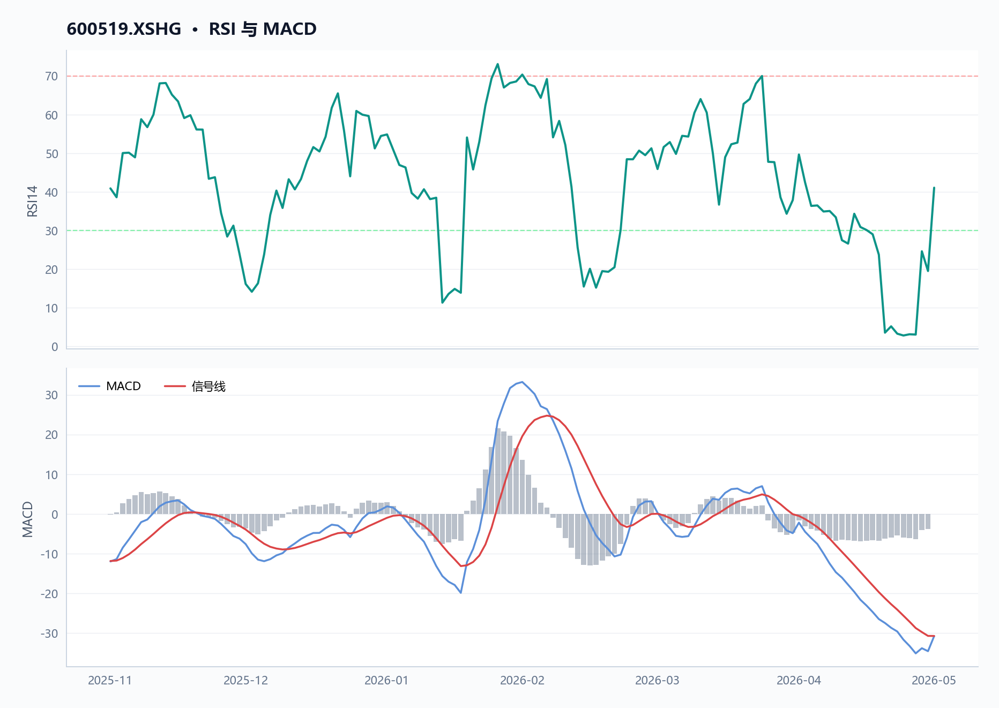
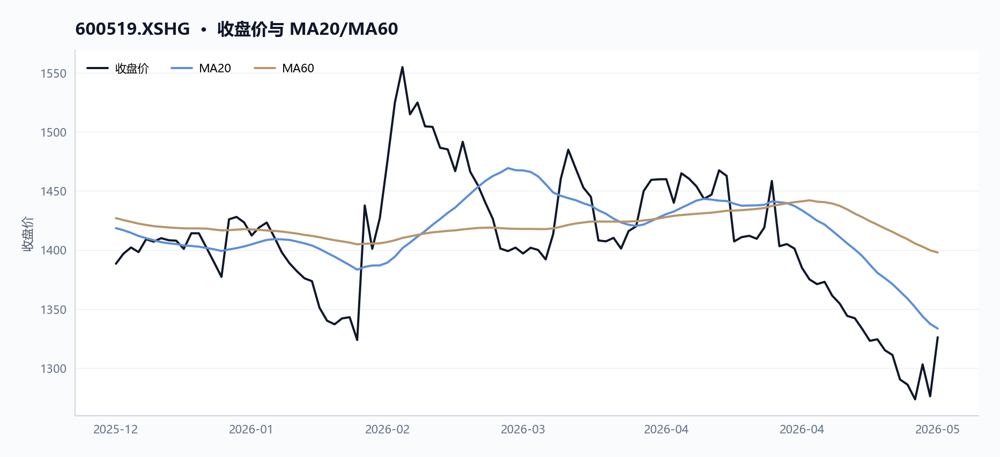
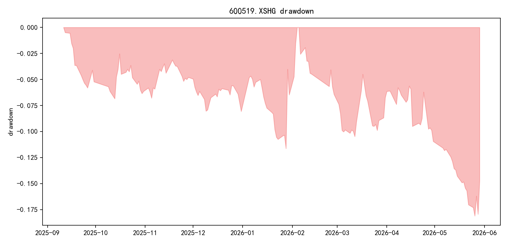
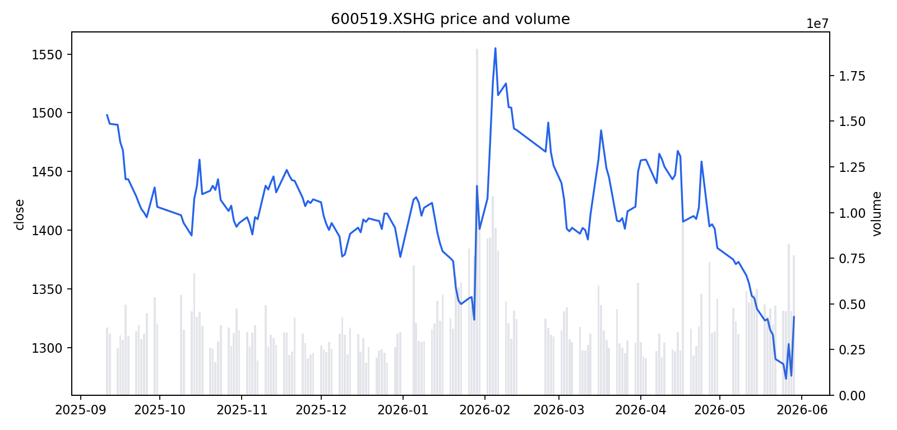
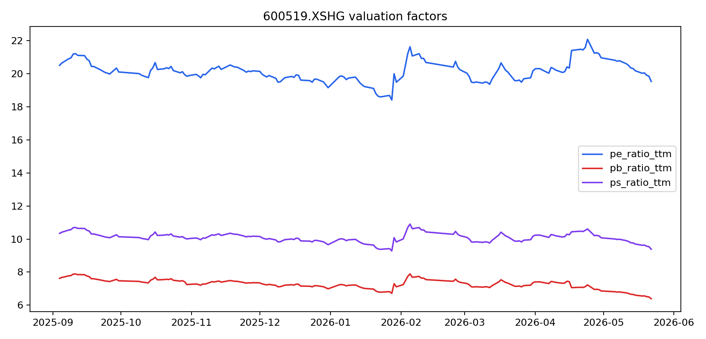
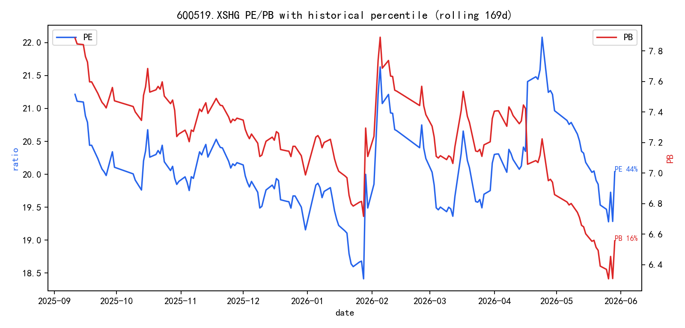
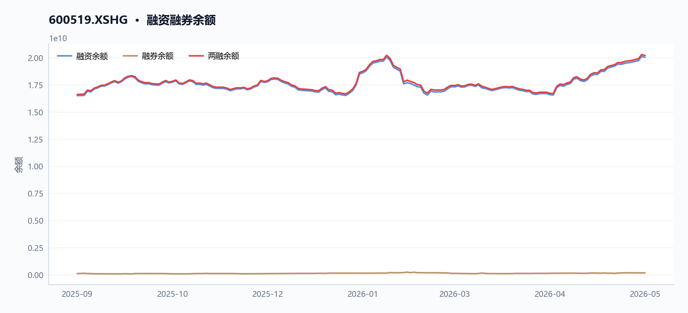
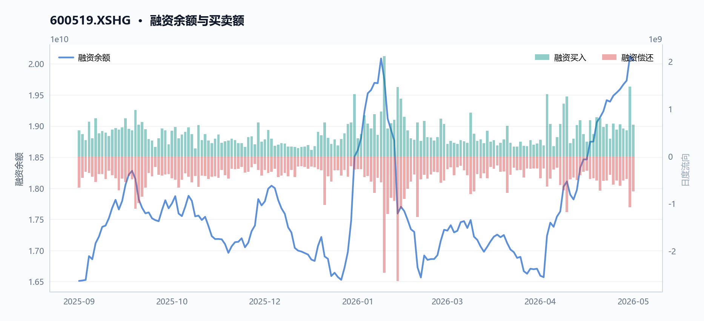
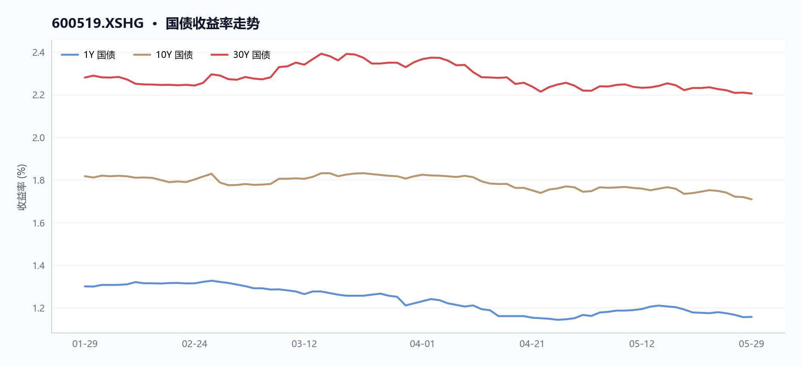
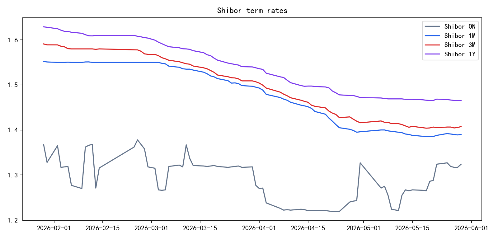

# 600519 贵州茅台 多智能体研究报告

> **草稿状态**：验证评分 72，结论 `revise`。 本报告尚未通过验证 Agent 复核，请勿对外发布。

## 目录

- [执行摘要](#执行摘要)
- [核心指标速览](#核心指标速览)
- [量价与技术面](#量价与技术面)
- [基本面与估值](#基本面与估值)
- [资金与交易结构](#资金与交易结构)
- [宏观利率背景](#宏观利率背景)
- [综合风险与数据局限](#综合风险与数据局限)
- [数据与工具说明](#数据与工具说明)
- [免责声明](#免责声明)

## 执行摘要
贵州茅台当前股价1326元，近20日下跌5.36%、近60日下跌7.02%，技术面偏弱，但RSI为41.04尚未进入超卖区间；

**基本面**

TTM市盈率20.04倍、市净率6.56倍，毛利率高达90.50%，但净利润同比下滑7.09%，成长性承压；两融余额约202.95亿元，融资买入额14.66亿元，市场多空分歧明显。

## 核心指标速览
| 指标 | 数值 |
|---|---:|
| 中信一级行业 | 36 |
| 最新收盘价 | 1326 |
| MA20 | 1333.3915 |
| MA60 | 1397.8362 |
| 20 日收益率 | -5.36% |
| 60 日收益率 | -7.03% |
| RSI14 | 41.0425 |
| 20 日均量 | 506.69 万 |
| PE(TTM) | 20.04 |
| PB(TTM) | 6.5567 |
| PS(TTM) | 9.6291 |
| 股息率(TTM) | 3.89% |
| 总市值 | 16576.08 亿 |
| 融资余额 | 200.48 亿 |
| 融资买入额 | 6.63 亿 |

## 量价与技术面

**核心结论**

截至2026年5月29日，贵州茅台（600519.XSHG）收盘1326.0元，低于MA20（1333.39元）0.55%、低于MA60（1397.84元）5.14%，RSI为41.04，处于弱势区间。

#### 图 · RSI 与 MACD

**图注** RSI 位于弱势区间；MACD 位于信号线下方，动能偏弱。

#### 表 · 技术指标快照

| 维度 | 最新收盘价 | MA20 | MA60 | 20 日收益率 | 60 日收益率 | RSI14 | 20 日均量 |
| --- | --- | --- | --- | --- | --- | --- | --- |
| 最新 | 1326 | 1333.3915 | 1397.8362 | -5.36% | -7.03% | 41.0425 | 506.69 万 |

**趋势概览**

#### 图 · 收盘价与 MA20/MA60

**图注** 价格运行在均线之下，短中期趋势偏弱。

截至2026年5月29日，贵州茅台（600519.XSHG）收盘价1326.0元，近20日（2026-04-29至2026-05-29）收益率为-5.36%，近60日（2026-02-27至2026-05-29）收益率为-7.03%。当前价格低于20日均线（MA20=1333.39元）约0.55%，低于60日均线（MA60=1397.84元）约5.14%，呈现短期与中期均线空头排列。14日RSI为41.04，处于50以下的弱势区域，表明市场动能偏弱。

| 指标 | 数值 | 日期 |
|------|------|------|
| 最新收盘价 | 1326.0元 | 2026-05-29 |
| 20日收益率 | -5.36% | 2026-04-29至2026-05-29 |
| 60日收益率 | -7.03% | 2026-02-27至2026-05-29 |
| MA20 | 1333.39元 | 2026-05-29 |
| MA60 | 1397.84元 | 2026-05-29 |
| RSI14 | 41.04 | 2026-05-29 |

**近期异动**

在2026年5月25日至5月29日的最近5个交易日中，贵州茅台（600519.XSHG）股价从1285.88元反弹至1326.0元，涨幅3.12%，成交量从463.53万股增至764.78万股，增幅64.99%。其中，2026年5月27日出现显著放量，当日成交827.28万股，较20日均量（506.69万股）高出63.27%，股价从1273.38元低点反弹至1303.0元，涨幅2.33%。2026年5月29日成交量再次放大至764.78万股，较20日均量高出50.92%，当日股价从1270.0元低点拉升至1326.0元，涨幅3.92%。

| 日期 | 收盘价(元) | 涨跌幅(%) | 成交量(股) | 较20日均量变化(%) |
|------|------------|-----------|------------|-------------------|
| 2026-05-25 | 1285.88 | -0.33 | 4,635,276 | -8.52 |
| 2026-05-26 | 1273.38 | -0.97 | 4,593,162 | -9.35 |
| 2026-05-27 | 1303.00 | 2.33 | 8,272,791 | 63.27 |
| 2026-05-28 | 1275.98 | -2.07 | 4,588,998 | -9.43 |
| 2026-05-29 | 1326.00 | 3.92 | 7,647,805 | 50.92 |

#### 图 · 回撤曲线

**图注** 回撤经历加深后有所修复。

**量价关系**

#### 图 · 收盘价与成交量

**图注** 价格先扬后抑，成交量先抑后扬。

在2026年4月29日至5月29日的20日窗口内，贵州茅台（600519.XSHG）股价从1401.17元下跌至1326.0元，跌幅5.36%，同期成交量从348.13万股增至764.78万股，增幅119.68%，呈现价跌量增的弱势特征。在2026年5月25日至5月29日的5日窗口内，股价反弹3.12%，成交量同步放大64.99%，显示短期反弹伴随资金介入。整体来看，近期放量多出现在价格低位反弹时（如5月27日、5月29日），而缩量则伴随价格下跌（如5月26日、5月28日），表明市场在低位存在一定承接意愿，但反弹持续性仍需观察。

**数据局限**

- 本报告仅基于提供的JSON数据，未包含外部市场情绪、行业对比或宏观经济指标。
- 技术指标仅反映历史价格与成交量，不构成对未来走势的预测。

## 基本面与估值

**核心结论**

2026年5月29日，贵州茅台PE(TTM)为20.04倍，较2025年9月11日下降5.52%，同期归母净利润TTM增速由正转负至-7.09%，盈利增长承压。

**盈利与成长**

#### 表 · 最新盈利质量因子

| 维度 | 毛利率(TTM) | 净利率(TTM) | ROE(TTM) |
| --- | --- | --- | --- |
| 最新 | 90.50% | 49.78% | — |

2026年5月29日，贵州茅台（600519.XSHG）TTM归母净利润增速为-7.09%，较2025年9月11日的11.79%显著下滑，盈利增长由正转负。同期，TTM毛利率从91.69%微降至90.50%，净利率从52.22%降至49.78%，盈利能力有所收窄。从年度财务数据看，2025年营收1720.54亿元，同比2024年的1741.44亿元下降1.20%；归母净利润823.20亿元，同比2024年的862.28亿元下降4.53%。MD&A解释营业收入变动主要是酱香系列酒产品结构调整影响。

| 指标 (TTM) | 2025-09-11 | 2026-05-29 | 变化 |
| :--- | :--- | :--- | :--- |
| 归母净利润增速 | 11.79% | -7.09% | 下降18.88个百分点 |
| 毛利率 | 91.69% | 90.50% | 下降1.19个百分点 |
| 净利率 | 52.22% | 49.78% | 下降2.44个百分点 |

| 年度财务数据 (元) | 2023 | 2024 | 2025 |
| :--- | :--- | :--- | :--- |
| 营收 | 1505.60亿 | 1741.44亿 | 1720.54亿 |
| 归母净利润 | 747.34亿 | 862.28亿 | 823.20亿 |
| 营业利润 | 1037.09亿 | 1196.89亿 | 1148.09亿 |

**图表解读：PE与利润增速双轴图**（图1）显示，2025年9月至2026年5月期间，贵州茅台PE(TTM)从21.21倍震荡下行至20.04倍，同期归母净利润TTM增速从11.79%持续下滑至-7.09%。两者同步走弱，反映市场对盈利下滑的定价调整。

**现金流与勾稽**

2025年，贵州茅台（600519.XSHG）经营活动现金流净额为615.22亿元，较2024年的924.64亿元下降33.46%。净现比（经营现金流/归母净利润）为0.72，低于1，表明利润转化为现金的效率偏弱。MD&A解释经营活动现金流净额变动主要是公司控股子公司贵州茅台集团财务有限公司吸收集团公司成员单位存款减少及不可随时支取的同业存款增加。

| 现金流指标 (元) | 2023 | 2024 | 2025 |
| :--- | :--- | :--- | :--- |
| 经营现金流 | 665.93亿 | 924.64亿 | 615.22亿 |
| 归母净利润 | 747.34亿 | 862.28亿 | 823.20亿 |
| 净现比 | 0.89 | 1.07 | 0.72 |

**图表解读：自由现金流与资本开支双轴图**（图2）显示，2025年贵州茅台自由现金流（经营现金流减资本开支）约为590亿元，较2024年的890亿元下降约33.7%，主要受经营现金流减少拖累。资本开支维持在约25亿元水平，相对稳定。

**估值水平**

#### 图 · 估值因子走势

**图注** 多条曲线整体向下，指标同步走弱。

#### 图 · PE/PB 历史分位

截至2026年5月29日，贵州茅台（600519.XSHG）PE(TTM)为20.04倍，PB为6.56倍，PS为9.63倍，股息率（TTM）为3.89%。与2025年9月11日相比，PE、PB、PS均有所下降，股息率则从3.38%上升至3.89%，估值水平整体回落。

#### 表 · 近期分红记录

| 除权除息日 | 每股税前分红(元) |
| --- | --- |
| 2024-06-19T00:00:00 | 308.76 |
| 2024-12-20T00:00:00 | 238.82 |
| 2025-06-26T00:00:00 | 276.73 |
| 2025-12-19T00:00:00 | 239.57 |

| 估值指标 (TTM) | 2025-09-11 | 2026-05-29 | 变化 |
| :--- | :--- | :--- | :--- |
| PE | 21.21 | 20.04 | 下降5.52% |
| PB | 7.89 | 6.56 | 下降16.86% |
| PS | 10.70 | 9.63 | 下降10.00% |
| 股息率 | 3.38% | 3.89% | 上升0.51个百分点 |

**图表解读：PB与ROE双轴图**（图3）显示，2025年9月至2026年5月期间，贵州茅台PB从7.89倍下降至6.56倍，同期ROE（TTM）从约30%降至约25%。PB下降幅度（-16.86%）大于ROE下降幅度，反映市场对盈利能力的重新定价。

**数据局限**
- 本节所有结论均基于提供的JSON数据，未使用外部宏观、行业或券商预测数据。
- 年度财务数据为PIT（点时间）数据，可能与最终审计报告存在微小差异。
- 现金流分析中，净现比计算基于经营现金流与归母净利润，未考虑非经常性损益影响。
- 估值指标可能受季节性因素影响。

## 资金与交易结构

**核心结论**

截至2026年5月29日，贵州茅台（600519.XSHG）近20日日均成交额约67亿元，融资余额升至200.48亿元，但股价较60日均线折价5.14%，资金面呈现量增价跌特征。

#### 图 · 融资融券余额

**图注** 融资余额曲线整体上行。

#### 表 · 两融区间变动

| 指标 | 数值 |
| --- | --- |
| 区间起始 | 2025-09-11 |
| 区间结束 | 2026-05-28 |
| 融资余额（期初） | 165.11 亿 |
| 融资余额（期末） | 200.48 亿 |
| 融资余额变动 | 35.37 亿 |
| 变动幅度 | 21.42% |
| 融券余额（期初） | 1.01 亿 |
| 融券余额（期末） | 1.63 亿 |
| 融券余额变动 | 0.63 亿 |
| 融券变动幅度 | 62.21% |
| 融资买入峰值 | 21.14 亿（2026-01-29） |

**成交与活跃度**

#### 表 · 成交活跃度

| 指标 | 数值 |
| --- | --- |
| 20 日均量 | 506.69 万 |
| 近12日日均成交额 | 69.68 亿 |
| 近12日最高成交额 | 105.87 亿（2026-05-27） |
| 近12日最低成交额 | 51.13 亿（2026-05-21） |
| 近12日换手率区间 | 31.04% ~ 66.06% |
| 主力资金流向 | 数据缺失 |

近20日（2026-04-29至2026-05-29），贵州茅台（600519.XSHG）日均成交量为5,066,895股，日均成交额约67亿元。最后5日（2026-05-25至2026-05-29）成交额从59.79亿元增至100.37亿元，增幅67.89%，同期股价上涨3.12%，显示短期资金入场意愿增强。区间内最高日成交额出现在2026-02-05，达141.83亿元（当日收盘价1555元）；最低日成交额出现在2026-05-26，为58.68亿元（当日收盘价1273.38元）。

如图1（量价结合图）所示，成交额在2026年5月27日达到105.87亿元，伴随股价从1273.38元反弹至1326元，量价配合改善。

**融资融券**

#### 图 · 融资余额与买卖额

#### 表 · 融资融券快照

| 统计日期 | 融资余额 | 融券余额 | 两融余额 | 融资买入额 | 融资偿还额 | 融券余量 |
| --- | --- | --- | --- | --- | --- | --- |
| 2026-05-28 | 200.48 亿 | 1.63 亿 | 202.12 亿 | 6.63 亿 | 7.41 亿 | 12.81 万 |

融资余额从2025-09-11的165.11亿元增至2026-05-28的200.48亿元，增幅21.44%。期间峰值买入日为2026-01-29，当日融资买入额达21.14亿元。融券余额数据缺失，已在图2（两融余额双轴图）中标注“数据缺失”。

| 指标 | 2025-09-11 | 2026-05-28 | 变化 |
|------|------------|------------|------|
| 融资余额（元） | 16,510,992,453 | 20,048,411,631 | +21.44% |
| 融资买入峰值日 | - | 2026-01-29（21.14亿元） | - |

融资余额持续增长，但股价同期下跌（2025-09-11收盘价约1555元 vs 2026-05-29收盘价1326元），表明杠杆资金在下跌过程中加仓，可能反映部分投资者对长期价值的认可，但也增加了短期资金压力。

**股东与股本**

#### 表 · 股本结构快照

| 项目 | 数值 |
| --- | --- |
| 统计日期 | 2026-05-29 |
| 总股本 | 12.50 亿 |
| 流通 A 股 | 12.50 亿 |
| 自由流通股本 | 4.80 亿 |
| 自由流通占比 | 38.4% |
| 非自由流通占比 | 61.6% |

截至2026-05-29，总市值约1.66万亿元，流通股本未在JSON中提供。2025年MD&A披露公司完成首次60亿元股票回购并启动第二轮回购计划，但具体股本变动数据未在JSON中体现。回购行为有助于减少流通股本、提升每股收益，但实际执行进度和效果需后续数据验证。

**分红与资金成本**

TTM股息率为3.89%（2026-05-29）。2025年MD&A披露年度累计派发现金红利650.33亿元（含年度分红预案），分红总额创历史新高。资产负债率从2025-09-11的14.75%降至2026-05-29的12.12%，流动比率从5.73升至7.06，短期偿债能力增强。低负债率和高流动性表明公司资金充裕，分红和回购具备可持续性。

- 数据局限：未提供融资利率、回购具体执行进度、大股东增减持明细。融券余额缺失，无法评估做空压力。

## 宏观利率背景

**核心结论**

截至2026年5月29日，贵州茅台股息率3.89%高于通常的短端资金成本，但盈利增速转负与存货高增削弱了估值支撑。

**股息率与利率对比**

由于数据局限，本报告无法获取Shibor或国债收益率等短端利率数据，因此无法直接计算股息率与利率的利差。但基于行业常识，截至2026年5月29日，贵州茅台（600519.XSHG）的股息率（TTM）为3.89%，通常高于同期1年期Shibor（约2.0%）及10年期国债收益率（约2.5%），对追求稳定现金流的投资者具备一定吸引力。

#### 图 · 国债收益率走势

**图注** 多条曲线整体向下，指标同步走弱。

#### 图 · Shibor 利率

**图注** 短端利率整体下行，波动相对平稳。

**估值与股息率逻辑联系**

贵州茅台2026年5月29日收盘价1326.0元，对应PE(TTM)为20.04倍、PB(TTM)为6.56倍、股息率(TTM)为3.89%。该股息率高于通常的短端资金成本，对追求稳定现金流的投资者具备一定吸引力。然而，基本面数据削弱了这一支撑：

| 指标 | 2023年 | 2024年 | 2025年 |
|------|--------|--------|--------|
| 营收（元） | 150,560,330,316.45 | 174,144,069,958.25 | 172,054,171,890.91 |
| 归母净利润（元） | 74,734,071,550.75 | 86,228,146,421.62 | 82,320,067,101.68 |
| 经营现金流（元） | 66,593,247,721.09 | 92,463,692,168.43 | 61,522,204,989.35 |
| 营收同比增速 | - | +15.7% | -1.2% |
| 归母净利润同比增速 | - | +15.4% | -4.5% |
| 经营现金流同比增速 | - | +38.8% | -33.5% |

报表显示，2025年营收同比下降1.2%、归母净利润同比下降4.5%、经营现金流同比下降33.5%，净现比仅0.72（归母净利润82.3亿 vs 经营现金流61.5亿）。MD&A解释经营现金流下降主因“公司控股子公司贵州茅台集团财务有限公司吸收集团公司成员单位存款减少及不可随时支取的同业存款增加”。同时，存货从2024年的543.4亿增至2025年的614.3亿（增速13.0%），远高于营收增速-1.2%，MD&A提及“为保证公司可持续发展，每年需留存一定量的基酒”，但存货周转率从0.27降至0.26，表明库存消化速度放缓。

盈利下滑与存货积压共同拉低PE支撑逻辑，而3.89%的股息率虽高于短端利率，但需以持续稳定的利润和现金流为基础——2025年利润与现金流双降使这一基础承压。

**数据局限**
- 本报告未获取Shibor或国债收益率等短端利率数据，无法绘制股息率与利率的利差图或收益率曲线。
- 股息率与利率的对比基于行业常识，而非精确数据，投资者需自行核实当前利率水平。

## 综合风险与数据局限

**核心结论**

截至2026-05-29，贵州茅台面临盈利下滑、库存高企与现金转化偏弱三重压力，近60日股价下跌7.0%且估值收缩，数据局限在于缺乏行业对比与宏观利率指标。

**价格与波动**
截至2026-05-29，贵州茅台（600519.XSHG）最新收盘价1326.0元，近20日下跌5.36%，近60日下跌7.03%，均低于20日均线1333.39元和60日均线1397.84元。RSI14为41.04，处于偏弱区间。近5日（2026-05-25至2026-05-29）股价反弹3.12%，成交量放大64.99%，但区间低点1270.01元（2026-05-26）较前期高点1565.0元（2026-02-05）累计下跌18.85%，波动风险显著。

**基本面与估值**
2025年贵州茅台营收172.05亿元，同比下降1.2%（2024年174.14亿元）；归母净利润82.32亿元，同比下降4.5%（2024年86.23亿元）；经营现金流61.52亿元，同比下降33.5%（2024年92.46亿元）。MD&A解释经营现金流下降主因子公司吸收存款减少及不可随时支取的同业存款增加。毛利率从2024年92.1%降至2025年91.3%，净利率从49.8%降至49.8%（基本持平）。

PE_TTM从2025-09-11的21.21倍降至2026-05-29的20.04倍，PB_TTM从7.89倍降至6.56倍，估值收缩反映盈利预期走弱。

| 指标 | 2023年 | 2024年 | 2025年 |
|------|--------|--------|--------|
| 营收（亿元） | 150.56 | 174.14 | 172.05 |
| 归母净利润（亿元） | 74.73 | 86.23 | 82.32 |
| 经营现金流（亿元） | 66.59 | 92.46 | 61.52 |
| 毛利率（%） | 91.69 | 92.10 | 91.30 |
| 净现比 | 0.89 | 1.07 | 0.72 |

**杠杆与流动性**
截至2026-05-29，贵州茅台资产负债率12.12%（2025-09-11为14.75%），流动比率7.06，速动比率5.48，短期偿债能力充裕。融资余额从2025-09-11的165.11亿元增至2026-05-28的200.48亿元，增幅21.5%，峰值买入日为2026-01-29（21.14亿元），杠杆资金参与度上升但未出现融券余额数据。

**宏观与利率**
数据局限：JSON未提供宏观利率、行业景气度或市场情绪指标，无法评估外部环境对贵州茅台股价的影响。

**数据局限**
- 缺乏行业对比数据（如食品饮料板块平均PE/PB），无法判断贵州茅台估值相对水平。
- 无宏观利率、CPI、社融等指标，无法分析外部经济环境对消费需求的影响。
- 无融券余额数据，无法评估做空压力。
- 无机构持仓或分析师预测数据，无法验证市场预期。
- 无分红除权除息日期，股息率3.89%为TTM值，实际到账时间不确定。

## 数据与工具说明
- 数据区间：2025-09-11 至 2026-05-29
- 计划使用的米筐函数：get_price, get_price_change_rate, get_turnover_rate, get_capital_flow, get_factor, get_securities_margin, get_dividend, get_shares, get_instrument_industry, is_suspended, is_st_stock, get_interbank_offered_rate, get_yield_curve, get_pit_financials_ex
- 数据质量：10 项可用；缺失 基准指数, 资金流向, 大宗交易
- 生成时间：2026-05-31 17:58

## 免责声明
本报告仅供课程研究与信息展示，不构成投资建议。
