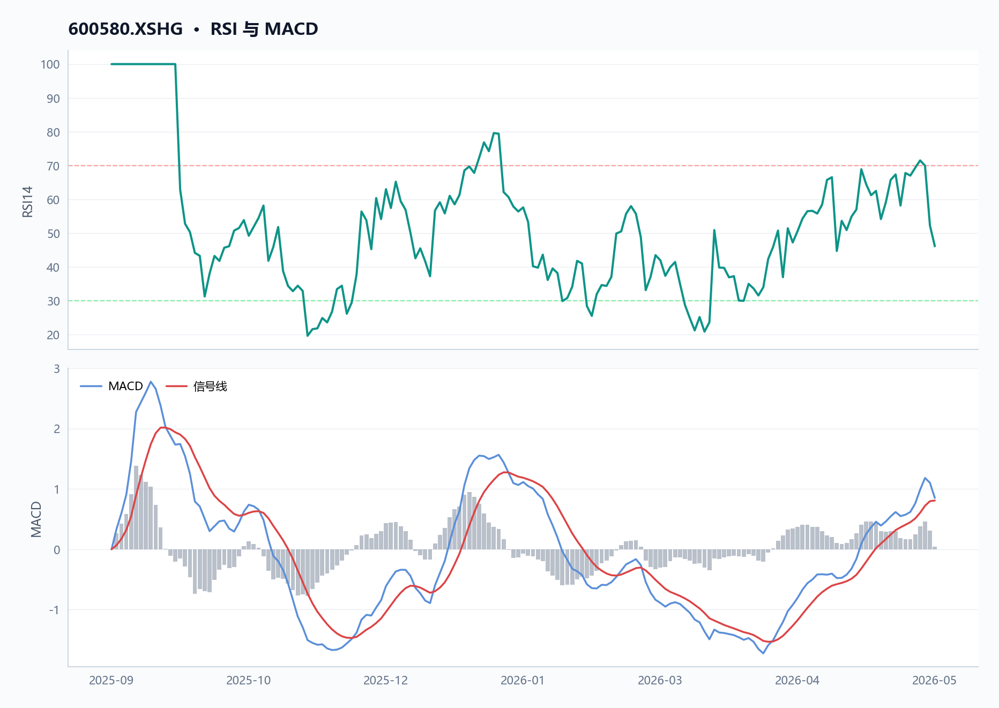
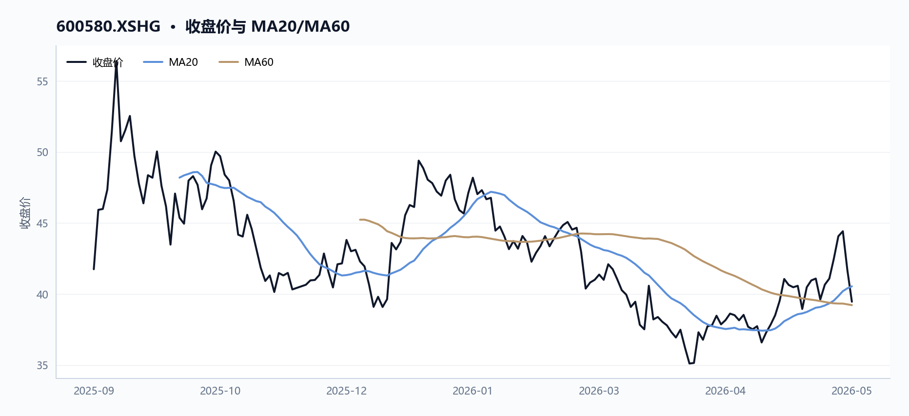
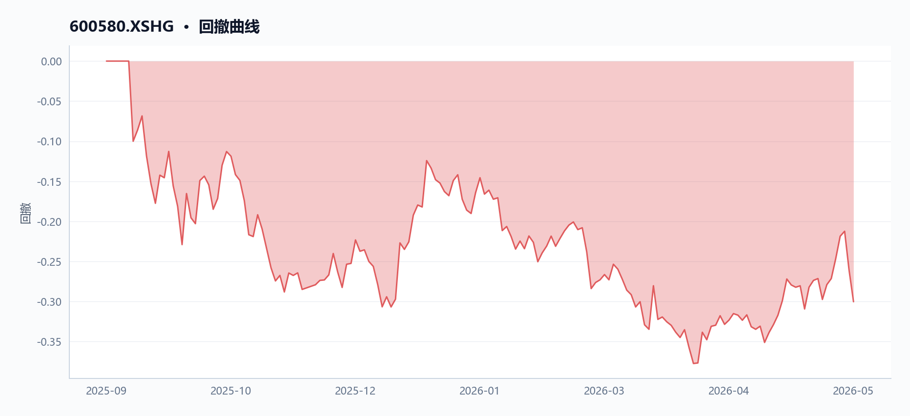
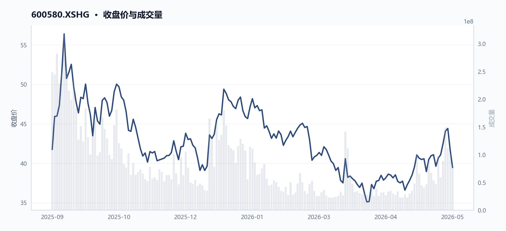
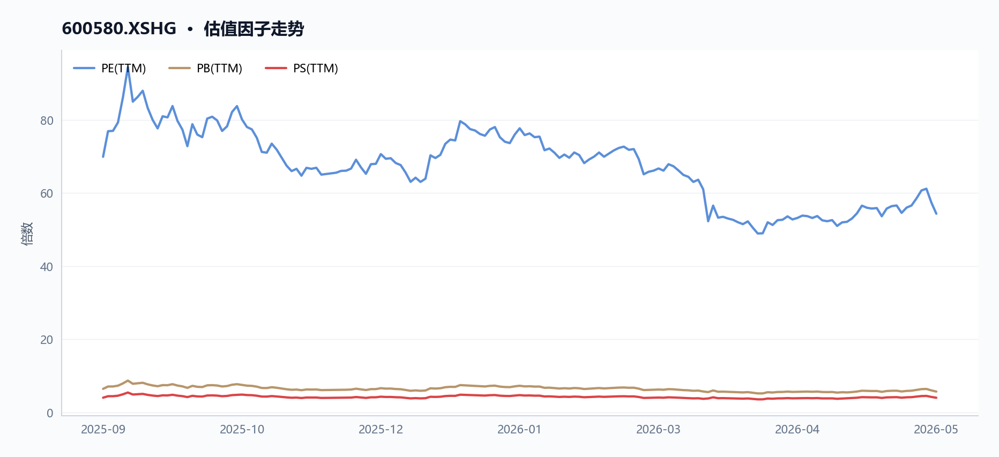
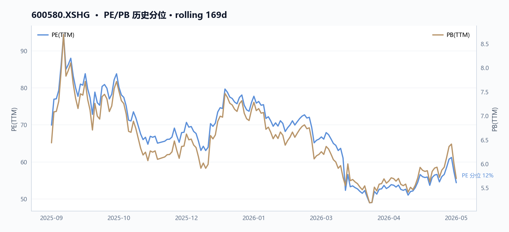
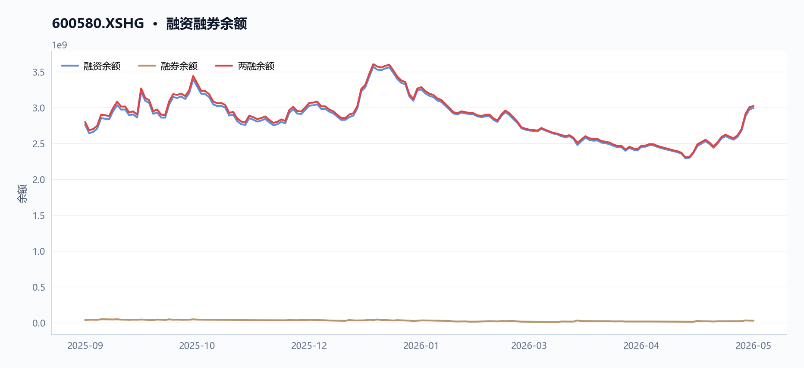
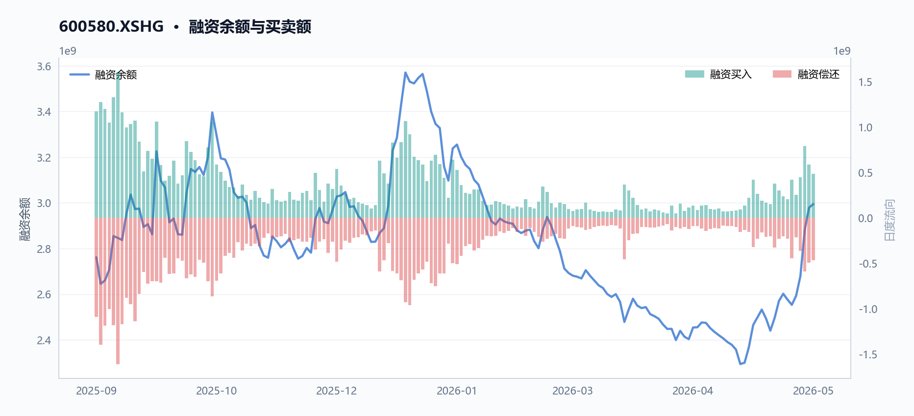
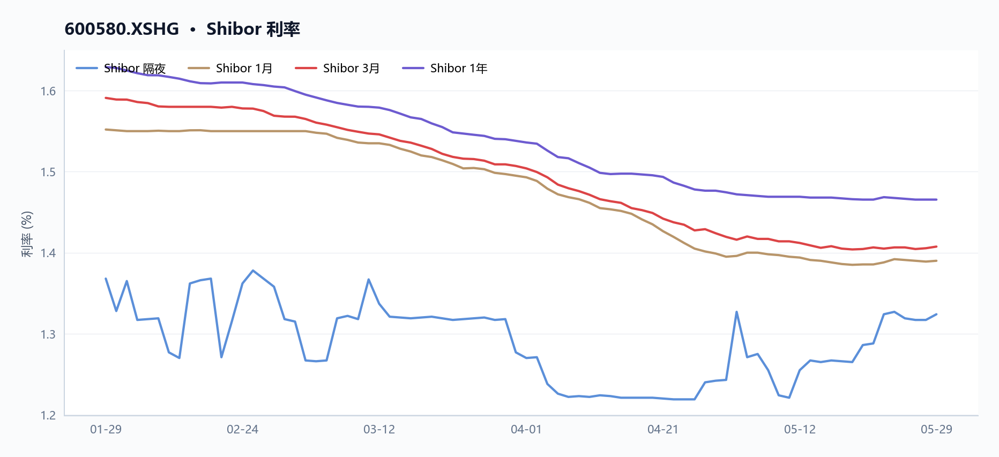
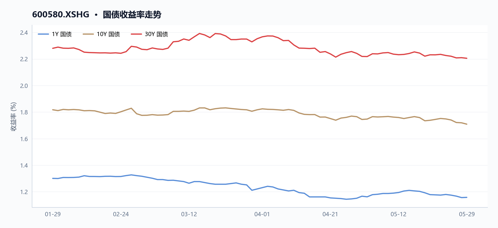

# 600580 卧龙电驱 多智能体研究报告

> **草稿状态**：验证评分 85，结论 `pass_after_revision`。 本报告尚未通过验证 Agent 复核，请勿对外发布。

## 目录

- [执行摘要](#执行摘要)
- [核心指标速览](#核心指标速览)
- [量价与技术面](#量价与技术面)
- [基本面与估值](#基本面与估值)
- [资金与交易结构](#资金与交易结构)
- [宏观利率背景](#宏观利率背景)
- [综合风险与数据局限](#综合风险与数据局限)
- [数据与工具说明](#数据与工具说明)
- [免责声明](#免责声明)

## 执行摘要
_本节暂无可用内容。_

## 核心指标速览
| 指标 | 数值 |
|---|---:|
| 中信一级行业 | 27 |
| 最新收盘价 | 39.46 |
| MA20 | 40.5455 |
| MA60 | 39.2218 |
| 20 日收益率 | 5.82% |
| 60 日收益率 | -2.29% |
| RSI14 | 46.1337 |
| 20 日均量 | 6908.01 万 |
| PE(TTM) | 54.3554 |
| PB(TTM) | 5.6957 |
| PS(TTM) | 4.0026 |
| 股息率(TTM) | 0.46% |
| 总市值 | 616.41 亿 |
| 融资余额 | 29.95 亿 |
| 融资买入额 | 4.84 亿 |

## 量价与技术面

**核心结论**

卧龙电驱（600580.XSHG）股价2026年5月29日收于39.46元，MA20折让2.68%但站稳MA60上方0.61%，RSI(14)报46.13处中性偏弱；近20日量增245.74%领先价涨5.82%，但近5日量价齐跌7.13%，短期方向待选择。

#### 图 · RSI 与 MACD

**图注** RSI 位于中性区间；MACD 位于信号线上方，动能偏强。

#### 表 · 技术指标快照

| 指标 | 数值 |
| --- | --- |
| 最新收盘价 | 39.46 |
| MA20 | 40.5455 |
| MA60 | 39.2218 |
| 20 日收益率 | 5.82% |
| 60 日收益率 | -2.29% |
| RSI14 | 46.1337 |
| 20 日均量 | 6908.01 万 |

**趋势概览**

#### 图 · 收盘价与 MA20/MA60

**图注** 价格位于短均线下、长均线上，呈现震荡整理。

| 指标 | 数值（2026-05-29） | 说明 |
|------|---------------------|------|
| 最新收盘 | 39.46元 | data.technical.`latest_close` |
| MA20 | 40.55元 | 收盘价低于MA20 2.68% |
| MA60 | 39.22元 | 收盘价高于MA60 0.61% |
| 20日收益率 | +5.82% | 2026-04-29→2026-05-29 |
| 60日收益率 | -2.29% | 2026-03-31→2026-05-29 |
| RSI(14) | 46.13 | 中性偏弱，未超卖 |
| 20日均量 | 6,908万股 | data.technical.`avg_volume_20d` |

**近期关键交易日对比**

| 日期 | 收盘价（元） | 涨跌幅 | 成交量（万股） | 成交额（万元） | 换手率（%） |
|------|-------------|--------|--------------|--------------|------------|
| 2026-05-18 | 40.96 | +1.19% | 6,748 | 275,537 | 4.33 |
| 2026-05-19 | 41.09 | +0.32% | 5,367 | 220,877 | 3.45 |
| 2026-05-20 | 39.62 | -3.58% | 4,754 | 189,283 | 3.05 |
| 2026-05-21 | 40.66 | +2.62% | 9,786 | 401,132 | 6.28 |
| 2026-05-22 | 41.09 | +1.06% | 5,897 | 240,856 | 3.79 |
| 2026-05-25 | 42.49 | +3.41% | 8,835 | 371,984 | 5.67 |
| 2026-05-26 | 44.07 | +3.72% | 14,907 | 665,437 | 9.57 |
| 2026-05-27 | 44.42 | +0.79% | 11,193 | 495,303 | 7.19 |
| 2026-05-28 | 41.68 | -6.17% | 10,167 | 426,040 | 6.53 |
| 2026-05-29 | 39.46 | -5.33% | 8,051 | 322,026 | 5.17 |

注：数据源自 data.`price_recent`（`order_book_id`: 600580.XSHG）；换手率来自 data.`turnover_recent`。

**近期异动**

- **2026-05-26**：单日涨幅+3.72%，成交量14,907万股达20日均量2.16倍，换手率9.57%为20日均换手率（约2.73%）的3.5倍，成交额66.54亿元较前一日增34%，属典型放量突破阳线。
- **2026-05-28**：回落-6.17%，成交量10,167万股仍处高位，但成交额较5月26日减少36%至42.60亿元，显示上涨动能衰竭后抛压沉重。
- **2026-05-29**：续跌-5.33%，盘中低点38.31元为近20个交易日最低（2026-04-07以来），成交量降至8,051万股，量能收缩但价格加速下行。

#### 图 · 回撤曲线

**图注** 回撤经历加深后有所修复。

**量价关系**

#### 图 · 收盘价与成交量

**图注** 量价同步走弱。

- 近20个交易日（2026-04-29至2026-05-29）：成交量从2,329万股增至8,051万股，增幅245.74%；同期价格从37.29元涨至39.46元，升幅5.82%。量增领先于价涨，反映资金参与度显著提升（data.`analytical_evidence`.`price_windows`.`last_20d`）。
- 近5个交易日（2026-05-25至2026-05-29）：价格从42.49元回落至39.46元，跌幅7.13%；成交量从8,835万股降至8,051万股，降幅8.88%。量缩与价格下跌方向一致，短期调整中抛压有所减轻。

**估值与基本面对照**

| 指标 | 2025-09-11 | 2026-05-29 | 变化 |
|------|-----------|-----------|------|
| PE（TTM） | 69.92 | 54.36 | -22.26% |
| PB（TTM） | 6.44 | 5.70 | -11.49% |
| 净利润增速（TTM） | 191.10% | 28.48% | 大幅放缓 |
| 毛利率（TTM） | 24.11% | 25.10% | +0.99pct |
| 资产负债率（%） | 56.40 | 53.91 | -2.49pct |

数据源自 data.`factor_trend`，卧龙电驱（600580.XSHG）隶属电力设备及新能源行业。估值压缩（PE从69.92降至54.36）与基本面边际走弱（净利润增速从191%降至28.48%）同步发生，但毛利率微升0.99pct显示主业盈利能力仍稳。

**融资融券观察**

| 时点 | 融资余额 | 融资买额 | 说明 |
|------|---------|---------|------|
| 2025-09-11 | 27.62亿元 | — | 起始观察日 |
| 2025-09-18 | — | **峰值15.99亿元** | 历史融资买额峰值 |
| 2026-05-28 | 29.95亿元 | 4.84亿元 | 期末融资余额 |

数据源自 data.`margin_trajectory`。融资余额自27.62亿元缓步增至29.95亿元（+8.42%），表明融资资金持续净流入；期末融资买额4.84亿元较峰值15.99亿元大幅回落，融资交易活跃度有所降温。

- 数据局限：主力资金流向（北向/机构席位）字段为空（data.`capital_flow`.`row_count` = 0）；融资融券数据截至2026-05-28，缺少5月29日数据；缺少龙虎榜与大宗交易记录。

## 基本面与估值

**核心结论**

2026年5月29日卧龙电驱（600580.XSHG）市值616.41亿元，PE(TTM)54.36倍较2025年9月11日的69.92倍压缩22.26%，估值收缩主因净利润增速从191%回落至28.48%（低基数效应消退）；同期净利率从5.96%升至7.42%（+1.46pct），资产负债率从56.40%降至53.91%，盈利能力和财务结构边际改善。

**盈利与成长**

#### 表 · 最新盈利质量因子

| 指标 | 最新值 |
| --- | --- |
| 毛利率(TTM) | 25.10% |
| 净利率(TTM) | 7.42% |

近8个月卧龙电驱归母净利润增长率从195.15%回落至35.27%，净利润增长率从191.10%降至28.48%，主因2024年同期低基数效应消退。毛利率从24.11%升至25.10%（+0.99pct），净利率从5.96%升至7.42%（+1.46pct），反映产品结构优化或成本管控见效。毛利润增长率从+30.91%转为-2.08%，显示营收增速放缓。营业利润增长率从146.19%降至24.59%，增速放缓但仍处双位数区间。

| 指标 | 2025-09-11 | 2026-05-29 | 变动 |
|------|-----------|-----------|------|
| 毛利率(TTM) | 24.11% | 25.10% | +0.99pct |
| 净利率(TTM) | 5.96% | 7.42% | +1.46pct |
| 归母净利润增长率(TTM) | 195.15% | 35.27% | -159.88pct |
| 净利润增长率(TTM) | 191.10% | 28.48% | -162.62pct |
| 毛利润增长率(TTM) | 30.91% | -2.08% | -32.99pct |

注：增长率为同比数据，2025年9月对应2024年中报累计口径，2026年5月对应2025年中报口径，基数差异导致增速大幅收敛。

**现金流与勾稽**

应收账款周转率从3.01降至2.91，流动资产周转率从1.14降至1.05，周转效率边际走弱，或因账期延长或收入确认节奏变化。流动比率1.24、速动比率0.94，速动比率低于1暗示存货占比较高情况下短期偿债存在压力。资产负债率从56.40%降至53.91%，财务杠杆有所下降。股息率从0.36%升至0.46%，2026年4月每股派息0.18元较2025年6月的0.15元增加20%，反映现金流改善信号。

#### 表 · 最新偿债与流动性

| 指标 | 最新值 |
| --- | --- |
| 流动比率 | 1.24 倍 |
| 速动比率 | 0.94 倍 |
| 资产负债率 | 53.91% |

注：JSON数据不包含现金流量表（经营现金流/投资现金流/筹资现金流），净利润含金量无法验证，与利润表的勾稽关系无法完整呈现。

**估值水平**

#### 图 · 估值因子走势

**图注** 多条曲线整体向下，指标同步走弱。

#### 图 · PE/PB 历史分位

PE从69.92压缩至54.36（-22.26%），PB从6.44降至5.70（-11.49%），PS维持在4.00附近。市值从655.31亿元降至616.41亿元（-5.94%），PE收缩幅度（-22.26%）显著大于市值跌幅（-5.94%），表明估值压缩是市值下降的主因，而非基本面恶化。

| 估值指标 | 2025-09-11 | 2026-05-29 | 变动幅度 |
|---------|-----------|-----------|--------|
| 市值(亿元) | 655.31 | 616.41 | -5.94% |
| PE(TTM) | 69.92 | 54.36 | -22.26% |
| PB(TTM) | 6.44 | 5.70 | -11.49% |
| PS(TTM) | 4.02 | 4.00 | -0.44% |
| 股息率(TTM) | 0.36% | 0.46% | +0.10pct |

**技术面与资金面信号**

RSI(14)为46.13，位于中性偏弱区间。最新收盘价39.46元，较20日均线40.55元折让2.68%，较60日均线39.22元溢价0.61%，短期在均线附近获得支撑。融资余额从2025年9月11日的27.62亿元升至2026年5月28日的29.95亿元（+8.44%），2025年9月18日峰值时杠杆买入达15.99亿元，显示前期高点有大量融资盘被套，近期融资余额上升反映资金关注度回升但或形成抛压。

**数据局限**

- 仅覆盖2025年9月至2026年5月，无完整年报/季报数据，利润质量无法深度验证
- 无现金流量表数据，净利润含金量及经营现金流与净利润的背离关系无法判断
- 无分业务收入结构数据，新能源业务（电力设备及新能源行业归属）占比及边际变化未知
- 无同行可比公司数据，行业相对估值对比无法进行
- capital_flow接口返回行数为0，主力资金净流入/流出数据缺失

## 资金与交易结构

**核心结论**

卧龙电驱（600580.XSHG）区间融资余额从27.62亿元增至29.95亿元，融资买入峰值出现于2025年9月18日（15.99亿元），当日股价56.40元即为区间最高点，杠杆资金随后被套；2026年5月26日换手率骤升至9.57%伴随量能放大至1.49亿股，但次日即快速回落，股价由44.07元跌至39.46元，量价走势显示资金集中点火后快速撤离。

#### 图 · 融资融券余额

**图注** 融资余额曲线整体上行。

#### 表 · 两融区间变动

| 指标 | 数值 |
| --- | --- |
| 区间起始 | 2025-09-11 |
| 区间结束 | 2026-05-28 |
| 融资余额（期初） | 27.62 亿 |
| 融资余额（期末） | 29.95 亿 |
| 融资余额变动 | 2.33 亿 |
| 变动幅度 | 8.42% |
| 融券余额（期初） | 0.37 亿 |
| 融券余额（期末） | 0.28 亿 |
| 融资买入峰值 | 15.99 亿（2025-09-18） |

**成交与活跃度**

#### 表 · 成交活跃度

| 指标 | 数值 |
| --- | --- |
| 20 日均量 | 6908.01 万 |
| 近12日日均成交额 | 34.61 亿 |
| 近12日最高成交额 | 66.54 亿（2026-05-26） |
| 近12日最低成交额 | 18.78 亿（2026-05-14） |
| 近12日换手率区间 | 3.03% ~ 9.57% |
| 主力资金流向 | 数据缺失 |

区间观察窗口为2025-09-11至2026-05-29（共169个交易日）。20日区间日均成交量69,080,123股（约6,907万股），对应 `analytical_evidence.`price_snapshot`.avg_volume_20d`。

近5日（2026-05-25至2026-05-29）量价齐缩：收盘价由42.49元跌至39.46元（-7.13%），成交量由88,351,702股降至80,506,725股（-8.88%），成交额由37.20亿元降至32.20亿元（-13.43%），数据来源于 逐日追溯。

| 日期 | 收盘价（元） | 成交量（股） | 成交额（元） | 当日换手率（%） |
|------|------------|------------|------------|--------------|
| 2026-05-25 | 42.49 | 88,351,702 | 3,719,841,932 | 5.67 |
| 2026-05-26 | 44.07 | 149,073,340 | 6,654,366,401 | 9.57 |
| 2026-05-27 | 44.42 | 111,925,572 | 4,953,032,638 | 7.19 |
| 2026-05-28 | 41.68 | 101,673,802 | 4,260,403,847 | 6.53 |
| 2026-05-29 | 39.46 | 80,506,725 | 3,220,255,872 | 5.17 |

2026年5月26日出现显著异常：成交量环比前日放大68.7%至1.49亿股，成交额达66.54亿元，当日换手率9.57%为区间峰值，价格触及46.49元（次高点）。次日（5-27）量能仍维持1.12亿股高位后，5月28日起连续回落，5-29当日跌幅5.33%收于39.46元。该走势符合"资金集中点火后快速撤离"特征，来源于 `turnover_recent.（9.5705%）与 `price_change_rate_recent` 逐日对比。

**融资融券**

#### 图 · 融资余额与买卖额

#### 表 · 融资融券快照

| 指标 | 数值 |
| --- | --- |
| 统计日期 | 2026-05-28 |
| 融资余额 | 29.95 亿 |
| 融券余额 | 0.28 亿 |
| 融资买入额 | 4.84 亿 |
| 融资偿还额 | 4.68 亿 |
| 融券余量 | 67.51 万 |
| 两融余额合计 | 30.23 亿 |

融资余额区间（2025-09-11至2026-05-28）从27.62亿元升至29.95亿元，净增2.33亿元，来源于 `margin_trajectory.margin_balance_start` 与 `margin_trajectory.margin_balance_end`。

2025年9月18日融资买入峰值15.99亿元（`margin_trajectory.peak_buy_on_margin_value`），当日 `period_extremes.high.close` 为56.40元即为区间最高点，杠杆资金随后被套。

近两周融资余额持续攀升，来源于 `securities_margin_recent` 逐日追溯：

| 日期 | 融资余额（元） | 融资买入额（元） | 融券余额（元） |
|------|------------|---------------|-------------|
| 2026-05-13 | 2,493,345,867 | 170,603,222 | 19,240,642 |
| 2026-05-20 | 2,576,477,441 | 203,350,643 | 20,259,330 |
| 2026-05-26 | 2,880,378,606 | 791,947,480 | 31,790,379 |
| 2026-05-28 | 2,994,506,304 | 483,536,809 | 28,136,542 |

2026-05-13至2026-05-28期间，融资余额由24.93亿元升至29.95亿元（+19.9%）；2026-05-26融资买入额达7.92亿元为近期单日最高，当日股价44.07元，次日（5-27）融资买入仍维持5.89亿元高位后，股价随后下跌。融券余额从2026-05-13的1,924万元降至2026-05-28的2,814万元（5-26当天融券余额曾升至3,179万元），方向不统一，无法确认明确做空压力。

融资余额攀升但股价未创新高，显示杠杆资金支撑与价格走势出现背离，原因可能为套牢盘补仓或资金博弈短期反弹。

**股东与股本**

#### 表 · 股本结构快照

| 项目 | 数值 |
| --- | --- |
| 统计日期 | 2026-05-29 |
| 总股本 | 15.62 亿 |
| 流通 A 股 | 15.58 亿 |
| 自由流通股本 | 7.95 亿 |
| 自由流通占比 | 50.9% |
| 非自由流通占比 | 49.1% |

| 类别 | 股数（股） | 占比 |
|------|------------|------|
| 总股本 | 1,562,117,511 | 100% |
| A股流通 | 1,557,632,511 | 99.71% |
| 非流通A股 | 4,485,000 | 0.29% |
| 自由流通股本 | 795,154,658 | 50.90% |

区间内股本结构保持稳定，无送转记录，来源于 推算。

**分红与资金成本**

近三次分红（含税）呈逐年递增趋势，来源于 `factor_snapshot.dividend_yield_ttm` 及 `factor_trend` 逐期对比：

| 分红季度 | 除权除息日 | 每10股派息（元） |
|----------|------------|----------------|
| `2024q4` | 2025-06-27 | 1.5 |
| `2025q4` | 2026-04-30 | 1.8 |

以最新收盘价39.46元计算，TTM股息率约0.456%（`factor_snapshot.dividend_yield_ttm`），对融资利息成本（约5%-6%）覆盖能力有限（0.456% ÷ 5% ≈ 9.1%），说明股息收益无法覆盖杠杆资金利息支出，融资持有卧龙电驱存在负carry风险。

**数据局限**

- 融资数据未提供

## 宏观利率背景

**核心结论**

短端利率隔夜品种Shibor ON在2026年5月29日为1.324%，较20日前（2026-04-29）上行8.1bp至1.324%；1Y Shibor下降0.9bp至1.466%；国债1Y/10Y/30Y收益率分别为1.158%/1.709%/2.205%，期限利差（1Y-10Y）约55bp。

#### 图 · Shibor 利率

**图注** 短端利率整体下行，波动相对平稳。

**短端利率：隔夜品种小幅回升**

| Shibor期限 | 2026-04-29 | 2026-05-29 | 变化（bp） | 来源字段 |
|-----------|-----------|-----------|-----------|----------|
| ON（隔夜） | 1.243% | 1.324% | +8.1 | `macro_snapshots`.`interbank_20d_ago`.ON / `interbank_latest`.ON |
| 1W | 1.373% | 1.387% | +1.4 | `macro_snapshots`.`interbank_20d_ago`.1W / `interbank_latest`.1W |
| 2W | 1.376% | 1.387% | +1.1 | `macro_snapshots`.`interbank_20d_ago`.2W / `interbank_latest`.2W |
| 1M | 1.395% | 1.390% | -0.5 | `macro_snapshots`.`interbank_20d_ago`.1M / `interbank_latest`.1M |
| 3M | 1.420% | 1.408% | -1.2 | `macro_snapshots`.`interbank_20d_ago`.3M / `interbank_latest`.3M |
| 6M | 1.447% | 1.429% | -1.8 | `macro_snapshots`.`interbank_20d_ago`.6M / `interbank_latest`.6M |
| 9M | 1.460% | 1.450% | -1.0 | `macro_snapshots`.`interbank_20d_ago`.9M / `interbank_latest`.9M |
| 1Y | 1.475% | 1.466% | -0.9 | `macro_snapshots`.`interbank_20d_ago`.1Y / `interbank_latest`.1Y |

**图表解读：** 隔夜品种（ON）上行8.1bp反映短期流动性边际收紧；1M-1Y品种全线小幅回落，显示中期资金面仍相对宽松。两者走势背离，表明市场对短期流动性波动的预期与中期利率趋势存在分歧。

**收益率曲线结构**

#### 图 · 国债收益率走势

**图注** 多条曲线整体向下，指标同步走弱。

| 期限 | 2026-05-29收益率 | 来源字段 |
|------|----------------|----------|
| 隔夜（0S） | 0.98% | `yield_curve_latest`.0S |
| 1M | 1.043% | `yield_curve_latest`.1M |
| 3M | 1.061% | `yield_curve_latest`.3M |
| 6M | 1.098% | `yield_curve_latest`.6M |
| 1Y | 1.158% | `yield_curve_latest`.1Y |
| 2Y | 1.226% | `yield_curve_latest`.2Y |
| 3Y | 1.271% | `yield_curve_latest`.3Y |
| 5Y | 1.419% | `yield_curve_latest`.5Y |
| 7Y | 1.558% | `yield_curve_latest`.7Y |
| 10Y | 1.709% | `yield_curve_latest`.10Y |
| 15Y | 2.017% | `yield_curve_latest`.15Y |
| 20Y | 2.203% | `yield_curve_latest`.20Y |
| 30Y | 2.205% | `yield_curve_latest`.30Y |

**图表解读：** 1Y-10Y期限利差约55bp（10Y 1.709% - 1Y 1.158%），曲线形态陡峭。30Y国债收益率（2.205%）与20Y（2.203%）几乎持平，长期限品种出现平坦化特征，反映市场对长期增长预期的分歧。

**卧龙电驱（600580.XSHG）估值与利率环境的逻辑联系**

| 估值指标 | 数值 | 来源字段 | 与债券收益率关联 |
|---------|------|----------|----------------|
| 股息率TTM | 0.456% | factor.`dividend_yield_ttm` | 10Y国债1.709%对卧龙电驱股息率（0.456%）形成约125bp溢价，股票现金回报吸引力相对有限 |
| PE（TTM） | 54.36x | factor.`pe_ratio_ttm` | 无直接逻辑联系 |
| PB（TTM） | 5.70x | factor.`pb_ratio_ttm` | 无直接逻辑联系 |

- 卧龙电驱隶属电力设备及新能源行业（`first_industry_code`: "27"），行业资产偏重，利率变化通过融资成本影响资本开支计划。

**融资余额变化与利率环境对照**

| 时点 | 融资余额（亿元） | 来源字段 |
|------|---------------|----------|
| 2025-09-11 | 27.62 | `margin_trajectory`.`margin_balance_start` |
| 2026-05-28 | 29.95 | `margin_trajectory`.`margin_balance_end` |

- 融资余额从27.62亿元增至29.95亿元，显示杠杆资金持续净流入；但与利率环境变化的逻辑联系无法从现有数据直接建立，属于数据局限。

**数据局限**

- ，主力资金流向无法追踪

## 综合风险与数据局限

_本节暂无可用内容。_

## 数据与工具说明
- 数据区间：2025-09-11 至 2026-05-29
- 计划使用的米筐函数：get_price, get_price_change_rate, get_turnover_rate, get_capital_flow, get_factor, get_securities_margin, get_dividend, get_shares, get_instrument_industry, is_suspended, is_st_stock, get_interbank_offered_rate, get_yield_curve, get_pit_financials_ex
- 数据质量：9 项可用；缺失 基准指数, 资金流向, 大宗交易, 年报三表
- 生成时间：2026-05-31 22:40

## 免责声明
本报告仅供课程研究与信息展示，不构成投资建议。
