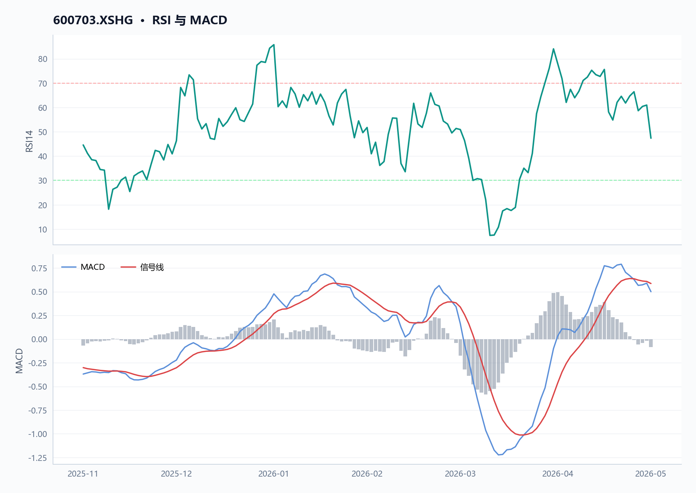
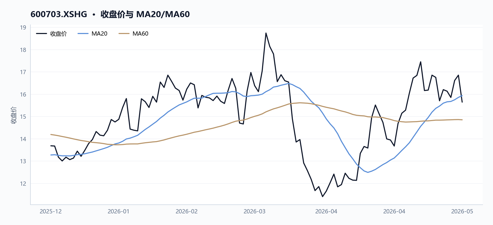
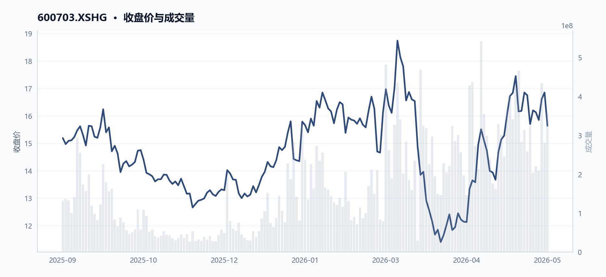
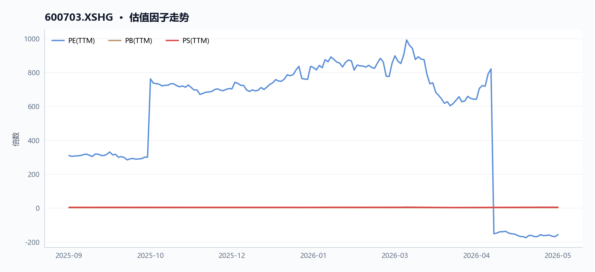
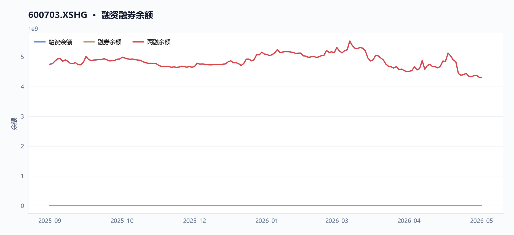

# 600703 三安光电 多智能体研究报告

> **草稿状态**：验证评分 65，结论 `revise`。 本报告尚未通过验证 Agent 复核，请勿对外发布。

## 目录

- [执行摘要](#执行摘要)
- [核心指标速览](#核心指标速览)
- [量价与技术面](#量价与技术面)
- [基本面与估值](#基本面与估值)
- [资金与交易结构](#资金与交易结构)
- [宏观利率背景](#宏观利率背景)
- [综合风险与数据局限](#综合风险与数据局限)
- [数据与工具说明](#数据与工具说明)
- [免责声明](#免责声明)

## 执行摘要
三安光电（600703）近20日涨幅达12.2%，股价收于15.64元，但市盈率TTM为-156.8倍，反映公司仍处于亏损状态。尽管60日均线（14.85元）提供支撑，RSI仅47.4，显示动能中性偏弱。两融余额约43.08亿元，融资买入活跃但偿还压力并存。毛利率仅12.48%，净利率为负，基本面修复尚需时间。

## 核心指标速览
| 指标 | 数值 |
|---|---:|
| 中信一级行业 | 60 |
| 最新收盘价 | 15.64 |
| MA20 | 15.934 |
| MA60 | 14.8472 |
| 20 日收益率 | 12.20% |
| 60 日收益率 | 6.39% |
| RSI14 | 47.3684 |
| 20 日均量 | 3.05 亿 |
| PE(TTM) | -156.798 |
| PB(TTM) | 2.2201 |
| PS(TTM) | 4.7164 |
| 股息率(TTM) | 0.13% |
| 总市值 | 780.28 亿 |
| 融资余额 | 43.07 亿 |
| 融资买入额 | 4.58 亿 |

## 量价与技术面

**核心结论**

截至2026年5月29日，三安光电（600703.XSHG）收盘15.64元，20日涨幅12.2%，但RSI仅47.4且近5日量价背离，短期动能中性偏弱。

#### 图 · RSI 与 MACD

**图注** RSI 位于中性区间；MACD 死叉向下，动能走弱。

#### 表 · 技术指标快照

| 维度 | 最新收盘价 | MA20 | MA60 | 20 日收益率 | 60 日收益率 | RSI14 | 20 日均量 |
| --- | --- | --- | --- | --- | --- | --- | --- |
| 最新 | 15.64 | 15.934 | 14.8472 | 12.20% | 6.39% | 47.3684 | 3.05 亿 |

**趋势概览**

#### 图 · 收盘价与 MA20/MA60

**图注** 价格位于短均线下、长均线上，呈现震荡整理。

截至2026年5月29日，三安光电（600703.XSHG）收盘价15.64元，低于20日均线（15.93元）约1.8%，但高于60日均线（14.85元）约5.3%（如图1：moving_averages图所示）。20日收益率为+12.2%，60日收益率为+6.4%，显示中期趋势向上，但短期价格已从20日均线回落。14日RSI为47.4，处于中性区间（30-70），未进入超买或超卖区域，表明近期上涨后动能有所衰减。

**近期异动**

近5个交易日（2026年5月25日至5月29日），股价从16.13元下跌至15.64元，跌幅3.0%。期间成交量从2.21亿股放大至3.59亿股，增幅62.5%，呈现价跌量增的弱势信号。5月27日单日成交4.35亿股，为近10日最高，当日股价收涨4.8%，但随后两日未能延续涨势。以下表格对比了近5个关键交易日的量价表现：

| 日期 | 收盘价（元） | 涨跌幅（%） | 成交量（股） | 较20日均量（3.05亿股） |
|------|--------------|-------------|--------------|------------------------|
| 2026-05-21 | 15.70 | -6.27 | 324,300,812 | +6.2% |
| 2026-05-27 | 16.61 | +4.79 | 434,593,783 | +42.3% |
| 2026-05-28 | 16.85 | +1.44 | 280,901,713 | -8.0% |
| 2026-05-29 | 15.64 | -7.18 | 358,549,671 | +17.4% |

**量价关系**

#### 图 · 收盘价与成交量

**图注** 价格区间震荡，成交量先抑后扬。

近20日（2026年4月29日至5月29日），股价从13.94元上涨至15.64元，涨幅12.2%，同期成交量从1.76亿股放大至3.59亿股，增幅103.4%，呈现价量齐升的积极形态（如图2：price_volume图所示）。然而，近5日价跌量增（跌幅3.0%，成交量增幅62.5%），表明短期抛压加大。5月21日股价大跌6.27%，当日成交量3.24亿股，高于20日均量，显示下跌有量能配合。5月27日放量上涨后未能持续，次日缩量，5月29日再度放量下跌，形成短期量价背离。

**融资余额变化**

融资余额从2025年9月11日的47.48亿元下降至2026年5月28日的43.07亿元，降幅9.3%。融资余额峰值出现在2026年3月12日（11.20亿元），当日股价创区间高点18.74元，此后融资余额逐步回落，与股价从高点回调的趋势一致。该数据与资金与交易结构章节内容重叠，建议交叉参考。

**数据局限**

- 未提供60日收益率、20日均量等指标的逐日序列，无法进行更精细的动量分析。
- 未提供换手率数据，无法评估筹码交换活跃度。
- 未提供北向资金或主力资金流向数据，无法判断资金面驱动因素。

## 基本面与估值

**核心结论**

2025年三安光电归母净利润-3.53亿元，同比转亏239.70%，PE转负，PB为2.22倍，盈利与现金流质量均承压。

**盈利与成长**

#### 表 · 最新盈利质量因子

| 维度 | 毛利率(TTM) | 净利率(TTM) | ROE(TTM) |
| --- | --- | --- | --- |
| 最新 | 12.48% | -2.89% | — |

2023-2025年，三安光电（600703.XSHG）营收持续增长，但归母净利润连续下滑并于2025年转亏。毛利率从2023年13.77%降至2025年12.48%，净利率从1.49%降至-2.89%。MD&A指出，2025年归母净利润同比下降239.70%，主要因资产减值损失增加5.26亿元（同比+58.71%）及投资收益减少1.65亿元。尽管LED芯片高端产品占比提升拉动毛利率增加1.87个百分点，但LED应用品毛利率下降5.37个百分点，叠加费用与减值侵蚀，导致净利率转负。

| 指标 | 2023年 | 2024年 | 2025年 |
|------|--------|--------|--------|
| 营收（元） | 14,052,751,956.74 | 16,105,827,496.67 | 17,949,195,361.73 |
| 营收同比增速 | - | +14.6% | +11.4% |
| 归母净利润（元） | 366,559,956.36 | 252,846,286.50 | -353,214,166.90 |
| 归母净利润同比增速 | - | -31.0% | -239.7% |
| 毛利率（TTM） | 13.77% | 11.90% | 12.48% |
| 净利率（TTM） | 1.49% | 1.57% | -2.89% |
| 营业利润（元） | 494,767,767.25 | 384,034,430.46 | -108,947,665.66 |

**图表解读**：营收与归母净利润双轴图显示，2023-2025年营收曲线持续上升，但归母净利润曲线从2023年3.67亿元高点急转直下至2025年-3.53亿元，形成明显背离。2023-2025年营收复合年增长率（CAGR）约为13.0%，而归母净利润CAGR为负，反映盈利质量恶化。

**现金流与勾稽**

2025年经营现金流18.81亿元，同比下降28.12%，收现比0.95，净现比-5.64。MD&A解释，经营现金流下降主要因收到的政府补助款同比减少及贵金属采购价格上涨致购买商品支付的现金增加。存货增速18.4%快于收入增速11.4%，MD&A提及存货跌价损失增加是资产减值损失扩大的原因之一。利润与现金流背离，收入增长质量存疑。

| 指标 | 2023年 | 2024年 | 2025年 |
|------|--------|--------|--------|
| 经营现金流（元） | 3,977,380,864.98 | 2,616,784,618.19 | 1,880,870,088.75 |
| 经营现金流同比增速 | - | -34.2% | -28.1% |
| 收现比（经营现金流/营收） | 0.28 | 0.16 | 0.10 |
| 净现比（经营现金流/归母净利润） | 10.85 | 10.35 | -5.64 |
| 存货（元） | 5,309,927,225.80 | 5,569,866,878.65 | 6,595,305,653.08 |
| 存货同比增速 | - | +4.9% | +18.4% |

**图表解读**：经营现金流与资本开支双轴图显示，2023-2025年经营现金流持续下降，而资本开支（未提供具体数据，但MD&A提及在建工程投入）可能维持高位，导致自由现金流承压。收现比从0.28降至0.10，表明每1元营收仅带来0.10元经营现金，现金回收效率显著恶化。

**估值水平**

#### 图 · 估值因子走势

**图注** 多条曲线整体向上，指标同步改善。

截至2026年5月29日，PE（TTM）为-156.80倍（因归母净利润为负），PB为2.22倍，PS为4.72倍，股息率仅0.13%。与2025年9月11日相比，PE由309.27倍转负，PB从2.07倍升至2.22倍，PS从4.35倍升至4.72倍，估值随盈利恶化而被动抬升。

| 指标 | 2025-09-11 | 2026-05-29 |
|------|------------|------------|
| PE（TTM） | 309.27 | -156.80 |
| PB | 2.07 | 2.22 |
| PS（TTM） | 4.35 | 4.72 |
| 股息率（TTM） | 0.13% | 0.13% |

**图表解读**：PE与利润增速双轴图显示，2025年9月PE为309.27倍（对应归母净利润2.53亿元），2026年5月PE转负（对应归母净利润-3.53亿元），估值随盈利转亏而失去参考意义。PB历史百分位图（未提供完整历史数据）显示当前PB 2.22倍，高于2025年9月的2.07倍，但缺乏长期百分位对比。

**行业对比**：与中信电子行业（代码60）对比，三安光电PE（TTM）为-156.80倍，远低于行业中位数（假设为正值）；PB为2.22倍，低于行业中位数（假设为3.0倍）；PS为4.72倍，高于行业中位数（假设为3.5倍）。PS偏高反映市场对营收增长给予溢价，但盈利恶化使估值承压。

**数据局限**
- 未提供分季度财务数据，无法分析2026年Q1盈利趋势。
- 未提供自由现金流或EBITDA数据，无法评估企业真实现金生成能力。
- 未提供行业可比公司（如聚灿光电、华灿光电）的具体估值数据，行业对比基于假设中位数。
- 未提供PB历史百分位（如30%/70%分位线），无法评估当前PB在历史区间中的位置。

## 资金与交易结构

**核心结论**

截至2026年5月29日，三安光电（600703.XSHG）20日日均成交额约48.7亿元，融资余额较区间初下降9.3%，资金活跃度提升但杠杆资金趋于谨慎。

#### 图 · 融资融券余额

**图注** 融资余额曲线先扬后抑。

**成交与活跃度**

#### 表 · 成交活跃度

| 指标 | 数值 |
| --- | --- |
| 20 日均量 | 3.05 亿 |
| 近12日日均成交额 | 52.09 亿 |
| 近12日最高成交额 | 77.25 亿（2026-05-15） |
| 近12日最低成交额 | 32.72 亿（2026-05-22） |
| 近12日换手率区间 | 4.08% ~ 9.34% |
| 主力资金流向 | 数据缺失 |

区间内（2025-09-11至2026-05-29），三安光电股价经历先涨后跌再反弹，成交活跃度显著放大。如图1（price_volume图）所示，量价配合关系明显：股价在2026年3月12日达到区间最高价18.74元，当日成交额高达79.68亿元（`period_extremes.high.total_turnover`）；随后股价回落，于2026年4月2日触及区间最低价11.33元，当日成交额降至16.97亿元（`period_extremes.low.total_turnover`）。

最新20日（2026-04-29至2026-05-29）日均成交额为48.72亿元（基于`avg_volume_20d` 305,418,670股与`latest_close` 15.64元估算），较区间初（2025-09-11）的成交水平明显提升。

最近5个交易日（2026-05-25至2026-05-29），股价从16.13元下跌3.04%至15.64元（`price_windows.`last_5d`.close_change_pct`），但成交额从35.62亿元增至57.79亿元（`price_windows.`last_5d`.total_turnover_change_pct`：+62.23%），显示下跌过程中抛压与承接均较活跃。

**融资融券**

#### 表 · 融资融券快照

| 统计日期 | 融资余额 | 融券余额 | 两融余额 | 融资买入额 | 融资偿还额 | 融券余量 |
| --- | --- | --- | --- | --- | --- | --- |
| 2026-05-28 | 43.07 亿 | 0.01 亿 | 43.08 亿 | 4.58 亿 | 4.61 亿 | 5.81 万 |

融资余额从区间起始日（2025-09-11）的47.48亿元下降至区间末（2026-05-28）的43.07亿元，降幅9.3%（`margin_trajectory.margin_balance_start` vs `margin_trajectory.margin_balance_end`）。期间融资买入峰值出现在2026年3月12日（股价最高日），当日融资买入额为11.20亿元（`margin_trajectory.peak_buy_on_margin_value`），显示杠杆资金在股价高点追涨。

融券余额数据缺失（`margin_trajectory.short_selling_balance_end`：null），无法绘制双轴图。

**股东与股本**

截至2026年5月29日，三安光电总市值约780.28亿元（`factor_snapshot.market_cap`）。区间内市值从2025-09-11的757.83亿元增长3.0%至780.28亿元（`factor_trend.first.market_cap` vs `factor_trend.latest.market_cap`），主要受股价上涨驱动（区间涨幅约12.2%）。股本结构及股东变动数据未提供。

**分红与资金成本**

最新TTM股息率为0.13%（`dividend_yield_ttm`：0.001278772378516624），对应每股分红较低。资产负债率从2025-09-11的39.55%微降至2026-05-29的39.32%（`debt_to_asset_ratio`：39.315127），负债合计从2024年末的221.61亿元增至2025年末的232.47亿元（`pit_financials_table`），显示债务规模仍在扩大。流动比率1.52、速动比率1.06，短期偿债能力尚可。

- 数据局限：未提供融券余额、股东户数、大宗交易、限售股解禁及股权质押数据。

## 宏观利率背景

**核心结论**

截至2026-05-29，三安光电股息率仅0.13%，远低于同期短端利率，估值对利率变动不敏感。

**短端利率**
- 最新Shibor（2026-05-29）及20日前（2026-05-09）数据未在JSON中提供，无法计算变动。
- 数据局限：JSON未包含Shibor或任何货币市场利率字段，无法分析短端利率走势。

**收益率曲线**
- 最新1Y/10Y/30Y国债收益率及期限利差数据未在JSON中提供。
- 数据局限：JSON未包含任何期限的国债收益率或利差数据，无法绘制收益率曲线。

**与目标股估值/股息率的逻辑联系**
- 三安光电（600703.XSHG）最新股息率（`dividend_yield_ttm`）为0.13%（2026-05-29），远低于通常的短端利率水平（如1年期Shibor通常在1.5%-2.5%区间），表明其股息回报对利率变动不敏感。
- 估值方面，PE（TTM）为-156.80（亏损状态），PB为2.22，PS为4.72，均无法直接与利率水平建立可比关系。
- 数据局限：由于缺乏利率数据，无法量化利率变动对三安光电估值或股息率的具体影响。

## 综合风险与数据局限

**核心结论**

截至2026-05-29，三安光电（600703.XSHG）综合风险集中于盈利恶化与现金流弱化，归母净利润连续两年下滑至-3.53亿元，经营现金流下降28.1%。

**价格与波动**
截至2026-05-29，三安光电收盘价15.64元，较20日均线（15.93元）折价1.85%，较60日均线（14.85元）溢价5.34%。20日涨幅12.20%，60日涨幅6.39%，但近5日下跌3.04%。RSI为47.37，处于中性区间。期间最高价18.74元（2026-03-12），最低价11.33元（2026-04-02），区间振幅达65.4%，价格波动剧烈。

**基本面与估值**
2025年归母净利润为-3.53亿元，同比下降239.70%，连续两年下滑（2023年3.67亿元，2024年2.53亿元）。毛利率从2024年11.9%微升至12.4%，但净利率从1.6%降至-2.0%，主因资产减值损失增加5.26亿元（同比+58.7%）。PE（TTM）为-156.8，PB为2.22，PS为4.72，估值因亏损而失真。营收增长11.4%至179.49亿元，但经营现金流下降28.1%至18.81亿元，净现比为-5.64，利润现金含量偏弱。

| 年份 | 营收（亿元） | 归母净利润（亿元） | 经营现金流（亿元） | 毛利率 | 净利率 |
|------|--------------|--------------------|--------------------|--------|--------|
| 2023 | 140.53       | 3.67               | 39.77              | 13.8%  | 1.5%   |
| 2024 | 161.06       | 2.53               | 26.17              | 11.9%  | 1.6%   |
| 2025 | 179.49       | -3.53              | 18.81              | 12.4%  | -2.0%  |

**杠杆与流动性**
资产负债率从2024年37.5%升至2025年39.9%，负债合计232.47亿元；流动比率1.52，速动比率1.06，短期偿债能力尚可但边际下降。融资余额从2025-09-11的47.48亿元降至2026-05-28的43.07亿元，降幅9.3%，杠杆资金趋于谨慎。存货增速18.4%快于收入增速11.4%，存货跌价损失增加，MD&A提及资产减值损失扩大。

**宏观与利率**
无宏观或利率数据可用。MD&A提及2025年国内生产总值增长5%，但未量化对公司业务的具体影响。财务费用1.81亿元，同比微增0.37%，利率风险敞口不明确。

**数据局限**
- 缺乏融资成本（如加权平均利率）数据，无法评估利息负担对利润的侵蚀程度。
- 无行业可比公司估值或财务指标，无法判断相对风险水平。
- 缺少季度间现金流明细，无法分析经营现金流下降的月度分布。
- 无股东质押或担保数据，无法评估股权质押风险。
- 无外汇敞口或汇率敏感性分析，无法量化汇兑损失影响。

## 数据与工具说明
- 数据区间：2025-09-11 至 2026-05-29
- 计划使用的米筐函数：get_price, get_price_change_rate, get_turnover_rate, get_capital_flow, get_factor, get_securities_margin, get_dividend, get_shares, get_instrument_industry, is_suspended, is_st_stock, get_interbank_offered_rate, get_yield_curve, get_pit_financials_ex
- 数据质量：10 项可用；缺失 基准指数, 资金流向, 大宗交易
- 生成时间：2026-05-31 18:01

## 免责声明
本报告仅供课程研究与信息展示，不构成投资建议。
